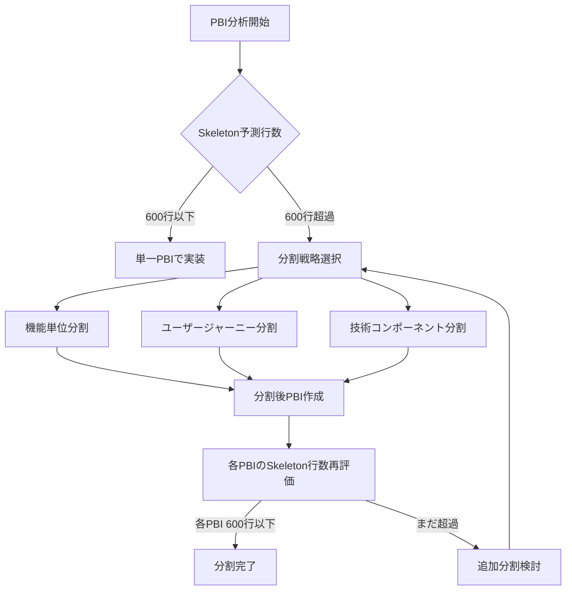

# CLAUDE.md

このファイルは、このリポジトリでコードを扱う際のClaude Code (claude.ai/code) への指針を提供します。

## リポジトリ情報

- **リモートリポジトリ**: https://github.com/judowine/PlaygroundWithClaudeCode
- **メインブランチ**: main
- **開発ブランチ**: manager_multiagent

### Git操作の基本
```bash
# リモートの状態確認
git remote -v

# ブランチ作成・切り替え
git checkout -b feature/[PBI-ID]-[feature-name]

# 変更のプッシュ
git push -u origin [branch-name]

# プルリクエスト作成
gh pr create --title "[PR-Title]" --body "[PR-Description]"
```

### コミット管理ルール

#### 基本方針
**読みやすさ重視**: 変更内容を理解しやすい単位でコミットを分割します

**コミット単位の基準**:
- **1つの論理的変更**: 1つのコミットには1つの論理的な変更のみを含める
- **変更行数制限**: 1コミットあたり**200行以内**を目標とする
- **独立性**: 各コミットが独立してビルド・テスト可能な状態を保つ

#### コミットメッセージフォーマット

**基本形式**:
```
[分類] [対象]: [変更内容の簡潔な説明]

- 変更の詳細や理由（必要に応じて）
- 影響範囲や注意点（必要に応じて）

[PBI-ID] 関連PBI参照
```

**分類タグ**:
- **[feat]**: 新機能追加
- **[fix]**: バグ修正  
- **[refactor]**: リファクタリング
- **[test]**: テスト追加・修正
- **[docs]**: ドキュメント更新
- **[style]**: コードスタイル修正（機能変更なし）
- **[perf]**: パフォーマンス改善
- **[build]**: ビルドシステム関連
- **[ci]**: CI設定変更

**例**:
```
[feat] TodoRepository: getAllTodos メソッドを追加

- Room を使用した TODO 項目の取得機能を実装
- Result<T> パターンでエラーハンドリング対応
- Flow による リアルタイム更新のサポート

PBI-001A TODO一覧表示機能
```

#### コミット分割のガイドライン

**推奨する分割パターン**:

1. **機能単位分割**
   ```bash
   git commit -m "[feat] TodoItem: ドメインモデルを追加"
   git commit -m "[feat] TodoRepository: インターフェースを定義"
   git commit -m "[feat] GetTodosUseCase: UseCase を実装"
   ```

2. **レイヤー単位分割**
   ```bash
   git commit -m "[feat] Data Layer: TodoDao と Entity を追加"
   git commit -m "[feat] Domain Layer: UseCase 群を実装"
   git commit -m "[feat] Presentation Layer: ViewModel を追加"
   ```

3. **ファイル種別単位分割**
   ```bash
   git commit -m "[feat] Models: Todo関連のドメインモデルを追加"
   git commit -m "[test] Models: TodoItem のユニットテストを追加"
   git commit -m "[docs] Models: Todo モデルのKDoc を追加"
   ```

#### 避けるべきコミットパターン

**❌ 避けるべき例**:
```bash
# 複数の論理変更を含む大きすぎるコミット
git commit -m "TODO機能の実装"  # 500行変更、複数ファイル

# 曖昧すぎる説明
git commit -m "修正"
git commit -m "更新"

# 関係のない変更を含む
git commit -m "[feat] TodoList: 一覧画面とバグ修正"
```

**✅ 推奨例**:
```bash
# 適切な粒度での分割
git commit -m "[feat] TodoList: 一覧画面レイアウト追加"      # 80行
git commit -m "[feat] TodoList: 削除ボタンの動作を実装"     # 45行
git commit -m "[fix] TodoList: アイテム重複表示を修正"      # 12行
```

#### 自動コミット分割のヒント

**ステージング活用**:
```bash
# ファイルの一部のみをステージング
git add -p [filename]

# 特定ファイルのみコミット
git add [specific-files]
git commit -m "[feat] [対象]: [変更内容]"

# 残りの変更を別コミット
git add [remaining-files] 
git commit -m "[test] [対象]: [テスト内容]"
```

**コミット前チェックリスト**:
- [ ] 1つの論理的変更のみを含んでいる
- [ ] 変更行数が200行以内である
- [ ] ビルドが成功する
- [ ] 関連テストが通る
- [ ] コミットメッセージが明確である

## プロジェクト概要

これはAndroid、iOS、Web（WASM）、Desktop（JVM）、Serverプラットフォームを対象としたKotlin Multiplatformプロジェクトです。UIにはCompose Multiplatform、サーバーコンポーネントにはKtorを使用しています。

## プロジェクト構造

- **`/composeApp`** - Compose Multiplatformを使用したメインのマルチプラットフォームUIアプリケーション
  - `commonMain/kotlin` - 全プラットフォーム共通のUIコード
  - `androidMain/kotlin` - Android固有の実装
  - `iosMain/kotlin` - iOS固有の実装
  - `jvmMain/kotlin` - Desktop JVM固有の実装
  - `wasmJsMain/kotlin` - Web WASM固有の実装
- **`/server`** - Ktorサーバーアプリケーション（JVMのみ）
- **`/shared`** - 全ターゲット間で共有されるビジネスロジックとユーティリティ
  - `commonMain/kotlin` - プラットフォーム非依存の共有コード
  - プラットフォーム固有の実装用フォルダー
- **`/iosApp`** - iOSアプリケーションのエントリーポイント（Swift/Objective-C）

## 必須コマンド

### ビルド
```bash
./gradlew build                    # 全モジュールをビルド
./gradlew :composeApp:build        # composeアプリのみをビルド
./gradlew :server:build            # サーバーのみをビルド
./gradlew :shared:build            # 共有モジュールのみをビルド
```

### アプリケーション実行
```bash
./gradlew run                                              # サーバーアプリケーションを実行
./gradlew :composeApp:wasmJsBrowserDevelopmentRun         # ブラウザでWebアプリを実行
./gradlew :composeApp:runDebugExecutableLinuxX64          # デスクトップアプリを実行（Linux）
```

### テスト
```bash
./gradlew check                    # 全テストとチェックを実行
./gradlew allTests                 # 全ターゲットのテストを実行
./gradlew :composeApp:jvmTest      # composeアプリのJVMテストを実行
./gradlew :server:test             # サーバーテストを実行
./gradlew :shared:allTests         # 共有モジュールの全テストを実行
```

### プラットフォーム固有のテスト
```bash
./gradlew :composeApp:testDebugUnitTest     # Androidユニットテスト
./gradlew :composeApp:iosX64Test            # iOSシミュレーターテスト
./gradlew :composeApp:wasmJsBrowserTest     # Webブラウザーテスト
```

### コード品質
```bash
./gradlew lint                     # Android lintを実行
./gradlew lintFix                  # lintを実行し安全な修正を適用
```

## 開発アーキテクチャ

- **共有ビジネスロジック**: `shared/commonMain`の共通コードと各プラットフォームディレクトリのプラットフォーム固有実装
- **UIフレームワーク**: プラットフォーム間で一貫したUIのためのCompose Multiplatform
- **サーバー**: NettyエンジンベースのKtor RESTサーバー
- **プラットフォーム抽象化**: プラットフォーム固有の実装はexpect/actualパターンに従う
- **ビルドシステム**: Kotlin DSLとバージョンカタログを使用するGradle
- **パッケージ構造**: 全コードで`com.example.playground`ベースパッケージを使用

## 主要設定ファイル

- **`build.gradle.kts`** - ルートビルド設定
- **`settings.gradle.kts`** - プロジェクト構造とモジュール定義
- **`gradle.properties`** - Gradleとビルド最適化設定
- **モジュール固有の`build.gradle.kts`** ファイル - 依存関係とプラットフォーム設定を定義

## ホットリロード開発

プロジェクトはCompose Hot Reloadサポートを含みます：
```bash
./gradlew hotRunJvm                # ホットリロード有効で実行
./gradlew reload                   # 実行中のアプリでホットリロードをトリガー
```

## PBI（Product Backlog Item）管理システム

このプロジェクトは包括的なPBI管理システムを採用しています。

### PBI状態管理フロー
```
requirements → ready → active → completed → archived
  要件定義中   着手可能  進行中     完了    アーカイブ
     ↓          ↓
   blocked    blocked
 （ブロック中）（ブロック中）
```

### PBI管理コマンド
```bash
/create-pbi [テーマ]               # インタラクティブPBI作成
/create-pbi ユーザー認証機能       # テーマ指定でPBI作成
```

### PBIディレクトリ構造
- **`docs/pbi/requirements/`** - 要件定義中のPBI
- **`docs/pbi/blocked/`** - ブロック中のPBI（依存関係未解決）
- **`docs/pbi/ready/`** - 着手可能なPBI（Definition of Ready完了）
- **`docs/pbi/active/`** - 進行中のPBI
- **`docs/pbi/completed/`** - 完了したPBI
- **`docs/pbi/archived/`** - アーカイブされたPBI
- **`docs/pbi/templates/`** - PBIテンプレート
- **`docs/pbi/workflow.md`** - PBI管理ワークフロー

### Definition of Ready (DoR)
PBIが`ready`状態になるためには、以下6カテゴリのチェックリストをクリアする必要があります：
1. **要件定義完了度** - ユーザーストーリーと受け入れ条件の明確化
2. **技術仕様明確性** - アーキテクチャ設計とAPI仕様の確定
3. **Kotlin Multiplatform対応** - プラットフォーム別実装方針とexpect/actual戦略
4. **依存関係解決状況** - 外部依存とPBI間依存の整理
5. **見積もり精度** - ストーリーポイントと工数の妥当性確認
6. **承認プロセス完了** - ステークホルダーとチームの最終承認

## 専門Agent活用

プロジェクトには11の専門agentが設定されており、開発プロセス全体をサポートします：

### プロジェクト管理
- **strategic-project-manager** - プロジェクト全体統制、リソース管理、リスクマネジメント

### プロダクト・要件管理
- **product-owner-pbi-manager** - PBI作成・管理、ステークホルダーヒアリング
- **pbi-refinement-facilitator** - PBI詳細化、バックロググルーミング
- **market-analyst** - 市場分析、競合調査

### UX・デザイン
- **ux-persona-journey-designer** - ユーザーペルソナ、ユーザージャーニー設計  
- **design-system-ui-architect** - UIデザインシステム、画面レイアウト
- **interaction-prototyping-agent** - インタラクション設計、プロトタイピング

### 開発・アーキテクチャ
- **architecture-strategist** - システムアーキテクチャ、技術戦略
- **frontend-generalist-dev** - フロントエンド総合開発
- **backend-security-architect** - バックエンド開発、セキュリティ設計

### 品質保証
- **qa-test-strategist** - テスト戦略、品質保証計画

### Agent活用例
```bash
# Agentを使用したタスクの例
- プロジェクト計画: strategic-project-managerで全体統制・リソース配分
- 新機能のPBI作成: product-owner-pbi-managerでヒアリング実行
- UI設計: design-system-ui-architectでデザインシステム構築
- アーキテクチャ検討: architecture-strategistで設計レビュー
- テスト計画: qa-test-strategistで包括的テスト設計
```

### Strategic Project Manager詳細仕様

**Agent名**: `strategic-project-manager`

**専門領域**:
- プロジェクト全体統制とガバナンス
- マルチプラットフォーム開発のリソース管理
- PBI優先度調整と開発スケジューリング
- クロスファンクショナルチーム連携
- リスク管理と品質コントロール
- ステークホルダー管理と進捗報告

**主要機能**:

1. **プロジェクト計画管理**
   - WBS統合とマイルストーン設定
   - Kotlin Multiplatform特有のタスク依存関係管理
   - プラットフォーム別開発優先度調整
   - 開発チーム間の作業分散とロードバランシング

2. **リソース管理**
   - 専門Agent活用戦略の策定
   - 開発者スキルマッピングとアサイン最適化
   - 並行開発タスクの効率化
   - ボトルネック特定と解消策提案

3. **品質・リスク管理**
   - Definition of Done準拠チェック
   - 技術的負債の監視と改善計画
   - プラットフォーム間の品質一貫性確保
   - セキュリティ・パフォーマンスリスク評価

4. **ステークホルダー管理**
   - 進捗レポートとダッシュボード生成
   - 課題エスカレーションと解決調整
   - 要件変更の影響分析と対応判断
   - チーム間コミュニケーション促進

**活用シーン**:
```bash
# プロジェクト開始時
strategic-project-manager: 全体計画策定、リソース配分、リスク分析

# 開発中の統制
strategic-project-manager: 進捗監視、ボトルネック解消、優先度調整

# リリース前の品質確保
strategic-project-manager: 品質ゲート、リリース判定、展開計画

# 課題発生時の対応
strategic-project-manager: 影響分析、対応策立案、リソース再配分
```

**他Agentとの連携パターン**:

- **product-owner-pbi-manager**: PBI優先度調整、要件変更影響分析
- **architecture-strategist**: 技術的意思決定、アーキテクチャリスク評価  
- **qa-test-strategist**: 品質基準設定、テスト戦略調整
- **frontend-generalist-dev** / **backend-security-architect**: 開発進捗管理、技術課題解決
- **design-system-ui-architect**: デザインシステム統制、UI一貫性管理

## PBI分割戦略

効率的な開発とレビューのため、PBIは適切な粒度で分割する必要があります。特にSkeleton実装時の変更行数を600行以内に抑えることを目標とします。

### PBI分割の基本方針

**変更行数制限**: Skeleton PRの変更行数は**600行以内**を目標とします
- **測定基準**: `git diff --stat`による追加・変更行数の合計
- **制限超過時**: PBI分割または段階的実装を検討

### 分割パターン

#### 1. 機能単位分割
**適用基準**: 独立してテスト・デプロイ可能な機能境界
```
例: 「TODOアプリ」を分割
├── PBI-001A: TODO作成機能
├── PBI-001B: TODO一覧表示機能  
├── PBI-001C: TODO編集・削除機能
└── PBI-001D: TODO検索・フィルタ機能
```

**メリット**: 
- 機能ごとの独立開発が可能
- テストとデプロイの並列化
- 障害影響の局所化

#### 2. ユーザージャーニー単位分割
**適用基準**: ユーザーが価値を感じられる操作フローの完結単位
```
例: 「ユーザー管理」を分割
├── PBI-002A: 新規ユーザー登録フロー
├── PBI-002B: ログイン・認証フロー
├── PBI-002C: プロファイル管理フロー
└── PBI-002D: パスワード変更フロー
```

**メリット**:
- ユーザー価値の早期提供
- E2Eテストの明確化
- ステークホルダーレビューの容易さ

#### 3. 技術コンポーネント単位分割
**適用基準**: アーキテクチャ境界に沿った技術的分割
```
例: 「通知システム」を分割
├── PBI-003A: 通知データモデルとRepository
├── PBI-003B: 通知送信UseCase
├── PBI-003C: 通知UI表示機能
└── PBI-003D: プラットフォーム固有通知実装
```

**メリット**:
- 技術専門性の活用
- レイヤー別並行開発
- 技術負債の管理しやすさ

### 分割判定フローチャート



### 分割後PBI命名規則

**基本形式**: `[元PBI-ID][分割識別子]: [機能説明]`

**分割識別子**:
- **A, B, C, ...**: 機能単位分割
- **-Journey1, -Journey2, ...**: ユーザージャーニー分割  
- **-Data, -Domain, -UI, -Platform**: 技術コンポーネント分割

**例**:
```
元PBI: PBI-001: ローカル完結TODOアプリ

機能単位分割後:
├── PBI-001A: TODO作成機能
├── PBI-001B: TODO一覧表示機能
├── PBI-001C: TODO編集・削除機能
```

## 実装開発フロー（Step 1-2 Standard Process）

このプロジェクトでは、PBIの`ready`状態から機能実装完了（統合テスト成功）まで、以下の標準化された2段階プロセスに従います：

### Step 1: Skeleton実装
PBIの`ready`状態から開始し、実装の骨格を構築します。プロジェクトの性質と要件に応じて適切な実装レベルを選択できます。

### Step 1実装の選択肢

プロジェクトの性質と要件に応じて、以下から選択：

**Option A: Minimal → Full → Layer実装**
```
Step 1.0: Minimal Skeleton → Step 1.2: Full Skeleton → Step 2: Layer実装
```
- 大規模・複雑な機能向け
- 早期レビューとアーキテクチャ確認重視
- ステークホルダーとの方向性合意が必要

**Option B: Full → Layer実装（従来）**
```
Step 1.2: Full Skeleton → Step 2: Layer実装  
```
- 中規模機能向け
- 動作確認を早期に行いたい場合
- プロトタイピング重視

**Option C: Direct Layer実装**
```
Step 2: Layer実装（Skeletonスキップ）
```
- 小規模・定型的な機能向け
- アーキテクチャが確定済み
- 高速開発重視

#### 1.0 Minimal Skeleton実装
**目的**: 最小限の構造定義による早期レビューと方向性確認

**実装基準**:
- **インターフェース定義**: 全メソッドシグネチャのみ
- **クラス構造**: プロパティ定義とコンストラクタのみ  
- **実装**: 全メソッドを`TODO()`で実装
- **依存関係**: 型定義のみ、実装は一切行わない
- **変更行数制限**: 600行以内（`git diff --stat`基準）

**実装例**:
```kotlin
// Domain Layer - 型定義のみ
interface TodoRepository {
    suspend fun getAllTodos(): Result<List<TodoItem>> = TODO()
    suspend fun createTodo(todo: TodoItem): Result<TodoItem> = TODO()
}

// UseCase - 構造のみ
class GetTodosUseCase(
    private val repository: TodoRepository
) {
    suspend operator fun invoke(): Result<List<TodoItem>> = TODO()
}

// ViewModel - 状態プロパティのみ
class TodoListViewModel(
    private val getTodosUseCase: GetTodosUseCase
) : ViewModel() {
    private val _uiState = MutableStateFlow<TodoListUiState>(TODO())
    val uiState: StateFlow<TodoListUiState> = TODO()
    
    fun loadTodos() = TODO()
    fun deleteTodo(id: Long) = TODO()
}

// UI State - データクラスのみ
data class TodoListUiState(
    val todos: List<TodoItem> = emptyList(),
    val isLoading: Boolean = false,
    val errorMessage: String? = null
)
```

**禁止事項**:
- データベース実装（Room、SQLite等）
- 実際の業務ロジック記述
- エラーハンドリングの詳細実装
- プラットフォーム固有実装
- テストコード（構造確認のみ）

**完了基準**:
- 全クラス・メソッドが定義済み
- コンパイルエラーなし（ただし実行時は全てTODO例外）
- アーキテクチャ構造の可視化完了
- 依存関係グラフが明確

#### 1.1 Design Doc作成
**目的**: 技術仕様と受け入れ条件の明確化

**使用Agent**: `architecture-strategist` + `design-system-ui-architect`

**成果物**: `docs/design/design-docs/[PBI-ID]-design.md`

**内容**:
- **使用技術**: Kotlin Multiplatform、Compose Multiplatform、Ktor等の具体的技術選択
- **受け入れ条件**: PBIから抽出した動作要件を技術的に詳述
- **アーキテクチャ概要**: Layered Architectureでの配置と依存関係
- **プラットフォーム対応**: 各プラットフォームでの実装方針

**品質基準**:
- 受け入れ条件が測定可能で具体的
- 技術選択に明確な根拠
- プラットフォーム間の一貫性確保

#### 1.2 Full Skeleton実装
**目的**: 動作可能なプロトタイプレベルの構造実装

**使用Agent**: `frontend-generalist-dev` + `backend-security-architect`

**実装範囲**:
```kotlin
// 例: 主要なクラス・メソッド・プロパティを空実装で定義
class UserRepository {
    // TODO: データベースアクセス実装
    suspend fun findUserById(id: String): User? = null
    
    // TODO: ユーザー作成処理実装  
    suspend fun createUser(user: User): Result<User> = TODO()
}

data class User(
    val id: String,
    val name: String,
    // TODO: その他必要プロパティ追加
)
```

**実装基準**:
- 全てのクラス、メソッド、プロパティを定義
- モック実装またはTODOコメントで実装方針を明記
- ビルド・実行可能な状態を保持
- Layered Architectureの各層を適切に配置
- **変更行数制限**: 600行以内（`git diff --stat`基準）

#### 1.3 Skeleton PR提出
**PR要件**:
- **タイトル**: `[Skeleton] [PBI-ID] [機能名]`
- **説明**: Design Docへのリンクと実装方針の要約
- **レビュー観点**: アーキテクチャ構造、命名規則、TODO内容の妥当性

**段階的コミット戦略**:
Skeleton実装時は以下の順序で段階的にコミット：

```bash
# 1. Domain Layer（型定義）
git commit -m "[feat] Domain: TodoItem モデルを追加"
git commit -m "[feat] Domain: TodoRepository インターフェースを定義"
git commit -m "[feat] Domain: UseCase クラス群を追加"

# 2. Data Layer（インターフェース実装）
git commit -m "[feat] Data: TodoEntity とマッパーを追加"
git commit -m "[feat] Data: TodoDao インターフェースを定義"
git commit -m "[feat] Data: TodoRepositoryImpl スケルトンを実装"

# 3. Presentation Layer（UI構造）
git commit -m "[feat] Presentation: TodoListUiState を定義"
git commit -m "[feat] Presentation: TodoListViewModel スケルトンを実装"
git commit -m "[feat] Presentation: TodoList画面コンポーネント構造を追加"

# 4. Platform Layer（プラットフォーム固有）
git commit -m "[feat] Platform: Android用DatabaseModule追加"
git commit -m "[feat] Platform: 依存性注入設定を追加"
```

**コミット粒度の目安**:
- **1コミット**: 200行以内、単一責任の実装
- **PR全体**: 600行以内、5-10コミットに分割
- **各コミット**: 独立してビルド成功する状態を保持

**品質チェック**:
```bash
./gradlew build                    # ビルド成功確認
./gradlew allTests                 # 基本テスト実行
./gradlew lint                     # コード品質チェック
```

### Step 2: レイヤー別実装とテスト
Skeleton実装を基に、Layered Architectureに従って段階的に実装します。

#### 2.1 タスク分割
**分割基準**: Layered Architectureの各層
```
1. Data Layer (Repository, DataSource, Entity)
2. Domain Layer (UseCase, Domain Model, Repository Interface)  
3. Presentation Layer (ViewModel, UI Components)
4. Platform Layer (Platform-specific implementations)
```

**使用Agent**: `architecture-strategist`による分割支援

#### 2.2 各レイヤー実装
**実装順序**: Data → Domain → Presentation → Platform

**各レイヤーPR要件**:
- **タイトル**: `[Layer] [PBI-ID] [レイヤー名] Implementation`
- **実装完了基準**: 
  - 該当レイヤーの全TODOを実装
  - 単体テスト実装・成功
  - 上位レイヤーとの統合確認

**品質基準**:
- テストカバレッジ > 80%
- 循環的複雑度 < 10
- レイヤー間依存関係の適切性

#### 2.3 統合テスト実装
**目的**: Design Docの受け入れ条件を満たす動作保証

**実装場所**: ViewModelレベルでの結合テスト

**使用Agent**: `qa-test-strategist`

**テスト実装基準**:
```kotlin
@Test
fun `ユーザー作成が正常に完了する`() = runTest {
    // Given: 有効なユーザー情報
    val userInput = CreateUserRequest(name = "テストユーザー")
    
    // When: ユーザー作成を実行
    val result = viewModel.createUser(userInput)
    
    // Then: 受け入れ条件を満たす
    assertTrue(result.isSuccess)
    assertEquals("テストユーザー", result.getOrNull()?.name)
    // TODO: Design Docの全受け入れ条件をテスト
}
```

**統合テストPR要件**:
- **タイトル**: `[Integration] [PBI-ID] [機能名] Integration Tests`
- **内容**: Design Docの受け入れ条件の完全実装とテスト
- **成果物**: 動作する機能とテストコード

### 開発完了の定義

統合テスト成功をもって**開発完了**とします。この時点でPBIは`active`から`completed`状態に移行します。

**完了条件**:
- 統合実装品質ゲート合格
- Design Docの全受け入れ条件を満たす
- 全プラットフォームでビルド・テスト成功
- コードレビュー完了・マージ済み

**次段階**: リリース・運用保守フローへ移行（別ワークフロー）

### 品質ゲート

#### Skeleton実装品質ゲート
```yaml
criteria:
  design_doc_quality: ">= 4.0"
  skeleton_completeness: "100% (全構造定義済み)"
  build_success: "全プラットフォームでビルド成功"
  architecture_compliance: "Layered Architecture準拠"
  commit_quality: "適切な粒度でコミット分割済み"
  change_lines: "<= 600行 (PR全体)"
  commit_count: "5-10コミット（Skeleton実装）"
```

#### 統合実装品質ゲート  
```yaml
criteria:
  feature_completeness: "100% (受け入れ条件満足)"
  test_coverage: ">= 80%"
  integration_success: "全統合テスト成功"
  performance_requirements: "応答時間・リソース使用量基準満足"
```

### 開発効率化のコツ

#### Agent活用パターン
```bash
# Step 1: Skeleton開発
architecture-strategist: Design Doc作成・アーキテクチャ設計
frontend-generalist-dev: UI Skeleton実装
backend-security-architect: API・データ層Skeleton実装

# Step 2: レイヤー別実装
# Data Layer実装時
backend-security-architect: Repository、DataSource実装

# Domain Layer実装時  
architecture-strategist: UseCase、ビジネスロジック実装

# Presentation Layer実装時
frontend-generalist-dev: ViewModel、UI Components実装

# テスト実装時
qa-test-strategist: 統合テスト戦略・実装
```

#### トラブルシューティング
- **Skeleton段階での設計変更**: Design Docを更新してからSkeleton修正
- **レイヤー間統合エラー**: 該当レイヤーの境界設計をarchitecture-strategistで見直し
- **テスト失敗**: qa-test-strategistでテスト戦略を再検討

### テンプレート・参考資料
- **Design Docテンプレート**: `docs/design/templates/design-doc-template.md`
- **PBI管理ワークフロー**: `docs/pbi/workflow.md`
- **品質ゲート詳細**: `docs/workflow/quality-gates.md`
- **Multi-Agent開発プロセス**: `docs/workflow/multi-agent-development.md`
- **リリース・運用保守フロー**: `docs/workflow/release-operations-workflow.md`