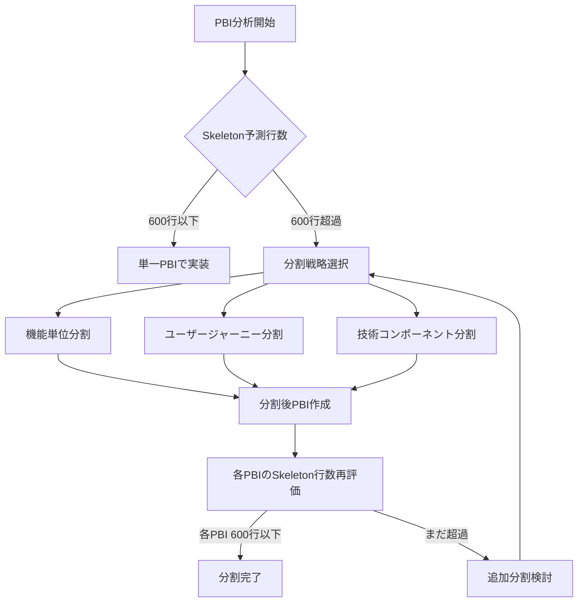
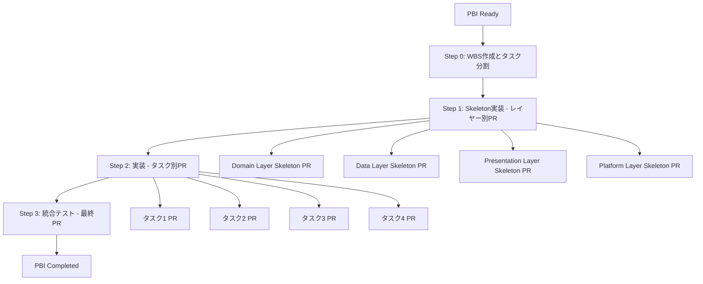

# CLAUDE.md

このファイルは、このリポジトリでコードを扱う際のClaude Code (claude.ai/code) への指針を提供します。

## リポジトリ情報

- **リモートリポジトリ**: https://github.com/judowine/PlaygroundWithClaudeCode
- **メインブランチ**: main
- **開発ブランチ**: manager_multiagent

### Git操作の基本
```bash
# リモートの状態確認
git remote -v

# ブランチ作成・切り替え
git checkout -b feature/[PBI-ID]-[feature-name]

# 変更のプッシュ
git push -u origin [branch-name]

# プルリクエスト作成
gh pr create --title "[PR-Title]" --body "[PR-Description]"
```

### コミット管理ルール

#### 基本方針
**読みやすさ重視**: 変更内容を理解しやすい単位でコミットを分割します

**コミット単位の基準**:
- **1つの論理的変更**: 1つのコミットには1つの論理的な変更のみを含める
- **変更行数制限**: 1コミットあたり**200行以内**を目標とする
- **独立性**: 各コミットが独立してビルド・テスト可能な状態を保つ

#### コミットメッセージフォーマット

**基本形式**:
```
[分類] [対象]: [変更内容の簡潔な説明]

- 変更の詳細や理由（必要に応じて）
- 影響範囲や注意点（必要に応じて）

[PBI-ID] 関連PBI参照
```

**分類タグ**:
- **[feat]**: 新機能追加
- **[fix]**: バグ修正  
- **[refactor]**: リファクタリング
- **[test]**: テスト追加・修正
- **[docs]**: ドキュメント更新
- **[style]**: コードスタイル修正（機能変更なし）
- **[perf]**: パフォーマンス改善
- **[build]**: ビルドシステム関連
- **[ci]**: CI設定変更

**例**:
```
[feat] TodoRepository: getAllTodos メソッドを追加

- Room を使用した TODO 項目の取得機能を実装
- Result<T> パターンでエラーハンドリング対応
- Flow による リアルタイム更新のサポート

PBI-001A TODO一覧表示機能
```

#### コミット分割のガイドライン

**推奨する分割パターン**:

1. **機能単位分割**
   ```bash
   git commit -m "[feat] TodoItem: ドメインモデルを追加"
   git commit -m "[feat] TodoRepository: インターフェースを定義"
   git commit -m "[feat] GetTodosUseCase: UseCase を実装"
   ```

2. **レイヤー単位分割**
   ```bash
   git commit -m "[feat] Data Layer: TodoDao と Entity を追加"
   git commit -m "[feat] Domain Layer: UseCase 群を実装"
   git commit -m "[feat] Presentation Layer: ViewModel を追加"
   ```

3. **ファイル種別単位分割**
   ```bash
   git commit -m "[feat] Models: Todo関連のドメインモデルを追加"
   git commit -m "[test] Models: TodoItem のユニットテストを追加"
   git commit -m "[docs] Models: Todo モデルのKDoc を追加"
   ```

#### 避けるべきコミットパターン

**❌ 避けるべき例**:
```bash
# 複数の論理変更を含む大きすぎるコミット
git commit -m "TODO機能の実装"  # 500行変更、複数ファイル

# 曖昧すぎる説明
git commit -m "修正"
git commit -m "更新"

# 関係のない変更を含む
git commit -m "[feat] TodoList: 一覧画面とバグ修正"
```

**✅ 推奨例**:
```bash
# 適切な粒度での分割
git commit -m "[feat] TodoList: 一覧画面レイアウト追加"      # 80行
git commit -m "[feat] TodoList: 削除ボタンの動作を実装"     # 45行
git commit -m "[fix] TodoList: アイテム重複表示を修正"      # 12行
```

#### 自動コミット分割のヒント

**ステージング活用**:
```bash
# ファイルの一部のみをステージング
git add -p [filename]

# 特定ファイルのみコミット
git add [specific-files]
git commit -m "[feat] [対象]: [変更内容]"

# 残りの変更を別コミット
git add [remaining-files] 
git commit -m "[test] [対象]: [テスト内容]"
```

**コミット前チェックリスト**:
- [ ] 1つの論理的変更のみを含んでいる
- [ ] 変更行数が200行以内である
- [ ] ビルドが成功する
- [ ] 関連テストが通る
- [ ] コミットメッセージが明確である

## プロジェクト概要

これはAndroid、iOS、Web（WASM）、Desktop（JVM）、Serverプラットフォームを対象としたKotlin Multiplatformプロジェクトです。UIにはCompose Multiplatform、サーバーコンポーネントにはKtorを使用しています。

## プロジェクト構造

- **`/composeApp`** - Compose Multiplatformを使用したメインのマルチプラットフォームUIアプリケーション
  - `commonMain/kotlin` - 全プラットフォーム共通のUIコード
  - `androidMain/kotlin` - Android固有の実装
  - `iosMain/kotlin` - iOS固有の実装
  - `jvmMain/kotlin` - Desktop JVM固有の実装
  - `wasmJsMain/kotlin` - Web WASM固有の実装
- **`/server`** - Ktorサーバーアプリケーション（JVMのみ）
- **`/shared`** - 全ターゲット間で共有されるビジネスロジックとユーティリティ
  - `commonMain/kotlin` - プラットフォーム非依存の共有コード
  - プラットフォーム固有の実装用フォルダー
- **`/iosApp`** - iOSアプリケーションのエントリーポイント（Swift/Objective-C）

## 必須コマンド

### ビルド
```bash
./gradlew build                    # 全モジュールをビルド
./gradlew :composeApp:build        # composeアプリのみをビルド
./gradlew :server:build            # サーバーのみをビルド
./gradlew :shared:build            # 共有モジュールのみをビルド
```

### アプリケーション実行
```bash
./gradlew run                                              # サーバーアプリケーションを実行
./gradlew :composeApp:wasmJsBrowserDevelopmentRun         # ブラウザでWebアプリを実行
./gradlew :composeApp:runDebugExecutableLinuxX64          # デスクトップアプリを実行（Linux）
```

### テスト
```bash
./gradlew check                    # 全テストとチェックを実行
./gradlew allTests                 # 全ターゲットのテストを実行
./gradlew :composeApp:jvmTest      # composeアプリのJVMテストを実行
./gradlew :server:test             # サーバーテストを実行
./gradlew :shared:allTests         # 共有モジュールの全テストを実行
```

### プラットフォーム固有のテスト
```bash
./gradlew :composeApp:testDebugUnitTest     # Androidユニットテスト
./gradlew :composeApp:iosX64Test            # iOSシミュレーターテスト
./gradlew :composeApp:wasmJsBrowserTest     # Webブラウザーテスト
```

### コード品質
```bash
./gradlew lint                     # Android lintを実行
./gradlew lintFix                  # lintを実行し安全な修正を適用
```

## 開発アーキテクチャ

- **共有ビジネスロジック**: `shared/commonMain`の共通コードと各プラットフォームディレクトリのプラットフォーム固有実装
- **UIフレームワーク**: プラットフォーム間で一貫したUIのためのCompose Multiplatform
- **サーバー**: NettyエンジンベースのKtor RESTサーバー
- **プラットフォーム抽象化**: プラットフォーム固有の実装はexpect/actualパターンに従う
- **ビルドシステム**: Kotlin DSLとバージョンカタログを使用するGradle
- **パッケージ構造**: 全コードで`com.example.playground`ベースパッケージを使用

## 主要設定ファイル

- **`build.gradle.kts`** - ルートビルド設定
- **`settings.gradle.kts`** - プロジェクト構造とモジュール定義
- **`gradle.properties`** - Gradleとビルド最適化設定
- **モジュール固有の`build.gradle.kts`** ファイル - 依存関係とプラットフォーム設定を定義

## ホットリロード開発

プロジェクトはCompose Hot Reloadサポートを含みます：
```bash
./gradlew hotRunJvm                # ホットリロード有効で実行
./gradlew reload                   # 実行中のアプリでホットリロードをトリガー
```

## PBI（Product Backlog Item）管理システム

このプロジェクトは包括的なPBI管理システムを採用しています。

### PBI状態管理フロー
```
requirements → ready → active → completed → archived
  要件定義中   着手可能  進行中     完了    アーカイブ
     ↓          ↓
   blocked    blocked
 （ブロック中）（ブロック中）
```

### PBI・開発管理コマンド
```bash
/create-pbi [テーマ]               # インタラクティブPBI作成
/create-pbi ユーザー認証機能       # テーマ指定でPBI作成
/ui-dev [PBI-ID]                   # PBIからUI開発ワークフロー実行
/ui-dev PBI-001A                   # 指定PBIのUI実装開始
```

### PBIディレクトリ構造
- **`docs/pbi/requirements/`** - 要件定義中のPBI
- **`docs/pbi/blocked/`** - ブロック中のPBI（依存関係未解決）
- **`docs/pbi/ready/`** - 着手可能なPBI（Definition of Ready完了）
- **`docs/pbi/active/`** - 進行中のPBI
- **`docs/pbi/completed/`** - 完了したPBI
- **`docs/pbi/archived/`** - アーカイブされたPBI
- **`docs/pbi/templates/`** - PBIテンプレート
- **`docs/pbi/workflow.md`** - PBI管理ワークフロー

### Definition of Ready (DoR)
PBIが`ready`状態になるためには、以下6カテゴリのチェックリストをクリアする必要があります：
1. **要件定義完了度** - ユーザーストーリーと受け入れ条件の明確化
2. **技術仕様明確性** - アーキテクチャ設計とAPI仕様の確定
3. **Kotlin Multiplatform対応** - プラットフォーム別実装方針とexpect/actual戦略
4. **依存関係解決状況** - 外部依存とPBI間依存の整理
5. **見積もり精度** - ストーリーポイントと工数の妥当性確認
6. **承認プロセス完了** - ステークホルダーとチームの最終承認

## 専門Agent活用

プロジェクトには11の専門agentが設定されており、開発プロセス全体をサポートします：

### プロジェクト管理
- **strategic-project-manager** - プロジェクト全体統制、リソース管理、リスクマネジメント

### プロダクト・要件管理
- **product-owner-pbi-manager** - PBI作成・管理、ステークホルダーヒアリング
- **pbi-refinement-facilitator** - PBI詳細化、バックロググルーミング
- **market-analyst** - 市場分析、競合調査

### UX・デザイン
- **ux-persona-journey-designer** - ユーザーペルソナ、ユーザージャーニー設計  
- **design-system-ui-architect** - UIデザインシステム、画面レイアウト
- **interaction-prototyping-agent** - インタラクション設計、プロトタイピング

### 開発・アーキテクチャ
- **architecture-strategist** - システムアーキテクチャ、技術戦略
- **frontend-generalist-dev** - フロントエンド総合開発
- **backend-security-architect** - バックエンド開発、セキュリティ設計

### 品質保証
- **qa-test-strategist** - テスト戦略、品質保証計画

### Agent活用例
```bash
# Agentを使用したタスクの例
- プロジェクト計画: strategic-project-managerで全体統制・リソース配分
- 新機能のPBI作成: product-owner-pbi-managerでヒアリング実行
- UI設計: design-system-ui-architectでデザインシステム構築
- アーキテクチャ検討: architecture-strategistで設計レビュー
- テスト計画: qa-test-strategistで包括的テスト設計
```

### Strategic Project Manager詳細仕様

**Agent名**: `strategic-project-manager`

**専門領域**:
- プロジェクト全体統制とガバナンス
- マルチプラットフォーム開発のリソース管理
- PBI優先度調整と開発スケジューリング
- クロスファンクショナルチーム連携
- リスク管理と品質コントロール
- ステークホルダー管理と進捗報告

**主要機能**:

1. **プロジェクト計画管理**
   - WBS統合とマイルストーン設定
   - Kotlin Multiplatform特有のタスク依存関係管理
   - プラットフォーム別開発優先度調整
   - 開発チーム間の作業分散とロードバランシング

2. **リソース管理**
   - 専門Agent活用戦略の策定
   - 開発者スキルマッピングとアサイン最適化
   - 並行開発タスクの効率化
   - ボトルネック特定と解消策提案

3. **品質・リスク管理**
   - Definition of Done準拠チェック
   - 技術的負債の監視と改善計画
   - プラットフォーム間の品質一貫性確保
   - セキュリティ・パフォーマンスリスク評価

4. **ステークホルダー管理**
   - 進捗レポートとダッシュボード生成
   - 課題エスカレーションと解決調整
   - 要件変更の影響分析と対応判断
   - チーム間コミュニケーション促進

**活用シーン**:
```bash
# プロジェクト開始時
strategic-project-manager: 全体計画策定、リソース配分、リスク分析

# 開発中の統制
strategic-project-manager: 進捗監視、ボトルネック解消、優先度調整

# リリース前の品質確保
strategic-project-manager: 品質ゲート、リリース判定、展開計画

# 課題発生時の対応
strategic-project-manager: 影響分析、対応策立案、リソース再配分
```

**他Agentとの連携パターン**:

- **product-owner-pbi-manager**: PBI優先度調整、要件変更影響分析
- **architecture-strategist**: 技術的意思決定、アーキテクチャリスク評価  
- **qa-test-strategist**: 品質基準設定、テスト戦略調整
- **frontend-generalist-dev** / **backend-security-architect**: 開発進捗管理、技術課題解決
- **design-system-ui-architect**: デザインシステム統制、UI一貫性管理

## PBI分割戦略

効率的な開発とレビューのため、PBIは適切な粒度で分割する必要があります。特にSkeleton実装時の変更行数を600行以内に抑えることを目標とします。

### PBI分割の基本方針

**変更行数制限**: Skeleton PRの変更行数は**600行以内**を目標とします
- **測定基準**: `git diff --stat`による追加・変更行数の合計
- **制限超過時**: PBI分割または段階的実装を検討

### 分割パターン

#### 1. 機能単位分割
**適用基準**: 独立してテスト・デプロイ可能な機能境界
```
例: 「TODOアプリ」を分割
├── PBI-001A: TODO作成機能
├── PBI-001B: TODO一覧表示機能  
├── PBI-001C: TODO編集・削除機能
└── PBI-001D: TODO検索・フィルタ機能
```

**メリット**: 
- 機能ごとの独立開発が可能
- テストとデプロイの並列化
- 障害影響の局所化

#### 2. ユーザージャーニー単位分割
**適用基準**: ユーザーが価値を感じられる操作フローの完結単位
```
例: 「ユーザー管理」を分割
├── PBI-002A: 新規ユーザー登録フロー
├── PBI-002B: ログイン・認証フロー
├── PBI-002C: プロファイル管理フロー
└── PBI-002D: パスワード変更フロー
```

**メリット**:
- ユーザー価値の早期提供
- E2Eテストの明確化
- ステークホルダーレビューの容易さ

#### 3. 技術コンポーネント単位分割
**適用基準**: アーキテクチャ境界に沿った技術的分割
```
例: 「通知システム」を分割
├── PBI-003A: 通知データモデルとRepository
├── PBI-003B: 通知送信UseCase
├── PBI-003C: 通知UI表示機能
└── PBI-003D: プラットフォーム固有通知実装
```

**メリット**:
- 技術専門性の活用
- レイヤー別並行開発
- 技術負債の管理しやすさ

### 分割判定フローチャート



### 分割後PBI命名規則

**基本形式**: `[元PBI-ID][分割識別子]: [機能説明]`

**分割識別子**:
- **A, B, C, ...**: 機能単位分割
- **-Journey1, -Journey2, ...**: ユーザージャーニー分割  
- **-Data, -Domain, -UI, -Platform**: 技術コンポーネント分割

**例**:
```
元PBI: PBI-001: ローカル完結TODOアプリ

機能単位分割後:
├── PBI-001A: TODO作成機能
├── PBI-001B: TODO一覧表示機能
├── PBI-001C: TODO編集・削除機能
```

## 実装開発フロー（WBS-Based Layered Development Process）

このプロジェクトでは、PBIの`ready`状態から機能実装完了（統合テスト成功）まで、以下のWBSベースの段階的実装プロセスに従います：

### フロー概要



### 基本原則

1. **WBS駆動開発**: 着手前に詳細なWork Breakdown Structureを作成
2. **レイヤー別Skeleton実装**: 各アーキテクチャ層ごとに独立したPRを提出
3. **タスク単位PR**: WBSの各タスクごとに独立したPRを作成
4. **依存関係管理**: 依存タスクはmainブランチマージ完了まで待機
5. **細粒度コミット**: 最小単位（50-100行）での頻繁なコミット

### 実装選択肢

プロジェクトの複雑度に応じて以下から選択：

**Pattern A: Full WBS Process（推奨）**
```
Step 0: WBS作成 → Step 1: Layer Skeleton PRs → Step 2: Task PRs → Step 3: Integration PR
```
- **適用**: 中〜大規模機能、新規ドメイン、複雑な要件
- **メリット**: 品質保証、リスク軽減、並行開発可能

**Pattern B: Simple Layer Process**
```
Step 0: Simple WBS → Step 1: Layer PRs → Step 3: Integration PR
```
- **適用**: 小規模機能、定型的実装、確立パターン
- **メリット**: 開発速度、シンプルさ

**Pattern C: Rapid Development**
```
Step 0: Task List → Step 2: Feature PR
```
- **適用**: 緊急対応、プロトタイピング、単純な修正
- **制限**: 例外的使用のみ

## Step 0: WBS作成とタスク分割

### 0.1 WBS（Work Breakdown Structure）作成

**目的**: 実装作業を管理可能な単位に分割し、依存関係を明確化

**使用Agent**: `strategic-project-manager` + `architecture-strategist`

**WBS成果物**: `docs/wbs/[PBI-ID]-wbs.md`

**WBSテンプレート**:
```yaml
# WBS: [PBI-ID] [機能名]
project_info:
  pbi_id: "PBI-001"
  title: "ローカル完結TODOアプリ"
  estimate_total: "5-8 days"

phases:
  phase_1_skeleton:
    title: "Skeleton実装フェーズ"
    estimate: "2-3 days"
    tasks:
      - id: "SK-001"
        title: "Domain Layer Skeleton"
        description: "TodoItem, Repository interface, UseCase interfaces"
        estimate: "0.5 days"
        dependencies: []
        pr_target: "feature/[PBI-ID]-domain-skeleton"

      - id: "SK-002"
        title: "Data Layer Skeleton"
        description: "Entity, Dao interface, Repository implementation skeleton"
        estimate: "0.5 days"
        dependencies: ["SK-001"]
        pr_target: "feature/[PBI-ID]-data-skeleton"

      - id: "SK-003"
        title: "Presentation Layer Skeleton"
        description: "UiState, ViewModel, Compose screen structure"
        estimate: "1 day"
        dependencies: ["SK-001"]
        pr_target: "feature/[PBI-ID]-presentation-skeleton"

      - id: "SK-004"
        title: "Platform Layer Skeleton"
        description: "Database module, DI setup"
        estimate: "0.5 days"
        dependencies: ["SK-002"]
        pr_target: "feature/[PBI-ID]-platform-skeleton"

  phase_2_implementation:
    title: "実装フェーズ"
    estimate: "2-3 days"
    tasks:
      - id: "IMPL-001"
        title: "データ永続化実装"
        description: "Room database, Dao implementation"
        estimate: "1 day"
        dependencies: ["SK-002", "SK-004"]
        pr_target: "feature/[PBI-ID]-data-persistence"

      - id: "IMPL-002"
        title: "ビジネスロジック実装"
        description: "UseCase implementation, validation logic"
        estimate: "0.5 days"
        dependencies: ["IMPL-001"]
        pr_target: "feature/[PBI-ID]-business-logic"

      - id: "IMPL-003"
        title: "UI基本機能実装"
        description: "Task creation, list display, basic interactions"
        estimate: "1 day"
        dependencies: ["SK-003", "IMPL-002"]
        pr_target: "feature/[PBI-ID]-ui-basic"

      - id: "IMPL-004"
        title: "UI高度機能実装"
        description: "Edit, delete, completion toggle, swipe actions"
        estimate: "0.5 days"
        dependencies: ["IMPL-003"]
        pr_target: "feature/[PBI-ID]-ui-advanced"

  phase_3_integration:
    title: "統合・テストフェーズ"
    estimate: "1 day"
    tasks:
      - id: "INT-001"
        title: "統合テスト実装"
        description: "E2E tests, acceptance criteria validation"
        estimate: "0.5 days"
        dependencies: ["IMPL-004"]
        pr_target: "feature/[PBI-ID]-integration-tests"

      - id: "INT-002"
        title: "最終統合とリリース準備"
        description: "Final integration, documentation, deployment prep"
        estimate: "0.5 days"
        dependencies: ["INT-001"]
        pr_target: "feature/[PBI-ID]-final-integration"
```

### 0.2 ブランチ戦略定義

**ブランチ命名規則**:
```bash
# Skeleton実装ブランチ
feature/[PBI-ID]-[layer]-skeleton
例: feature/PBI-001-domain-skeleton

# 実装タスクブランチ
feature/[PBI-ID]-[task-name]
例: feature/PBI-001-data-persistence

# 統合ブランチ
feature/[PBI-ID]-integration
例: feature/PBI-001-integration
```

### 0.3 依存関係管理ルール

**基本ルール**:
1. **依存タスクの完了待ち**: 依存関係にあるタスクは、依存先がmainにマージされるまで着手禁止
2. **並行開発許可**: 依存関係のないタスクは並行開発可能
3. **ブロック時対応**: 依存先の遅延時は、代替タスクまたは並行可能なタスクに着手

**依存関係チェックフロー**:
```bash
# タスク開始前チェック
1. WBSで依存関係確認
2. 依存先タスクのPR状態確認
3. mainブランチマージ確認
4. 着手判断（Go/No-Go）
```

## Step 1: Skeleton実装 - レイヤー別PR

### 1.1 基本方針

**原則**:
- **レイヤー単位でPR分離**: Domain, Data, Presentation, Platform各層で独立PR
- **インターフェース優先**: 実装詳細は後回し、構造とインターフェースを優先
- **最小実行可能**: コンパイル成功する最小限の実装
- **TODO活用**: 未実装部分はTODOコメントで実装方針明記

### 1.2 Domain Layer Skeleton実装

**対象ファイル**:
```
shared/src/commonMain/kotlin/domain/
├── model/TodoItem.kt
├── repository/TodoRepository.kt
└── usecase/
    ├── GetTodosUseCase.kt
    ├── CreateTodoUseCase.kt
    ├── UpdateTodoUseCase.kt
    └── DeleteTodoUseCase.kt
```

**実装例**:
```kotlin
// TodoRepository.kt
interface TodoRepository {
    fun getAllTodos(): Result<List<TodoItem>>
    fun createTodo(todo: TodoItem): Result<TodoItem>
    fun updateTodo(todo: TodoItem): Result<TodoItem>
    fun deleteTodo(id: Long): Result<Unit>
}

// GetTodosUseCase.kt
class GetTodosUseCase(
    private val repository: TodoRepository
) {
    operator fun invoke(): Result<List<TodoItem>> = TODO("Repository integration pending")
}
```

**PR要件**:
- **タイトル**: `[Skeleton] [PBI-ID] Domain Layer Implementation`
- **ブランチ**: `feature/[PBI-ID]-domain-skeleton`
- **変更行数**: 50-150行
- **依存関係**: なし

### 1.3 Data Layer Skeleton実装

**対象ファイル**:
```
shared/src/commonMain/kotlin/data/
├── entity/TodoEntity.kt
├── dao/TodoDao.kt
├── database/TodoDatabase.kt
├── repository/TodoRepositoryImpl.kt
└── mapper/TodoMapper.kt
```

**実装例**:
```kotlin
// TodoRepositoryImpl.kt
class TodoRepositoryImpl(
    private val dao: TodoDao,
    private val mapper: TodoMapper
) : TodoRepository {
    override fun getAllTodos(): Result<List<TodoItem>> = TODO("Dao implementation pending")
    override fun createTodo(todo: TodoItem): Result<TodoItem> = TODO("Create logic pending")
    // TODO: Other methods
}
```

**PR要件**:
- **タイトル**: `[Skeleton] [PBI-ID] Data Layer Implementation`
- **ブランチ**: `feature/[PBI-ID]-data-skeleton`
- **変更行数**: 100-200行
- **依存関係**: Domain Layer Skeleton (SK-001)

### 1.4 Presentation Layer Skeleton実装

**対象ファイル**:
```
composeApp/src/commonMain/kotlin/ui/
├── state/TodoListUiState.kt
├── viewmodel/TodoListViewModel.kt
├── components/
│   ├── TodoListScreen.kt
│   ├── TodoListItem.kt
│   └── TodoCreationDialog.kt
└── theme/TodoAppTheme.kt
```

**PR要件**:
- **タイトル**: `[Skeleton] [PBI-ID] Presentation Layer Implementation`
- **ブランチ**: `feature/[PBI-ID]-presentation-skeleton`
- **変更行数**: 200-300行
- **依存関係**: Domain Layer Skeleton (SK-001)

### 1.5 Platform Layer Skeleton実装

**対象ファイル**:
```
composeApp/src/androidMain/kotlin/platform/
├── DatabaseModule.kt
├── RepositoryModule.kt
└── PlatformModule.kt
```

**PR要件**:
- **タイトル**: `[Skeleton] [PBI-ID] Platform Layer Implementation`
- **ブランチ**: `feature/[PBI-ID]-platform-skeleton`
- **変更行数**: 50-100行
- **依存関係**: Data Layer Skeleton (SK-002)

### 1.6 コミット戦略（細粒度）

**コミット単位**: 50-100行の最小変更

**Domain Layer コミット例**:
```bash
git commit -m "[feat] Domain: TodoItem データクラスを追加

- id, title, description, isCompleted, timestamps プロパティ定義
- Kotlin Multiplatform 対応
- 不変オブジェクトとして設計

[PBI-001] 25行追加"

git commit -m "[feat] Domain: TodoRepository インターフェースを定義

- CRUD操作の基本メソッドシグネチャ
- Result型によるエラーハンドリング対応
- suspend function でコルーチン対応

[PBI-001] 15行追加"

git commit -m "[feat] Domain: GetTodosUseCase クラス構造を追加

- Repository依存性注入用コンストラクタ
- invoke operator でUseCase実行
- TODO: 実装詳細は次フェーズで対応

[PBI-001] 12行追加"
```

**品質チェック（各コミット後）**:
```bash
./gradlew :shared:build           # レイヤー単位ビルド確認
./gradlew :composeApp:build       # アプリレベルビルド確認
./gradlew check                   # 静的解析・lint確認
```

## Step 2: 実装フェーズ - タスク別PR

### 2.1 基本方針

**原則**:
- **WBSタスク単位でPR作成**: 各実装タスクごとに独立したPRを提出
- **依存関係の厳格管理**: 依存先タスクのmainマージ完了後に着手
- **段階的実装**: Skeleton → 基本実装 → 高度機能の順序
- **継続的品質管理**: 各タスク完了時に品質ゲート通過

### 2.2 タスク実装順序

**Phase 2 実装タスク**:
```
IMPL-001: データ永続化実装
    ↓
IMPL-002: ビジネスロジック実装
    ↓
IMPL-003: UI基本機能実装
    ↓
IMPL-004: UI高度機能実装
```

### 2.3 IMPL-001: データ永続化実装

**目的**: Room Database の完全実装とデータアクセス層完成

**対象ファイル**:
- `shared/src/androidMain/kotlin/data/database/TodoDatabase.kt`
- `shared/src/androidMain/kotlin/data/dao/TodoDaoImpl.kt`
- `shared/src/commonMain/kotlin/data/repository/TodoRepositoryImpl.kt`

**実装内容**:
```kotlin
@Database(entities = [TodoEntity::class], version = 1)
abstract class TodoDatabase : RoomDatabase() {
    abstract fun todoDao(): TodoDao

    companion object {
        const val DATABASE_NAME = "todo_database"
    }
}

class TodoRepositoryImpl(
    private val dao: TodoDao,
    private val mapper: TodoMapper
) : TodoRepository {
    override suspend fun getAllTodos(): Result<List<TodoItem>> = runCatching {
        dao.getAllTodos().map(mapper::toDomain)
    }
    // 他のCRUD操作の完全実装
}
```

**コミット戦略**:
```bash
git commit -m "[feat] Data: TodoEntity とマッパーの完全実装

- Room Entity アノテーション追加
- ドメインモデルとの相互変換実装
- データベーステーブル定義完了

[PBI-001] [IMPL-001] 45行追加"

git commit -m "[feat] Data: TodoDao の実装完了

- CRUD操作のSQL実装
- Flow ベースのリアクティブクエリ対応
- トランザクション処理実装

[PBI-001] [IMPL-001] 60行追加"

git commit -m "[feat] Data: TodoRepositoryImpl 実装完了

- 全CRUD操作の実装
- エラーハンドリングと Result 型対応
- 単体テスト追加

[PBI-001] [IMPL-001] 80行追加 / 25行テスト"
```

**PR要件**:
- **タイトル**: `[Implementation] [PBI-ID] Data Persistence Implementation`
- **ブランチ**: `feature/[PBI-ID]-data-persistence`
- **変更行数**: 150-250行
- **依存関係**: SK-002 (Data Layer Skeleton), SK-004 (Platform Layer Skeleton)
- **テスト要件**: データ層単体テスト、統合テスト

### 2.4 IMPL-002: ビジネスロジック実装

**目的**: UseCase層の完全実装とビジネスルール適用

**対象ファイル**:
- `shared/src/commonMain/kotlin/domain/usecase/*.kt`
- `shared/src/commonMain/kotlin/domain/validator/TodoValidator.kt`

**実装内容**:
```kotlin
class CreateTodoUseCase(
    private val repository: TodoRepository,
    private val validator: TodoValidator
) {
    suspend operator fun invoke(title: String, description: String): Result<TodoItem> {
        return validator.validateTodo(title, description)
            .mapCatching { validatedData ->
                val todo = TodoItem(
                    title = validatedData.title,
                    description = validatedData.description,
                    createdAt = Clock.System.now()
                )
                repository.createTodo(todo).getOrThrow()
            }
    }
}
```

**PR要件**:
- **依存関係**: IMPL-001 (データ永続化実装)
- **変更行数**: 100-200行
- **テスト要件**: ビジネスロジック単体テスト、バリデーションテスト

### 2.5 IMPL-003: UI基本機能実装

**目的**: Compose UI の基本機能実装（作成、一覧、基本操作）

**対象ファイル**:
- `composeApp/src/commonMain/kotlin/ui/components/todo/*.kt`
- `composeApp/src/commonMain/kotlin/ui/viewmodel/TodoListViewModel.kt`

**実装スコープ**:
- タスク作成フォーム
- タスク一覧表示
- 基本的なユーザー操作
- 状態管理とデータバインディング

**PR要件**:
- **依存関係**: SK-003 (Presentation Layer Skeleton), IMPL-002 (ビジネスロジック実装)
- **変更行数**: 200-300行
- **テスト要件**: UI ユニットテスト、スナップショットテスト

### 2.6 IMPL-004: UI高度機能実装

**目的**: 高度なUI機能実装（編集、削除、スワイプ操作、アニメーション）

**実装スコープ**:
- タスク編集機能
- スワイプ削除
- 完了状態トグル
- アニメーションとトランジション
- エラー状態とローディング表示

**PR要件**:
- **依存関係**: IMPL-003 (UI基本機能実装)
- **変更行数**: 150-250行
- **テスト要件**: インタラクションテスト、アクセシビリティテスト

### 2.7 コミット粒度指針

**細粒度コミットの基準**:
- **50-100行**: 理想的なコミット単位
- **単一責任**: 1つの機能・修正に限定
- **ビルド成功**: 各コミット後にビルドが成功する状態
- **論理的分割**: 関連する変更をグループ化

**コミットメッセージテンプレート**:
```bash
[種別] [対象]: [変更内容の要約]

- 変更の詳細1
- 変更の詳細2
- 関連する技術的考慮事項

[PBI-ID] [Task-ID] [追加行数]行追加 [削除行数]行削除
```

**例**:
```bash
git commit -m "[feat] ViewModel: TodoListViewModel 状態管理実装

- StateFlow によるリアクティブUI状態管理
- UseCase 統合と非同期処理対応
- エラーハンドリングとローディング状態実装

[PBI-001] [IMPL-003] 85行追加 3行削除"
```

### 2.8 品質チェック（タスク完了時）

**必須チェック項目**:
```bash
# ビルド確認
./gradlew build
./gradlew :shared:check
./gradlew :composeApp:check

# テスト実行
./gradlew test
./gradlew :shared:allTests
./gradlew :composeApp:testDebugUnitTest

# 静的解析
./gradlew lint
./gradlew detekt

# テストカバレッジ
./gradlew koverHtmlReport
# カバレッジ > 80% 確認
```

**コード品質基準**:
- **テストカバレッジ**: > 80%
- **循環的複雑度**: < 10
- **メソッド行数**: < 50行
- **クラス行数**: < 300行
- **依存関係**: レイヤー境界の適切性

## Step 3: 統合・テストフェーズ - 最終PR

### 3.1 INT-001: 統合テスト実装

**目的**: E2Eテストと受け入れ条件の完全検証

**対象ファイル**:
- `composeApp/src/test/kotlin/integration/*.kt`
- `composeApp/src/androidTest/kotlin/ui/*.kt`

**テスト実装内容**:
```kotlin
@Test
fun todoCompleteUserJourney() = runTest {
    // Given: アプリ起動状態
    composeTestRule.setContent { TodoAppTheme { TodoListScreen(...) } }

    // When & Then: 完全なユーザージャーニーテスト
    // 1. タスク作成
    composeTestRule.onNodeWithContentDescription("タスク作成ボタン").performClick()
    composeTestRule.onNodeWithText("タスクタイトル").performTextInput("買い物")
    composeTestRule.onNodeWithText("保存").performClick()

    // 2. タスク一覧確認
    composeTestRule.onNodeWithText("買い物").assertIsDisplayed()

    // 3. タスク完了切り替え
    composeTestRule.onNodeWithContentDescription("タスクを完了").performClick()
    composeTestRule.onNodeWithText("買い物")
        .assertTextEquals("買い物", textDecoration = TextDecoration.LineThrough)

    // 4. タスク編集
    composeTestRule.onNodeWithText("買い物").performClick()
    composeTestRule.onNodeWithText("買い物").performTextClearance()
    composeTestRule.onNodeWithText("買い物").performTextInput("食料品買い物")
    composeTestRule.onNodeWithText("更新").performClick()

    // 5. タスク削除
    composeTestRule.onNodeWithText("食料品買い物").performTouchInput { swipeLeft() }
    composeTestRule.onNodeWithText("削除").performClick()
    composeTestRule.onNodeWithText("削除").performClick() // 確認ダイアログ
    composeTestRule.onNodeWithText("食料品買い物").assertDoesNotExist()
}
```

**PR要件**:
- **タイトル**: `[Integration] [PBI-ID] Integration Tests and E2E Validation`
- **ブランチ**: `feature/[PBI-ID]-integration-tests`
- **依存関係**: IMPL-004 (UI高度機能実装)
- **テスト要件**: E2Eテスト、受け入れ条件検証、パフォーマンステスト

### 3.2 INT-002: 最終統合とリリース準備

**目的**: 全コンポーネントの最終統合と品質確認

**実装内容**:
- 全機能の統合確認
- パフォーマンス最適化
- ドキュメント整備
- リリース準備

**PR要件**:
- **タイトル**: `[Final] [PBI-ID] Final Integration and Release Preparation`
- **ブランチ**: `feature/[PBI-ID]-final-integration`
- **依存関係**: INT-001 (統合テスト実装)

### 3.3 最終品質ゲート

**品質確認項目**:
```bash
# 全プラットフォームビルド確認
./gradlew build
./gradlew :composeApp:assembleDebug
./gradlew :composeApp:assembleRelease

# 全テスト実行
./gradlew test
./gradlew :composeApp:testDebugUnitTest
./gradlew :composeApp:connectedAndroidTest

# 品質メトリクス確認
./gradlew detekt
./gradlew lint
./gradlew koverHtmlReport

# パフォーマンステスト
./gradlew :composeApp:benchmarkDebugAndroidTest
```

## 開発完了の定義

**PBI完了条件**:
1. **全PRマージ完了**: すべての実装PRがmainブランチにマージ済み
2. **受け入れ条件満足**: PBIの全受け入れ条件が実装・テスト済み
3. **品質ゲート通過**: 最終品質確認をクリア
4. **ドキュメント整備**: 実装ドキュメントと運用ガイド完成

**PBI状態遷移**: `active` → `completed`

## ワークフロー管理とツール

### WBS管理ツール

**WBS進捗管理**: `docs/wbs/[PBI-ID]-progress.md`
```yaml
# WBS進捗管理: [PBI-ID]
last_updated: "2025-01-15T10:30:00Z"

tasks:
  SK-001:
    status: "completed"
    pr_url: "https://github.com/repo/pull/123"
    merged_at: "2025-01-14T15:20:00Z"
    actual_effort: "0.3 days"

  SK-002:
    status: "in_progress"
    pr_url: "https://github.com/repo/pull/124"
    started_at: "2025-01-14T16:00:00Z"
    estimated_completion: "2025-01-15T12:00:00Z"

  IMPL-001:
    status: "blocked"
    blocked_by: ["SK-002", "SK-004"]
    estimated_start: "2025-01-16T09:00:00Z"

overall_progress:
  completed_tasks: 2
  total_tasks: 8
  completion_percentage: 25%
  on_schedule: true
```

### 依存関係チェック自動化

**pre-commit hook**: `.git/hooks/pre-commit`
```bash
#!/bin/bash
# 依存関係チェック
current_branch=$(git branch --show-current)
if [[ $current_branch == feature/* ]]; then
    pbi_id=$(echo $current_branch | cut -d'-' -f2)
    task_id=$(echo $current_branch | cut -d'-' -f3-)

    # WBSから依存関係確認
    python scripts/check_dependencies.py $pbi_id $task_id
    if [ $? -ne 0 ]; then
        echo "❌ 依存関係エラー: 依存先タスクがマージされていません"
        exit 1
    fi
fi
```

### PR作成自動化

**PR作成スクリプト**: `scripts/create_task_pr.sh`
```bash
#!/bin/bash
PBI_ID=$1
TASK_ID=$2
TASK_NAME=$3

# ブランチ作成
git checkout -b feature/${PBI_ID}-${TASK_ID}

# PR作成
gh pr create \
  --title "[Implementation] ${PBI_ID} ${TASK_NAME}" \
  --body "$(cat templates/pr_template_${TASK_ID}.md)" \
  --assignee @me \
  --label "pbi:${PBI_ID},task:${TASK_ID}"
```

### 品質ゲート自動化

**GitHub Actions**: `.github/workflows/quality_gate.yml`
```yaml
name: Quality Gate
on:
  pull_request:
    branches: [main]

jobs:
  quality_check:
    runs-on: ubuntu-latest
    steps:
      - uses: actions/checkout@v3

      - name: Build Check
        run: ./gradlew build

      - name: Test Coverage
        run: |
          ./gradlew koverHtmlReport
          coverage=$(./scripts/extract_coverage.sh)
          if (( $(echo "$coverage < 80" | bc -l) )); then
            echo "❌ テストカバレッジ不足: $coverage% < 80%"
            exit 1
          fi

      - name: Code Quality
        run: |
          ./gradlew detekt
          ./gradlew lint
```

## 改善されたワークフローの効果

### メリット

1. **品質向上**: レイヤー別PR により設計品質とコードレビュー品質が向上
2. **リスク軽減**: 細粒度PRにより問題の早期発見と影響範囲の限定
3. **並行開発**: 依存関係の明確化により効率的な並行開発が可能
4. **トレーサビリティ**: WBSベースの管理により進捗とリスクの可視化
5. **学習効果**: 細かいコミットによる実装プロセスの可視化

### 運用ガイドライン

1. **WBS更新頻度**: 日次での進捗更新
2. **PR滞留時間**: 24時間以内のレビュー・マージを目標
3. **依存関係ブロック**: 48時間超過時は代替タスクで並行作業
4. **品質ゲート失敗**: 即座の修正対応、マージ停止
5. **コミット頻度**: 機能実装中は2-3時間毎の細かいコミット推奨

### 開発効率化のコツ

#### Agent活用パターン
```bash
# Step 1: Skeleton開発
architecture-strategist: Design Doc作成・アーキテクチャ設計
frontend-generalist-dev: UI Skeleton実装
backend-security-architect: API・データ層Skeleton実装

# Step 2: レイヤー別実装
# Data Layer実装時
backend-security-architect: Repository、DataSource実装

# Domain Layer実装時  
architecture-strategist: UseCase、ビジネスロジック実装

# Presentation Layer実装時
frontend-generalist-dev: ViewModel、UI Components実装

# テスト実装時
qa-test-strategist: 統合テスト戦略・実装
```

#### トラブルシューティング
- **Skeleton段階での設計変更**: Design Docを更新してからSkeleton修正
- **レイヤー間統合エラー**: 該当レイヤーの境界設計をarchitecture-strategistで見直し
- **テスト失敗**: qa-test-strategistでテスト戦略を再検討

### テンプレート・参考資料
- **Design Docテンプレート**: `docs/design/templates/design-doc-template.md`
- **PBI管理ワークフロー**: `docs/pbi/workflow.md`
- **UI開発ワークフロー**: `docs/workflows/ui-development-workflow.md`
- **品質ゲート詳細**: `docs/workflow/quality-gates.md`
- **Multi-Agent開発プロセス**: `docs/workflow/multi-agent-development.md`
- **リリース・運用保守フロー**: `docs/workflow/release-operations-workflow.md`