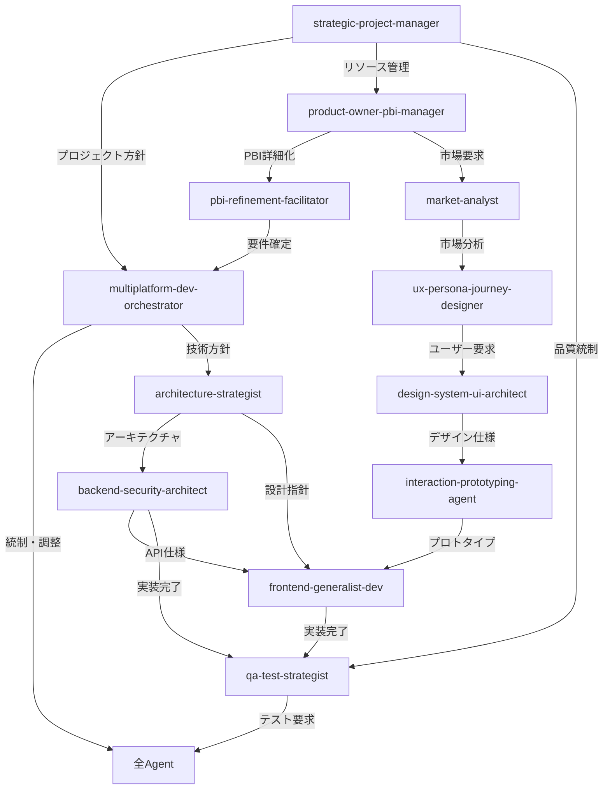

# Agent Coordination Matrix

## 概要
Kotlin Multiplatformプロジェクトにおける11の専門agentと新設の`multiplatform-dev-orchestrator`の連携関係を定義します。各開発フェーズにおける最適なagent組み合わせとハンドオフプロトコルを標準化します。

## Agent連携マップ

### 核となる連携関係



## フェーズ別Agent連携パターン

### Phase 1: プロジェクト計画・要件定義

#### 1.1 プロジェクト初期化
```yaml
trigger: "新PBI受領"
sequence:
  1:
    primary: strategic-project-manager
    task: "プロジェクト全体計画策定"
    deliverable: "プロジェクト計画書、リソース配分計画"
    
  2:
    primary: multiplatform-dev-orchestrator  
    task: "技術的実現性評価、タスク分解戦略策定"
    input_from: strategic-project-manager
    deliverable: "実装戦略書、agent割り当て計画"
```

#### 1.2 要件詳細化
```yaml
trigger: "プロジェクト計画承認"
parallel_execution:
  business_analysis:
    primary: product-owner-pbi-manager
    support: market-analyst
    task: "ステークホルダーヒアリング、ビジネス要件詳細化"
    deliverable: "詳細要件仕様書"
    
  technical_feasibility:
    primary: architecture-strategist
    support: backend-security-architect
    task: "技術アーキテクチャ評価、プラットフォーム制約分析"
    deliverable: "技術実現性レポート"

integration:
  agent: pbi-refinement-facilitator
  task: "要件統合、PBI詳細化、Definition of Ready確認"
  inputs: ["詳細要件仕様書", "技術実現性レポート"]
  deliverable: "統合PBI仕様書"
```

### Phase 2: UX・デザイン設計

#### 2.1 ユーザー中心設計
```yaml
trigger: "PBI仕様確定"
sequence:
  1:
    primary: ux-persona-journey-designer
    input_from: [market-analyst, product-owner-pbi-manager]
    task: "ユーザーペルソナ・ジャーニーマップ作成"
    deliverable: "UXリサーチレポート、ペルソナ定義"
    
  2:
    primary: design-system-ui-architect
    input_from: ux-persona-journey-designer
    support: architecture-strategist
    task: "UIデザインシステム設計、画面設計"
    deliverable: "デザインシステム仕様、画面設計書"
    
  3:
    primary: interaction-prototyping-agent
    input_from: design-system-ui-architect
    task: "インタラクション設計、プロトタイプ作成"
    deliverable: "インタラクティブプロトタイプ"

validation:
  agents: [ux-persona-journey-designer, product-owner-pbi-manager]
  task: "UXプロトタイプ検証、ステークホルダー承認"
  gate_criteria: ["ユーザビリティ要件充足", "ビジネス要件適合"]
```

### Phase 3: アーキテクチャ・技術設計

#### 3.1 システムアーキテクチャ
```yaml
trigger: "UX・デザイン承認"
sequence:
  1:
    primary: architecture-strategist
    input_from: [pbi-refinement-facilitator, design-system-ui-architect]
    support: multiplatform-dev-orchestrator
    task: "システムアーキテクチャ詳細設計"
    deliverable: "アーキテクチャ設計書、プラットフォーム統合戦略"
    
  2:
    primary: backend-security-architect
    input_from: architecture-strategist
    task: "API設計、セキュリティアーキテクチャ、データベース設計"
    deliverable: "API仕様書、セキュリティ設計書、DB設計書"

  3:
    primary: qa-test-strategist
    input_from: [architecture-strategist, backend-security-architect]
    task: "テストアーキテクチャ設計、品質要件定義"
    deliverable: "テスト戦略書、品質要件仕様"

integration_check:
  agent: multiplatform-dev-orchestrator
  task: "アーキテクチャ統合性確認、実装準備度評価"
  gate_criteria: ["技術的一貫性", "プラットフォーム間互換性", "実装可能性"]
```

### Phase 4: 実装

#### 4.1 基盤実装
```yaml
trigger: "アーキテクチャ設計承認"
parallel_execution:
  backend_foundation:
    primary: backend-security-architect
    task: "Server実装、API開発、セキュリティ実装"
    deliverable: "APIサービス、認証・認可システム"
    
  shared_logic:
    primary: architecture-strategist
    support: backend-security-architect
    task: "shared/commonMain実装、expect/actual定義"
    deliverable: "共通ビジネスロジック、プラットフォーム抽象化"
    
  design_system_impl:
    primary: frontend-generalist-dev
    input_from: design-system-ui-architect
    task: "デザインシステム基盤実装"
    deliverable: "共通UIコンポーネント、テーマシステム"

coordination:
  agent: multiplatform-dev-orchestrator
  frequency: "daily"
  task: "実装進捗統制、依存関係管理、統合性確認"
```

#### 4.2 プラットフォーム実装
```yaml
trigger: "基盤実装完了"
parallel_execution:
  android_implementation:
    primary: frontend-generalist-dev
    input_from: [design-system-ui-architect, backend-security-architect]
    task: "Android固有実装、UI実装、プラットフォーム統合"
    deliverable: "Android App実装"
    
  ios_implementation:
    primary: frontend-generalist-dev
    input_from: [design-system-ui-architect, backend-security-architect]
    task: "iOS固有実装、UI実装、プラットフォーム統合"
    deliverable: "iOS App実装"
    
  web_implementation:
    primary: frontend-generalist-dev
    input_from: [design-system-ui-architect, backend-security-architect]
    task: "Web実装、ブラウザ最適化"
    deliverable: "Web App実装"
    
  desktop_implementation:
    primary: frontend-generalist-dev
    input_from: [design-system-ui-architect, backend-security-architect]
    task: "Desktop実装、OS統合"
    deliverable: "Desktop App実装"

quality_control:
  agent: qa-test-strategist
  task: "各プラットフォーム品質確認、テスト実行"
  frequency: "per platform completion"
```

### Phase 5: 統合・品質保証

#### 5.1 統合テスト
```yaml
trigger: "全プラットフォーム実装完了"
sequence:
  1:
    primary: qa-test-strategist
    support: [frontend-generalist-dev, backend-security-architect]
    task: "統合テスト実行、エンドツーエンドテスト"
    deliverable: "統合テストレポート"
    
  2:
    primary: multiplatform-dev-orchestrator
    input_from: qa-test-strategist
    task: "クロスプラットフォーム一貫性確認"
    deliverable: "統合性評価レポート"
    
  3:
    primary: strategic-project-manager
    input_from: [qa-test-strategist, multiplatform-dev-orchestrator]
    task: "リリース判定、ステークホルダー承認"
    deliverable: "リリース承認書"
```

## ハンドオフプロトコル

### 標準ハンドオフテンプレート

#### Context Package構造
```yaml
handoff_context:
  # 基本情報
  metadata:
    handoff_id: "HO-{YYYYMMDD}-{sequential_number}"
    timestamp: "ISO8601 timestamp"
    from_agent: "source agent name"
    to_agent: "target agent name"
    orchestrator: "multiplatform-dev-orchestrator"
    
  # タスク情報
  task:
    pbi_id: "関連PBI識別子"
    phase: "current development phase"
    priority: "High|Medium|Low"
    estimated_effort: "story points or time estimate"
    deadline: "target completion date"
    
  # 成果物・入力データ
  deliverables:
    - type: "document|code|design|test"
      name: "deliverable name"
      location: "file path or URL"
      version: "version identifier"
      description: "brief description"
      
  # 制約・要件
  constraints:
    platform_requirements:
      - android: "specific requirements"
      - ios: "specific requirements"
      - web: "specific requirements"
      - desktop: "specific requirements"
      - server: "specific requirements"
    technical_constraints:
      - "performance requirements"
      - "security requirements"
      - "compatibility requirements"
    business_constraints:
      - "budget limitations"
      - "time constraints"
      - "regulatory requirements"
      
  # 成功基準
  success_criteria:
    functional:
      - "functional requirement 1"
      - "functional requirement 2"
    non_functional:
      - "performance targets"
      - "quality metrics"
    acceptance:
      - "acceptance criteria 1"
      - "acceptance criteria 2"
      
  # 依存関係
  dependencies:
    blocked_by:
      - agent: "dependency agent"
        task: "blocking task"
        expected_completion: "date"
    blocks:
      - agent: "dependent agent"
        task: "dependent task"
        handoff_trigger: "completion criteria"
        
  # 次ステップ
  next_steps:
    immediate:
      - "immediate action 1"
      - "immediate action 2"
    planned:
      - agent: "next agent"
        trigger: "completion of current task"
        expected_start: "date"
        
  # リスク・課題
  risks:
    technical:
      - risk: "technical risk description"
        impact: "High|Medium|Low"
        mitigation: "mitigation strategy"
    schedule:
      - risk: "schedule risk description"
        impact: "High|Medium|Low"
        mitigation: "mitigation strategy"
```

### ハンドオフ品質チェック

#### 送信側Agent責任
```yaml
pre_handoff_checklist:
  deliverables:
    - "全成果物が完成している"
    - "品質基準を満たしている"
    - "ドキュメントが最新化されている"
  
  documentation:
    - "作業内容が明確に記録されている"
    - "設計決定の理由が文書化されている"
    - "制約・前提条件が明記されている"
    
  validation:
    - "定義された成功基準を満たしている"
    - "次のagentが作業開始可能な状態"
    - "依存関係が解決されている"
```

#### 受信側Agent責任
```yaml
post_handoff_checklist:
  understanding:
    - "要求内容を正確に理解している"
    - "制約・前提条件を把握している"
    - "成功基準を認識している"
    
  readiness:
    - "必要なリソースが確保されている"
    - "技術的準備が完了している"
    - "依存関係が満たされている"
    
  confirmation:
    - "作業開始可能であることを確認"
    - "スケジュールに合意している"
    - "不明点・課題をクリアにしている"
```

## 特殊な連携パターン

### 1. 緊急対応パターン
```yaml
trigger: "重大な問題・ブロッカー発生"
escalation_sequence:
  1:
    agent: multiplatform-dev-orchestrator
    task: "問題分析、影響度評価"
    timeout: "30分以内"
    
  2:
    condition: "単一agent対応可能"
    agent: "appropriate specialist agent"
    support: qa-test-strategist
    
  3:
    condition: "複数agent連携必要"
    coordinator: multiplatform-dev-orchestrator
    participants: "problem-relevant agents"
    
  4:
    condition: "プロジェクト影響重大"
    escalate_to: strategic-project-manager
    include: [multiplatform-dev-orchestrator, "affected agents"]
```

### 2. 品質ゲート失敗時の対応
```yaml
trigger: "品質ゲート不合格"
response_sequence:
  1:
    agent: qa-test-strategist
    task: "不合格要因詳細分析"
    deliverable: "問題分析レポート"
    
  2:
    agent: multiplatform-dev-orchestrator
    input_from: qa-test-strategist
    task: "修正戦略策定、agent再割り当て"
    deliverable: "修正計画書"
    
  3:
    execution: "修正計画に基づく実装修正"
    coordination: multiplatform-dev-orchestrator
    
  4:
    agent: qa-test-strategist
    task: "修正確認、品質ゲート再実行"
```

### 3. 学習・改善パターン
```yaml
trigger: "タスク完了、フェーズ完了"
retrospective_sequence:
  1:
    participants: "participating agents"
    facilitator: multiplatform-dev-orchestrator
    task: "振り返り実施、学習ポイント抽出"
    
  2:
    agent: multiplatform-dev-orchestrator
    task: "プロセス改善提案、ベストプラクティス更新"
    deliverable: "改善提案書"
    
  3:
    approver: strategic-project-manager
    task: "改善策承認、プロセス更新"
    deliverable: "更新されたプロセス定義"
```

## 運用指標・監視

### Agent連携効率指標
```yaml
metrics:
  handoff_efficiency:
    - "ハンドオフ完了時間 (target: <24時間)"
    - "ハンドオフ品質スコア (target: >90%)"
    - "手戻り発生率 (target: <10%)"
    
  coordination_effectiveness:
    - "agent稼働率バランス (target: 70-90%)"
    - "依存関係解決時間 (target: <48時間)"
    - "並行作業効率 (target: >80%)"
    
  quality_consistency:
    - "品質ゲート通過率 (target: >95%)"
    - "クロスプラットフォーム一貫性 (target: 100%)"
    - "要件適合度 (target: >95%)"
```

### 監視・アラート
```yaml
monitoring:
  realtime_alerts:
    - "ハンドオフ遅延 (>48時間)"
    - "品質ゲート連続失敗 (2回以上)"
    - "重大な依存関係ブロック"
    
  daily_reports:
    - "agent稼働状況サマリー"
    - "ハンドオフ進捗レポート"
    - "品質指標ダッシュボード"
    
  weekly_analysis:
    - "連携効率性分析"
    - "ボトルネック特定・改善提案"
    - "学習・改善項目レビュー"
```

---

## まとめ

この Agent Coordination Matrix により、Kotlin Multiplatformプロジェクトにおける11の専門agentと統括orchestratorの効果的な連携を実現します。

標準化されたハンドオフプロトコルと品質管理により、高品質・高効率な開発プロセスを維持し、継続的な改善を通じてチーム全体の能力向上を図ります。