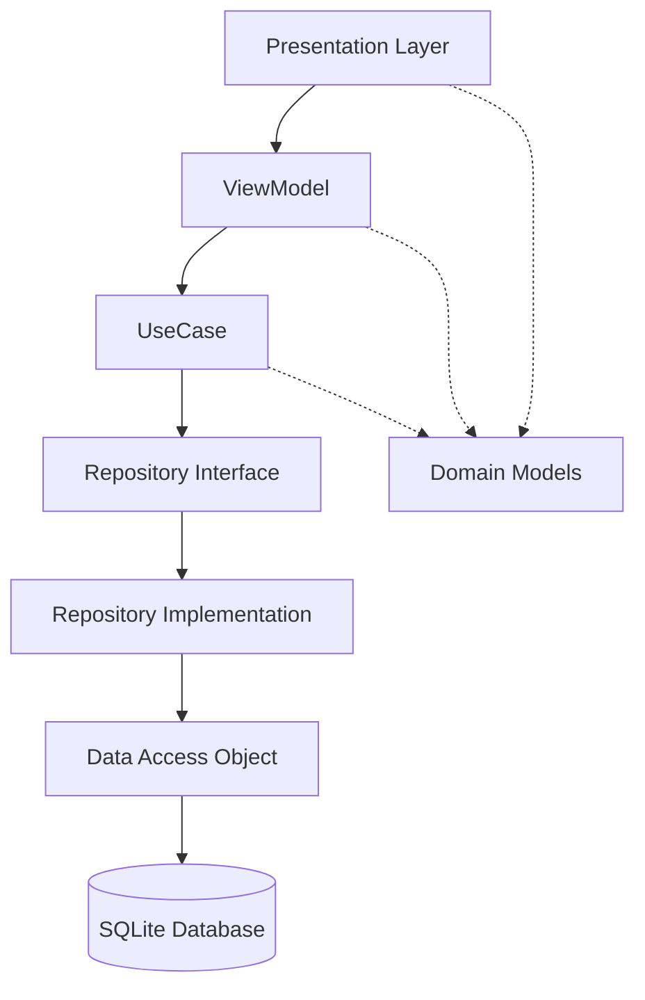

# Design Document: PBI-001 ローカル完結TODOアプリ（Android）

## 基本情報

- **PBI ID**: PBI-001
- **タイトル**: ローカル完結TODOアプリ（Android）
- **作成日**: 2025-01-12
- **設計責任者**: architecture-strategist + design-system-ui-architect
- **関連PBI**: なし

## 1. 使用技術の具体的選択と根拠

### 1.1 アーキテクチャフレームワーク

**選択技術**: Kotlin Multiplatform + Compose Multiplatform + SQLDelight + MVVM

**技術選択根拠**:

#### Kotlin Multiplatform
- **根拠**: プロジェクトの既存構成に合致し、将来的なマルチプラットフォーム展開に対応
- **利点**: ビジネスロジックの共通化、プラットフォーム間の一貫性確保
- **制約**: expect/actual宣言が必要な部分のみプラットフォーム固有実装

#### Compose Multiplatform  
- **根拠**: プロジェクトで既に設定済み、Material Design 3との統合が容易
- **利点**: 宣言的UI、Hot Reload対応、プラットフォーム間UI一貫性
- **制約**: compose.material3を使用してMaterial Design準拠

#### SQLDelight
- **根拠**: プロジェクトで既に生成コードが存在、Kotlin Multiplatform標準データベースソリューション
- **利点**: 型安全なSQL、マルチプラットフォーム対応、コンパイル時検証
- **制約**: PBIで指定されたRoomに代えてSQLDelightを使用（技術一貫性を優先）

#### MVVM + StateFlow
- **根拠**: Compose Multiplatformとの親和性、Lifecycle-aware設計
- **利点**: リアクティブな状態管理、テスト容易性
- **制約**: androidx.lifecycle.viewmodel-composeを使用

### 1.2 依存関係追加

```kotlin
// shared/build.gradle.kts への追加依存関係
sqldelight = "2.0.2"
kotlinx-datetime = "0.6.1"

implementation("app.cash.sqldelight:sqlite-driver:$sqldelight")
implementation("app.cash.sqldelight:coroutines-extensions:$sqldelight")
implementation("org.jetbrains.kotlinx:kotlinx-datetime:$kotlinx-datetime")

// Android固有
implementation("app.cash.sqldelight:android-driver:$sqldelight")
```

### 1.3 プラットフォーム要件

**Android**:
- minSdk: 24 (Android 7.0)
- targetSdk: 35 (Android 15)
- compileSdk: 35
- Java Version: 11

## 2. 受け入れ条件の技術的詳述

### 2.1 機能要件の技術実装

#### AC-001: タスク作成
```kotlin
// 技術実装要件
suspend fun createTodo(title: String, description: String): Result<TodoItem> {
    // バリデーション: titleが空でないこと
    require(title.isNotBlank()) { "タスクタイトルは必須です" }
    
    // 作成日時の自動生成（kotlinx-datetime使用）
    val createdAt = Clock.System.now().epochSeconds
    
    // データベース保存
    // UI更新通知（Flow経由）
}
```

#### AC-002: タスク表示
```kotlin
// 技術実装要件
@Composable
fun TodoListScreen() {
    // StateFlowによるリアクティブなデータバインディング
    val todoState by viewModel.todoState.collectAsState()
    
    // LazyColumnでリスト表示（パフォーマンス要件対応）
    LazyColumn {
        items(todoState.todos) { todo ->
            TodoListItem(
                todo = todo,
                onCompleteToggle = viewModel::toggleComplete,
                onDelete = viewModel::deleteTodo
            )
        }
    }
    
    // 空状態の表示
    if (todoState.todos.isEmpty()) {
        EmptyStateComponent()
    }
}
```

#### AC-003: タスク編集
```kotlin
// Navigation実装
navController.navigate("edit_todo/${todoId}")

// 編集画面の実装要件
@Composable
fun TodoEditScreen(todoId: Long) {
    var title by remember { mutableStateOf("") }
    var description by remember { mutableStateOf("") }
    
    // バックナビゲーション対応
    BackHandler {
        // 変更確認ダイアログ表示
        viewModel.confirmCancelEdit()
    }
}
```

#### AC-004: タスク削除
```kotlin
// スワイプ削除の技術実装
@OptIn(ExperimentalMaterial3Api::class)
@Composable
fun SwipeToDeleteItem(
    onDelete: () -> Unit,
    content: @Composable () -> Unit
) {
    val dismissState = rememberSwipeToDismissBoxState(
        confirmValueChange = { dismissValue ->
            if (dismissValue == SwipeToDismissBoxValue.EndToStart) {
                onDelete()
                true
            } else false
        }
    )
}
```

#### AC-005: 完了状態管理
```kotlin
// データモデル更新
suspend fun toggleTodoComplete(todoId: Long): Result<TodoItem> {
    return try {
        val todo = getTodoById(todoId)
        val updatedTodo = todo.copy(
            isCompleted = !todo.isCompleted,
            completedAt = if (!todo.isCompleted) 
                Clock.System.now().epochSeconds 
            else null
        )
        updateTodo(updatedTodo)
        Result.success(updatedTodo)
    } catch (e: Exception) {
        Result.failure(e)
    }
}
```

### 2.2 非機能要件の技術実装

#### AC-006: パフォーマンス要件

**アプリ起動時間 < 3秒**:
```kotlin
// Application クラス最適化
class TodoApplication : Application() {
    override fun onCreate() {
        super.onCreate()
        // 重い初期化処理は遅延実行
        GlobalScope.launch(Dispatchers.IO) {
            initializeDatabase()
        }
    }
}
```

**タスク操作の応答時間 < 500ms**:
```kotlin
// データベース操作の最適化
@Query("SELECT * FROM todo_items ORDER BY created_at DESC")
fun getAllTodosFlow(): Flow<List<TodoEntity>>

// UIの最適化
@Composable
fun TodoListItem(todo: TodoItem) {
    // remember による再計算防止
    val formattedDate = remember(todo.createdAt) {
        formatDate(todo.createdAt)
    }
}
```

**1000件のタスクでもスムーズに動作**:
```kotlin
// LazyColumn + ページネーション実装
@Composable
fun TodoList(todos: List<TodoItem>) {
    LazyColumn {
        items(
            count = todos.size,
            key = { index -> todos[index].id }
        ) { index ->
            val todo = todos[index]
            TodoListItem(todo = todo)
        }
    }
}
```

#### AC-007: データ永続化
```sql
-- SQLDelight スキーマ定義
CREATE TABLE todo_items (
    id INTEGER PRIMARY KEY AUTOINCREMENT,
    title TEXT NOT NULL,
    description TEXT NOT NULL DEFAULT '',
    is_completed INTEGER NOT NULL DEFAULT 0,
    created_at INTEGER NOT NULL,
    completed_at INTEGER
);

CREATE INDEX idx_todo_created_at ON todo_items(created_at);
CREATE INDEX idx_todo_completed ON todo_items(is_completed);
```

#### AC-008: UI/UX要件

**Material Design 3準拠**:
```kotlin
@Composable
fun TodoTheme(content: @Composable () -> Unit) {
    MaterialTheme(
        colorScheme = if (isSystemInDarkTheme()) {
            dynamicDarkColorScheme(LocalContext.current)
        } else {
            dynamicLightColorScheme(LocalContext.current)
        },
        typography = Typography(),
        content = content
    )
}
```

**アクセシビリティ対応**:
```kotlin
@Composable
fun TodoListItem(todo: TodoItem) {
    Card(
        modifier = Modifier
            .semantics {
                contentDescription = if (todo.isCompleted) {
                    "完了済みタスク: ${todo.title}"
                } else {
                    "未完了タスク: ${todo.title}"
                }
                role = Role.Button
            }
    )
}
```

## 3. アーキテクチャ概要と依存関係

### 3.1 Layered Architecture構成

```
composeApp/androidMain/          # Presentation Layer (Android)
├── ui/
│   ├── screen/
│   │   ├── TodoListScreen.kt    # 一覧画面
│   │   ├── TodoEditScreen.kt    # 編集画面
│   │   └── TodoCreateScreen.kt  # 作成画面
│   ├── component/
│   │   ├── TodoListItem.kt      # リストアイテムUI
│   │   ├── TodoForm.kt          # 入力フォーム
│   │   └── EmptyStateComponent.kt # 空状態表示
│   ├── viewmodel/
│   │   ├── TodoListViewModel.kt # 一覧画面ViewModel
│   │   └── TodoEditViewModel.kt # 編集画面ViewModel
│   └── navigation/
│       └── TodoNavigation.kt    # ナビゲーション定義

shared/commonMain/               # Business Logic Layer
├── domain/
│   ├── model/
│   │   └── TodoItem.kt         # ドメインモデル
│   ├── repository/
│   │   └── TodoRepository.kt   # Repository インターフェース
│   └── usecase/
│       ├── GetTodosUseCase.kt  # 取得処理
│       ├── CreateTodoUseCase.kt # 作成処理
│       ├── UpdateTodoUseCase.kt # 更新処理
│       └── DeleteTodoUseCase.kt # 削除処理
├── data/
│   ├── database/
│   │   ├── TodoDatabase.kt     # データベース定義
│   │   ├── TodoDao.kt          # データアクセス
│   │   └── TodoEntity.kt       # データエンティティ
│   ├── repository/
│   │   └── TodoRepositoryImpl.kt # Repository実装
│   └── mapper/
│       └── TodoMapper.kt       # Entity ⟷ Domain変換

shared/androidMain/              # Platform Layer (Android)
├── database/
│   └── DatabaseDriverFactory.kt # Android SQLite Driver
└── di/
    └── AndroidModule.kt         # 依存性注入設定
```

### 3.2 依存関係設計



**依存関係ルール**:
- Presentation Layer → Domain Layer (ViewModel → UseCase)
- Domain Layer → Data Layer (UseCase → Repository)
- 上位レイヤーは下位レイヤーに依存、逆は禁止
- Interfaceを通じた依存性注入で疎結合を実現

### 3.3 データフロー設計

```kotlin
// リアクティブデータフロー
Database 
  ↓ (SQLDelight Flow)
TodoRepositoryImpl 
  ↓ (Flow<List<TodoItem>>)
GetTodosUseCase 
  ↓ (StateFlow<TodoListState>)
TodoListViewModel 
  ↓ (collectAsState())
TodoListScreen
```

## 4. プラットフォーム対応方針

### 4.1 Kotlin Multiplatform分割戦略

#### 共通部分 (shared/commonMain)
```kotlin
// ビジネスロジック - 全プラットフォーム共通
interface TodoRepository {
    fun getAllTodos(): Flow<List<TodoItem>>
    suspend fun createTodo(todo: TodoItem): Result<TodoItem>
    suspend fun updateTodo(todo: TodoItem): Result<TodoItem>
    suspend fun deleteTodo(id: Long): Result<Unit>
}

// ドメインモデル - 全プラットフォーム共通
data class TodoItem(
    val id: Long = 0,
    val title: String,
    val description: String = "",
    val isCompleted: Boolean = false,
    val createdAt: Long,
    val completedAt: Long? = null
)
```

#### プラットフォーム固有部分 (shared/androidMain)
```kotlin
// Android固有のDatabase Driver
actual class DatabaseDriverFactory {
    actual fun createDriver(): SqlDriver {
        return AndroidSqliteDriver(
            schema = TodoDatabase.Schema,
            context = context,
            name = "todo.db"
        )
    }
}
```

#### UI層 (composeApp/androidMain)
```kotlin
// Android固有のUI実装
@Composable
fun AndroidTodoListScreen() {
    // Android固有のシステムUI連携
    val systemUiController = rememberSystemUiController()
    LaunchedEffect(Unit) {
        systemUiController.setStatusBarColor(Color.Transparent)
    }
    
    // 共通UIロジック呼び出し
    TodoListScreen()
}
```

### 4.2 expect/actual実装戦略

```kotlin
// shared/commonMain - expect宣言
expect class DatabaseDriverFactory {
    fun createDriver(): SqlDriver
}

expect object DateTimeFormatter {
    fun format(epochSeconds: Long): String
}

// shared/androidMain - actual実装
actual class DatabaseDriverFactory(private val context: Context) {
    actual fun createDriver(): SqlDriver {
        return AndroidSqliteDriver(TodoDatabase.Schema, context, "todo.db")
    }
}

actual object DateTimeFormatter {
    actual fun format(epochSeconds: Long): String {
        val instant = Instant.fromEpochSeconds(epochSeconds)
        return instant.toLocalDateTime(TimeZone.currentSystemDefault())
            .format(LocalDateTime.Formats.ISO)
    }
}
```

## 5. データベース設計

### 5.1 SQLDelightスキーマ定義

```sql
-- shared/src/commonMain/sqldelight/com/example/playground/shared/database/todo.sq

CREATE TABLE todo_items (
    id INTEGER PRIMARY KEY AUTOINCREMENT,
    title TEXT NOT NULL CHECK(length(title) > 0),
    description TEXT NOT NULL DEFAULT '',
    is_completed INTEGER NOT NULL DEFAULT 0 CHECK(is_completed IN (0, 1)),
    created_at INTEGER NOT NULL,
    completed_at INTEGER,
    CONSTRAINT check_completed_at CHECK(
        (is_completed = 0 AND completed_at IS NULL) OR
        (is_completed = 1 AND completed_at IS NOT NULL)
    )
);

CREATE INDEX idx_todo_created_at ON todo_items(created_at DESC);
CREATE INDEX idx_todo_is_completed ON todo_items(is_completed);
CREATE INDEX idx_todo_title ON todo_items(title);

-- Basic CRUD operations
insertTodo:
INSERT INTO todo_items(title, description, created_at)
VALUES (?, ?, ?);

updateTodo:
UPDATE todo_items SET
    title = ?,
    description = ?,
    is_completed = ?,
    completed_at = ?
WHERE id = ?;

deleteTodo:
DELETE FROM todo_items WHERE id = ?;

selectAllTodos:
SELECT * FROM todo_items ORDER BY created_at DESC;

selectTodoById:
SELECT * FROM todo_items WHERE id = ?;

selectTodosByCompletion:
SELECT * FROM todo_items 
WHERE is_completed = ? 
ORDER BY created_at DESC;

-- Performance queries
selectTodosCount:
SELECT COUNT(*) FROM todo_items;

selectCompletedTodosCount:
SELECT COUNT(*) FROM todo_items WHERE is_completed = 1;
```

### 5.2 データマッピング戦略

```kotlin
// Entity → Domain Model変換
fun TodoEntity.toDomainModel(): TodoItem = TodoItem(
    id = id,
    title = title,
    description = description,
    isCompleted = is_completed == 1L,
    createdAt = created_at,
    completedAt = completed_at
)

// Domain Model → Entity変換
fun TodoItem.toEntity(): TodoEntity = TodoEntity(
    id = id,
    title = title,
    description = description,
    is_completed = if (isCompleted) 1L else 0L,
    created_at = createdAt,
    completed_at = completedAt
)
```

### 5.3 データベースマイグレーション戦略

```kotlin
object TodoDatabaseMigrations {
    val MIGRATION_1_2 = Migration(1, 2) { database ->
        database.execute("ALTER TABLE todo_items ADD COLUMN priority INTEGER DEFAULT 1")
    }
    
    val MIGRATION_2_3 = Migration(2, 3) { database ->
        database.execute("CREATE INDEX idx_todo_priority ON todo_items(priority)")
    }
}
```

## 6. API設計（内部アーキテクチャ）

### 6.1 Repository Interface

```kotlin
interface TodoRepository {
    /**
     * すべてのTODOアイテムを取得（リアルタイム更新）
     * @return Flow<List<TodoItem>> - TODOアイテムのリアクティブストリーム
     */
    fun getAllTodos(): Flow<List<TodoItem>>
    
    /**
     * 完了状態でフィルタリングしたTODOアイテムを取得
     * @param isCompleted true: 完了済み, false: 未完了
     * @return Flow<List<TodoItem>>
     */
    fun getTodosByCompletion(isCompleted: Boolean): Flow<List<TodoItem>>
    
    /**
     * 特定のTODOアイテムを取得
     * @param id TODOアイテムID
     * @return Result<TodoItem>
     */
    suspend fun getTodoById(id: Long): Result<TodoItem>
    
    /**
     * TODOアイテムを作成
     * @param todo 作成するTODOアイテム（IDは自動生成）
     * @return Result<TodoItem> - 作成されたTODOアイテム（ID含む）
     */
    suspend fun createTodo(todo: TodoItem): Result<TodoItem>
    
    /**
     * TODOアイテムを更新
     * @param todo 更新するTODOアイテム
     * @return Result<TodoItem>
     */
    suspend fun updateTodo(todo: TodoItem): Result<TodoItem>
    
    /**
     * TODOアイテムを削除
     * @param id 削除するTODOアイテムのID
     * @return Result<Unit>
     */
    suspend fun deleteTodo(id: Long): Result<Unit>
    
    /**
     * TODOアイテムの完了状態を切り替え
     * @param id TODOアイテムID
     * @return Result<TodoItem> - 更新されたTODOアイテム
     */
    suspend fun toggleTodoCompletion(id: Long): Result<TodoItem>
}
```

### 6.2 UseCase定義

```kotlin
// 取得系UseCase
class GetTodosUseCase(
    private val repository: TodoRepository
) {
    operator fun invoke(): Flow<List<TodoItem>> = repository.getAllTodos()
}

class GetTodosByCompletionUseCase(
    private val repository: TodoRepository
) {
    operator fun invoke(isCompleted: Boolean): Flow<List<TodoItem>> =
        repository.getTodosByCompletion(isCompleted)
}

// 作成・更新系UseCase
class CreateTodoUseCase(
    private val repository: TodoRepository
) {
    suspend operator fun invoke(title: String, description: String): Result<TodoItem> {
        return if (title.isBlank()) {
            Result.failure(IllegalArgumentException("タイトルは必須です"))
        } else {
            val todo = TodoItem(
                title = title.trim(),
                description = description.trim(),
                createdAt = Clock.System.now().epochSeconds
            )
            repository.createTodo(todo)
        }
    }
}

class UpdateTodoUseCase(
    private val repository: TodoRepository
) {
    suspend operator fun invoke(todo: TodoItem): Result<TodoItem> {
        return if (todo.title.isBlank()) {
            Result.failure(IllegalArgumentException("タイトルは必須です"))
        } else {
            repository.updateTodo(todo)
        }
    }
}

// 削除・状態変更系UseCase
class DeleteTodoUseCase(
    private val repository: TodoRepository
) {
    suspend operator fun invoke(id: Long): Result<Unit> = repository.deleteTodo(id)
}

class ToggleTodoCompletionUseCase(
    private val repository: TodoRepository
) {
    suspend operator fun invoke(id: Long): Result<TodoItem> =
        repository.toggleTodoCompletion(id)
}
```

### 6.3 ViewModel State Management

```kotlin
// UI State定義
data class TodoListUiState(
    val todos: List<TodoItem> = emptyList(),
    val isLoading: Boolean = false,
    val errorMessage: String? = null,
    val showCompletedOnly: Boolean = false
)

data class TodoEditUiState(
    val todo: TodoItem? = null,
    val title: String = "",
    val description: String = "",
    val isLoading: Boolean = false,
    val errorMessage: String? = null,
    val hasUnsavedChanges: Boolean = false
)

// ViewModel実装
class TodoListViewModel(
    private val getTodosUseCase: GetTodosUseCase,
    private val deleteTodoUseCase: DeleteTodoUseCase,
    private val toggleTodoCompletionUseCase: ToggleTodoCompletionUseCase
) : ViewModel() {
    
    private val _uiState = MutableStateFlow(TodoListUiState())
    val uiState: StateFlow<TodoListUiState> = _uiState.asStateFlow()
    
    init {
        loadTodos()
    }
    
    private fun loadTodos() {
        viewModelScope.launch {
            _uiState.update { it.copy(isLoading = true) }
            getTodosUseCase()
                .catch { error ->
                    _uiState.update { 
                        it.copy(
                            isLoading = false, 
                            errorMessage = error.message 
                        )
                    }
                }
                .collect { todos ->
                    _uiState.update { 
                        it.copy(
                            todos = todos, 
                            isLoading = false, 
                            errorMessage = null
                        )
                    }
                }
        }
    }
    
    fun deleteTodo(id: Long) {
        viewModelScope.launch {
            deleteTodoUseCase(id)
                .onFailure { error ->
                    _uiState.update { it.copy(errorMessage = error.message) }
                }
        }
    }
    
    fun toggleTodoCompletion(id: Long) {
        viewModelScope.launch {
            toggleTodoCompletionUseCase(id)
                .onFailure { error ->
                    _uiState.update { it.copy(errorMessage = error.message) }
                }
        }
    }
}
```

## 7. エラーハンドリング戦略

### 7.1 Result型による統一的エラーハンドリング

```kotlin
// カスタムResult実装 (Kotlin標準のResultを拡張)
sealed class TodoError : Exception() {
    object NetworkError : TodoError()
    object DatabaseError : TodoError()
    data class ValidationError(override val message: String) : TodoError()
    data class NotFoundError(val id: Long) : TodoError()
}

// Repository層でのエラーハンドリング
class TodoRepositoryImpl(
    private val todoDao: TodoDao
) : TodoRepository {
    
    override suspend fun createTodo(todo: TodoItem): Result<TodoItem> = runCatching {
        if (todo.title.isBlank()) {
            throw TodoError.ValidationError("タイトルは必須です")
        }
        
        val id = todoDao.insertTodo(
            title = todo.title,
            description = todo.description,
            created_at = todo.createdAt
        )
        
        todo.copy(id = id)
    }.mapError { exception ->
        when (exception) {
            is SQLiteException -> TodoError.DatabaseError
            is TodoError -> exception
            else -> TodoError.DatabaseError
        }
    }
}

// Extension function for error mapping
inline fun <T> Result<T>.mapError(transform: (Throwable) -> Throwable): Result<T> = when {
    isSuccess -> this
    else -> Result.failure(transform(exceptionOrNull()!!))
}
```

### 7.2 ViewModel層でのエラー処理

```kotlin
class TodoListViewModel(...) : ViewModel() {
    
    fun deleteTodo(id: Long) {
        viewModelScope.launch {
            _uiState.update { it.copy(isLoading = true) }
            
            deleteTodoUseCase(id)
                .onSuccess {
                    _uiState.update { it.copy(isLoading = false) }
                }
                .onFailure { error ->
                    val message = when (error) {
                        is TodoError.NotFoundError -> "タスクが見つかりません"
                        is TodoError.DatabaseError -> "データベースエラーが発生しました"
                        else -> "予期しないエラーが発生しました"
                    }
                    _uiState.update { 
                        it.copy(
                            isLoading = false, 
                            errorMessage = message
                        )
                    }
                }
        }
    }
}
```

### 7.3 UI層でのエラー表示

```kotlin
@Composable
fun TodoListScreen(viewModel: TodoListViewModel) {
    val state by viewModel.uiState.collectAsState()
    
    // エラー表示
    state.errorMessage?.let { error ->
        LaunchedEffect(error) {
            // Snackbar表示
            snackbarHostState.showSnackbar(
                message = error,
                duration = SnackbarDuration.Short
            )
            viewModel.clearError()
        }
    }
    
    // ローディング状態表示
    if (state.isLoading) {
        Box(
            modifier = Modifier.fillMaxSize(),
            contentAlignment = Alignment.Center
        ) {
            CircularProgressIndicator()
        }
    }
}
```

### 7.4 データベースエラーリカバリ

```kotlin
class TodoRepositoryImpl(
    private val todoDao: TodoDao
) : TodoRepository {
    
    override suspend fun createTodo(todo: TodoItem): Result<TodoItem> = runCatching {
        // トランザクション付きでデータベース操作
        todoDao.database.transactionWithResult {
            val id = todoDao.insertTodo(
                title = todo.title,
                description = todo.description,
                created_at = todo.createdAt
            )
            
            // 作成直後の検証
            val created = todoDao.selectTodoById(id)
                ?: throw TodoError.DatabaseError
                
            created.toDomainModel()
        }
    }.recoverCatching { error ->
        // データベース復旧処理
        when (error) {
            is SQLiteException -> {
                // データベース整合性チェック・修復
                recoverDatabase()
                throw TodoError.DatabaseError
            }
            else -> throw error
        }
    }
}
```

## 8. 実装スケジュール

### Step 1: Skeleton実装 (1日)

#### Phase 1.1: Design Doc作成 (2時間)
- [ ] 本Design Doc完成
- [ ] アーキテクチャ承認

#### Phase 1.2: Full Skeleton実装 (6時間)
```kotlin
// 実装する空実装クラス群
- TodoItem.kt (Domain Model)
- TodoRepository.kt (Interface)
- GetTodosUseCase.kt (TODO実装)
- CreateTodoUseCase.kt (TODO実装)
- UpdateTodoUseCase.kt (TODO実装)  
- DeleteTodoUseCase.kt (TODO実装)
- TodoRepositoryImpl.kt (TODO実装)
- TodoListViewModel.kt (TODO実装)
- TodoEditViewModel.kt (TODO実装)
- TodoListScreen.kt (TODO実装)
- TodoEditScreen.kt (TODO実装)
```

### Step 2: レイヤー別実装 (2-3日)

#### Phase 2.1: Data Layer実装 (1日)
- [ ] SQLDelightスキーマ定義
- [ ] TodoDao実装
- [ ] DatabaseDriverFactory実装  
- [ ] TodoRepositoryImpl実装
- [ ] 単体テスト実装

#### Phase 2.2: Domain Layer実装 (0.5日)
- [ ] UseCase群実装
- [ ] バリデーション実装
- [ ] 単体テスト実装

#### Phase 2.3: Presentation Layer実装 (1.5日)
- [ ] ViewModel実装
- [ ] UI Components実装
- [ ] Navigation実装
- [ ] 画面間連携テスト

#### Phase 2.4: 統合テスト実装 (0.5日)
- [ ] E2Eテスト実装
- [ ] 受け入れ条件検証
- [ ] パフォーマンステスト

## 9. テスト戦略

### 9.1 単体テスト

```kotlin
// UseCase テスト例
@Test
fun `createTodo - 有効なタイトルで作成成功`() = runTest {
    // Given
    val title = "テストタスク"
    val description = "テスト説明"
    val mockRepository = mockk<TodoRepository>()
    
    coEvery { mockRepository.createTodo(any()) } returns Result.success(
        TodoItem(id = 1, title = title, description = description, createdAt = 12345)
    )
    
    val useCase = CreateTodoUseCase(mockRepository)
    
    // When
    val result = useCase(title, description)
    
    // Then
    assertTrue(result.isSuccess)
    assertEquals(title, result.getOrNull()?.title)
}
```

### 9.2 統合テスト

```kotlin
// ViewModel 統合テスト例
@Test
fun `TodoListViewModel - タスク作成からリスト表示まで`() = runTest {
    // Given
    val viewModel = TodoListViewModel(getTodosUseCase, deleteTodoUseCase, toggleUseCase)
    
    // When - タスク作成
    viewModel.createTodo("新しいタスク", "説明")
    
    // Then - UIStateが更新される
    val state = viewModel.uiState.value
    assertEquals(1, state.todos.size)
    assertEquals("新しいタスク", state.todos[0].title)
}
```

### 9.3 UI テスト

```kotlin
// Compose UI テスト例
@Test
fun todoListScreen_displaysTasksCorrectly() {
    val testTodos = listOf(
        TodoItem(id = 1, title = "タスク1", createdAt = 12345),
        TodoItem(id = 2, title = "タスク2", createdAt = 12346, isCompleted = true)
    )
    
    composeTestRule.setContent {
        TodoListScreen(todos = testTodos)
    }
    
    composeTestRule.onNodeWithText("タスク1").assertIsDisplayed()
    composeTestRule.onNodeWithText("タスク2").assertIsDisplayed()
}
```

## 10. 品質ゲート

### Skeleton実装品質ゲート
- [ ] 全構造定義完了（TODO実装含む）
- [ ] コンパイルエラーなし
- [ ] アーキテクチャ図との整合性
- [ ] 変更行数 ≤ 600行
- [ ] コミット分割適切（5-10コミット）

### 統合実装品質ゲート  
- [ ] 全受け入れ条件満足
- [ ] テストカバレッジ ≥ 80%
- [ ] パフォーマンス要件クリア
- [ ] アクセシビリティ要件満足
- [ ] 静的解析チェックパス

---

**文書履歴**
- v1.0 (2025-01-12): 初版作成
- 次回レビュー予定: Step 1実装完了後