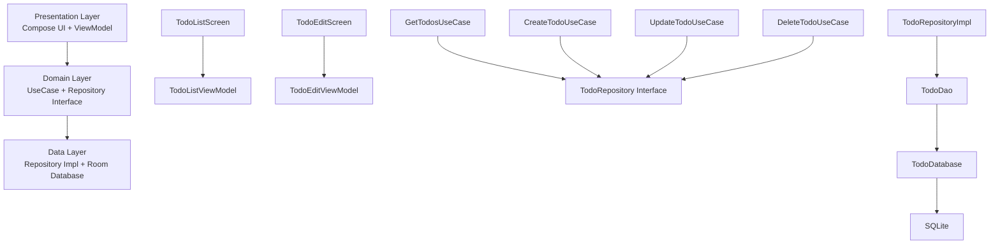
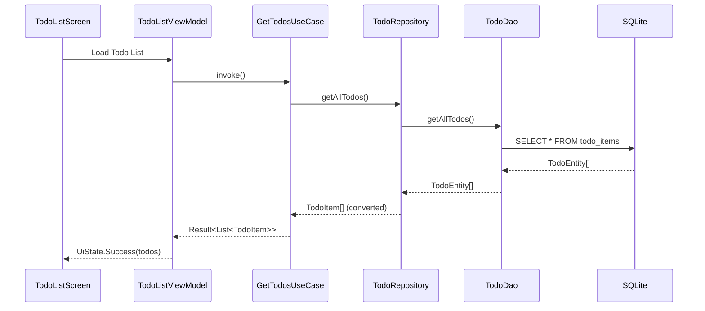

# Design Doc: PBI-001 ローカル完結TODOアプリ（Android）

## 基本情報
- **タスクID**: PBI-001
- **タスク名**: ローカル完結TODOアプリ（Android）
- **関連PBI**: PBI-001
- **作成日**: 2025-09-11
- **作成者**: architecture-strategist + design-system-ui-architect
- **ステータス**: draft
- **ストーリーポイント**: 8

## 設計概要

### 目的
Kotlin Multiplatformアーキテクチャを活用し、ローカルデータ永続化機能を持つAndroid TODOアプリケーションを実装する。Multi-Agent開発プロセスのStep 1-2標準フローの実証デモとして機能する。

### スコープ
**対象範囲**:
- Android プラットフォーム（API Level 24+）
- ローカルSQLiteデータベースによる永続化
- タスクCRUD操作（作成・表示・編集・削除・完了状態管理）
- Material Design 3準拠UI
- ダークモード・アクセシビリティ対応

**除外範囲**:
- ネットワーク通信・クラウド同期
- 他プラットフォーム（iOS、Web、Desktop）の実装
- ユーザー認証・マルチユーザー対応
- 高度なタスク分類・検索機能

### 前提条件
- Kotlin Multiplatformプロジェクト基盤が整備済み
- Compose Multiplatform環境が設定済み
- Android開発環境（API Level 24+）が利用可能

## システム設計

### アーキテクチャ概要


### モジュール構成
#### Kotlin Multiplatform構成
- **shared/commonMain**: ドメインモデル、Repository Interface、UseCase
- **shared/androidMain**: Room Database実装、Repository実装
- **composeApp/commonMain**: Compose UI共通部分
- **composeApp/androidMain**: Android固有UI実装・ViewModelレイヤー

#### Layered Architecture詳細
```
┌─────────────────────────────────────┐
│         Presentation Layer          │
│  (composeApp/androidMain & commonMain) │
│  ┌─────────────┐ ┌─────────────────┐ │
│  │ Compose UI  │ │ ViewModel       │ │
│  │ Components  │ │ + State Mgmt    │ │
│  └─────────────┘ └─────────────────┘ │
└─────────────────────────────────────┘
             │
             ▼
┌─────────────────────────────────────┐
│            Domain Layer             │
│        (shared/commonMain)          │
│  ┌─────────────┐ ┌─────────────────┐ │
│  │ UseCase     │ │ Repository      │ │
│  │ Business    │ │ Interface       │ │
│  │ Logic       │ │ + Domain Model  │ │
│  └─────────────┘ └─────────────────┘ │
└─────────────────────────────────────┘
             │
             ▼
┌─────────────────────────────────────┐
│             Data Layer              │
│        (shared/androidMain)         │
│  ┌─────────────┐ ┌─────────────────┐ │
│  │ Repository  │ │ Room Database   │ │
│  │ Impl        │ │ DAO + Entity    │ │
│  └─────────────┘ └─────────────────┘ │
└─────────────────────────────────────┘
```

### データ設計
#### データモデル

**Domain Model (shared/commonMain)**:
```kotlin
// ドメインレイヤーの純粋なビジネスモデル
data class TodoItem(
    val id: Long = 0,
    val title: String,
    val description: String = "",
    val isCompleted: Boolean = false,
    val createdAt: Long,
    val completedAt: Long? = null
) {
    companion object {
        fun create(title: String, description: String = ""): TodoItem {
            return TodoItem(
                title = title.trim(),
                description = description.trim(),
                createdAt = System.currentTimeMillis()
            )
        }
    }
    
    fun markCompleted(): TodoItem = copy(
        isCompleted = true,
        completedAt = System.currentTimeMillis()
    )
    
    fun markUncompleted(): TodoItem = copy(
        isCompleted = false,
        completedAt = null
    )
    
    fun update(title: String, description: String): TodoItem = copy(
        title = title.trim(),
        description = description.trim()
    )
}
```

**Database Entity (shared/androidMain)**:
```kotlin
@Entity(tableName = "todo_items")
data class TodoEntity(
    @PrimaryKey(autoGenerate = true)
    val id: Long = 0,
    @ColumnInfo(name = "title")
    val title: String,
    @ColumnInfo(name = "description")
    val description: String,
    @ColumnInfo(name = "is_completed")
    val isCompleted: Boolean,
    @ColumnInfo(name = "created_at")
    val createdAt: Long,
    @ColumnInfo(name = "completed_at")
    val completedAt: Long?
)

// Domain Model ↔ Entity 変換
fun TodoItem.toEntity(): TodoEntity = TodoEntity(
    id = id,
    title = title,
    description = description,
    isCompleted = isCompleted,
    createdAt = createdAt,
    completedAt = completedAt
)

fun TodoEntity.toDomain(): TodoItem = TodoItem(
    id = id,
    title = title,
    description = description,
    isCompleted = isCompleted,
    createdAt = createdAt,
    completedAt = completedAt
)
```

#### データフロー


### API設計
#### Repository Interface (shared/commonMain)
```kotlin
interface TodoRepository {
    suspend fun getAllTodos(): Result<List<TodoItem>>
    suspend fun getTodoById(id: Long): Result<TodoItem?>
    suspend fun createTodo(todo: TodoItem): Result<TodoItem>
    suspend fun updateTodo(todo: TodoItem): Result<TodoItem>
    suspend fun deleteTodo(id: Long): Result<Unit>
    suspend fun toggleTodoCompletion(id: Long): Result<TodoItem>
    
    // リアルタイム更新用
    fun observeTodos(): Flow<List<TodoItem>>
}
```

#### UseCase Interface (shared/commonMain)
```kotlin
class GetTodosUseCase(private val repository: TodoRepository) {
    suspend operator fun invoke(): Result<List<TodoItem>> = repository.getAllTodos()
    fun observeTodos(): Flow<List<TodoItem>> = repository.observeTodos()
}

class CreateTodoUseCase(private val repository: TodoRepository) {
    suspend operator fun invoke(title: String, description: String = ""): Result<TodoItem> {
        if (title.isBlank()) {
            return Result.failure(ValidationException("Title cannot be empty"))
        }
        val todo = TodoItem.create(title, description)
        return repository.createTodo(todo)
    }
}

class UpdateTodoUseCase(private val repository: TodoRepository) {
    suspend operator fun invoke(todoId: Long, title: String, description: String): Result<TodoItem> {
        if (title.isBlank()) {
            return Result.failure(ValidationException("Title cannot be empty"))
        }
        
        return repository.getTodoById(todoId).fold(
            onSuccess = { todo ->
                if (todo == null) {
                    Result.failure(NotFoundException("Todo not found"))
                } else {
                    repository.updateTodo(todo.update(title, description))
                }
            },
            onFailure = { Result.failure(it) }
        )
    }
}

class DeleteTodoUseCase(private val repository: TodoRepository) {
    suspend operator fun invoke(todoId: Long): Result<Unit> = repository.deleteTodo(todoId)
}

class ToggleTodoCompletionUseCase(private val repository: TodoRepository) {
    suspend operator fun invoke(todoId: Long): Result<TodoItem> = repository.toggleTodoCompletion(todoId)
}
```

### UI設計
#### 画面構成

**1. TodoListScreen**:
- **表示データ**: 全TODO項目リスト、完了/未完了状態、作成日時
- **操作**: 新規作成、編集画面遷移、削除（スワイプ）、完了状態切り替え

**2. TodoEditScreen**:
- **表示データ**: タイトル入力フィールド、説明入力フィールド
- **操作**: 保存、キャンセル、バリデーション

#### Compose実装方針

**State Management**:
```kotlin
// TodoListViewModel State
data class TodoListUiState(
    val todos: List<TodoItem> = emptyList(),
    val isLoading: Boolean = false,
    val errorMessage: String? = null,
    val showDeleteConfirmation: TodoItem? = null
)

// TodoEditViewModel State  
data class TodoEditUiState(
    val todo: TodoItem? = null,
    val title: String = "",
    val description: String = "",
    val titleError: String? = null,
    val isLoading: Boolean = false,
    val isSaved: Boolean = false
)
```

**Screen Components**:
```kotlin
@Composable
fun TodoListScreen(
    viewModel: TodoListViewModel = hiltViewModel(),
    onNavigateToEdit: (Long?) -> Unit
) {
    val uiState by viewModel.uiState.collectAsState()
    
    TodoListContent(
        uiState = uiState,
        onCreateClick = { onNavigateToEdit(null) },
        onEditClick = { todoId -> onNavigateToEdit(todoId) },
        onDeleteClick = viewModel::deleteTodo,
        onToggleCompletion = viewModel::toggleCompletion
    )
}

@Composable
fun TodoEditScreen(
    todoId: Long? = null,
    viewModel: TodoEditViewModel = hiltViewModel(),
    onNavigateBack: () -> Unit
) {
    val uiState by viewModel.uiState.collectAsState()
    
    LaunchedEffect(todoId) {
        if (todoId != null) {
            viewModel.loadTodo(todoId)
        }
    }
    
    TodoEditContent(
        uiState = uiState,
        onTitleChange = viewModel::updateTitle,
        onDescriptionChange = viewModel::updateDescription,
        onSaveClick = { 
            viewModel.saveTodo()
            if (uiState.isSaved) onNavigateBack()
        },
        onCancelClick = onNavigateBack
    )
}
```

#### プラットフォーム固有UI要件
- **Android**: Material Design 3、Navigation Component、アクセシビリティ（TalkBack）対応
- **ダークモード**: システム設定に追従、適切なカラーテーマ適用
- **レスポンシブ**: 様々な画面サイズ対応（Phone、Tablet）

## 技術仕様

### 依存関係
```kotlin
// shared/build.gradle.kts
dependencies {
    commonMain.dependencies {
        implementation(libs.kotlinx.coroutines.core)
        implementation(libs.kotlinx.datetime)
    }
    
    androidMain.dependencies {
        implementation(libs.room.runtime)
        implementation(libs.room.ktx)
        kapt(libs.room.compiler)
        implementation(libs.kotlinx.coroutines.android)
    }
}

// composeApp/build.gradle.kts
dependencies {
    commonMain.dependencies {
        implementation(compose.runtime)
        implementation(compose.foundation)
        implementation(compose.material3)
        implementation(compose.ui)
        implementation(compose.components.resources)
        implementation(libs.navigation.compose)
        implementation(libs.lifecycle.viewmodel.compose)
    }
    
    androidMain.dependencies {
        implementation(libs.compose.ui.tooling.preview)
        implementation(libs.androidx.activity.compose)
        implementation(libs.koin.android)
        implementation(libs.koin.androidx.compose)
    }
}
```

### 設定・環境変数
| 項目 | 値 | 説明 |
|------|----|----|
| MIN_SDK_VERSION | 24 | Android 7.0以上 |
| TARGET_SDK_VERSION | 34 | Android 14対応 |
| DATABASE_VERSION | 1 | 初期バージョン |
| DATABASE_NAME | "todo_database" | SQLiteデータベース名 |

### パフォーマンス要件
- **アプリ起動時間**: < 3秒（Cold Start）
- **タスク操作応答時間**: < 500ms（CRUD操作）
- **リスト表示**: 1000件のタスクでもスムーズスクロール（60fps維持）
- **メモリ使用量**: < 200MB（通常使用時）
- **ストレージ使用量**: 効率的なSQLiteクエリ、インデックス活用

### セキュリティ要件
- **データ暗号化**: SQLiteデータベースレベルでの暗号化不要（ローカル専用）
- **入力検証**: タイトル必須、文字数制限（タイトル100文字、説明500文字）
- **SQLインジェクション対策**: Room使用によるParameterizedQuery
- **データ整合性**: Room @Entity制約、Foreign Key制約

## 実装詳細

### クラス設計
#### Data Layer (shared/androidMain)
```kotlin
@Dao
interface TodoDao {
    @Query("SELECT * FROM todo_items ORDER BY created_at DESC")
    suspend fun getAllTodos(): List<TodoEntity>
    
    @Query("SELECT * FROM todo_items ORDER BY created_at DESC")
    fun observeAllTodos(): Flow<List<TodoEntity>>
    
    @Query("SELECT * FROM todo_items WHERE id = :id")
    suspend fun getTodoById(id: Long): TodoEntity?
    
    @Insert
    suspend fun insertTodo(todo: TodoEntity): Long
    
    @Update
    suspend fun updateTodo(todo: TodoEntity)
    
    @Delete
    suspend fun deleteTodo(todo: TodoEntity)
    
    @Query("DELETE FROM todo_items WHERE id = :id")
    suspend fun deleteTodoById(id: Long)
}

@Database(
    entities = [TodoEntity::class],
    version = 1,
    exportSchema = false
)
@TypeConverters(Converters::class)
abstract class TodoDatabase : RoomDatabase() {
    abstract fun todoDao(): TodoDao
    
    companion object {
        const val DATABASE_NAME = "todo_database"
    }
}

class TodoRepositoryImpl(
    private val todoDao: TodoDao
) : TodoRepository {
    override suspend fun getAllTodos(): Result<List<TodoItem>> = try {
        val entities = todoDao.getAllTodos()
        Result.success(entities.map { it.toDomain() })
    } catch (e: Exception) {
        Result.failure(e)
    }
    
    override fun observeTodos(): Flow<List<TodoItem>> = 
        todoDao.observeAllTodos().map { entities ->
            entities.map { it.toDomain() }
        }
    
    override suspend fun createTodo(todo: TodoItem): Result<TodoItem> = try {
        val entity = todo.toEntity()
        val id = todoDao.insertTodo(entity)
        Result.success(todo.copy(id = id))
    } catch (e: Exception) {
        Result.failure(e)
    }
    
    override suspend fun toggleTodoCompletion(id: Long): Result<TodoItem> = try {
        val entity = todoDao.getTodoById(id) 
            ?: return Result.failure(NotFoundException("Todo not found"))
        
        val updatedTodo = entity.toDomain().let { todo ->
            if (todo.isCompleted) todo.markUncompleted() else todo.markCompleted()
        }
        
        todoDao.updateTodo(updatedTodo.toEntity())
        Result.success(updatedTodo)
    } catch (e: Exception) {
        Result.failure(e)
    }
}
```

#### Presentation Layer (composeApp/androidMain)
```kotlin
class TodoListViewModel(
    private val getTodosUseCase: GetTodosUseCase,
    private val deleteTodoUseCase: DeleteTodoUseCase,
    private val toggleCompletionUseCase: ToggleTodoCompletionUseCase
) : ViewModel() {
    
    private val _uiState = MutableStateFlow(TodoListUiState())
    val uiState: StateFlow<TodoListUiState> = _uiState.asStateFlow()
    
    init {
        observeTodos()
    }
    
    private fun observeTodos() {
        viewModelScope.launch {
            getTodosUseCase.observeTodos().collect { todos ->
                _uiState.update { it.copy(todos = todos, isLoading = false) }
            }
        }
    }
    
    fun deleteTodo(todoId: Long) {
        viewModelScope.launch {
            deleteTodoUseCase(todoId).fold(
                onSuccess = { /* already updated via observe */ },
                onFailure = { error -> 
                    _uiState.update { it.copy(errorMessage = error.message) }
                }
            )
        }
    }
    
    fun toggleCompletion(todoId: Long) {
        viewModelScope.launch {
            toggleCompletionUseCase(todoId).fold(
                onSuccess = { /* already updated via observe */ },
                onFailure = { error ->
                    _uiState.update { it.copy(errorMessage = error.message) }
                }
            )
        }
    }
}

class TodoEditViewModel(
    private val getTodoByIdUseCase: GetTodoByIdUseCase,
    private val createTodoUseCase: CreateTodoUseCase,
    private val updateTodoUseCase: UpdateTodoUseCase
) : ViewModel() {
    
    private val _uiState = MutableStateFlow(TodoEditUiState())
    val uiState: StateFlow<TodoEditUiState> = _uiState.asStateFlow()
    
    fun loadTodo(todoId: Long) {
        viewModelScope.launch {
            _uiState.update { it.copy(isLoading = true) }
            
            getTodoByIdUseCase(todoId).fold(
                onSuccess = { todo ->
                    todo?.let {
                        _uiState.update { state ->
                            state.copy(
                                todo = it,
                                title = it.title,
                                description = it.description,
                                isLoading = false
                            )
                        }
                    }
                },
                onFailure = { error ->
                    _uiState.update { state ->
                        state.copy(isLoading = false, titleError = error.message)
                    }
                }
            )
        }
    }
    
    fun updateTitle(newTitle: String) {
        _uiState.update { it.copy(title = newTitle, titleError = null) }
    }
    
    fun updateDescription(newDescription: String) {
        _uiState.update { it.copy(description = newDescription) }
    }
    
    fun saveTodo() {
        val currentState = _uiState.value
        
        if (currentState.title.isBlank()) {
            _uiState.update { it.copy(titleError = "Title is required") }
            return
        }
        
        viewModelScope.launch {
            _uiState.update { it.copy(isLoading = true) }
            
            val result = if (currentState.todo == null) {
                createTodoUseCase(currentState.title, currentState.description)
            } else {
                updateTodoUseCase(currentState.todo.id, currentState.title, currentState.description)
            }
            
            result.fold(
                onSuccess = {
                    _uiState.update { it.copy(isLoading = false, isSaved = true) }
                },
                onFailure = { error ->
                    _uiState.update { 
                        it.copy(isLoading = false, titleError = error.message) 
                    }
                }
            )
        }
    }
}
```

### エラーハンドリング
```kotlin
sealed class TodoError : Exception() {
    object NetworkError : TodoError() {
        override val message = "Network connection failed"
    }
    object DatabaseError : TodoError() {
        override val message = "Database operation failed"
    }
    data class ValidationError(val field: String, override val message: String) : TodoError()
    data class NotFoundException(override val message: String) : TodoError()
}

// Repository での使用例
override suspend fun getTodoById(id: Long): Result<TodoItem?> = try {
    val entity = todoDao.getTodoById(id)
    Result.success(entity?.toDomain())
} catch (e: SQLiteException) {
    Result.failure(TodoError.DatabaseError)
} catch (e: Exception) {
    Result.failure(e)
}
```

### ログ設計
```kotlin
// 各レイヤーでのログ出力方針
class TodoRepositoryImpl(private val dao: TodoDao) : TodoRepository {
    companion object {
        private const val TAG = "TodoRepository"
    }
    
    override suspend fun createTodo(todo: TodoItem): Result<TodoItem> {
        Log.d(TAG, "Creating todo: ${todo.title}")
        return try {
            val result = dao.insertTodo(todo.toEntity())
            Log.i(TAG, "Todo created successfully with id: $result")
            Result.success(todo.copy(id = result))
        } catch (e: Exception) {
            Log.e(TAG, "Failed to create todo", e)
            Result.failure(TodoError.DatabaseError)
        }
    }
}
```

## テスト設計

### テスト方針
- **単体テスト**: Repository、UseCase、ViewModelレイヤーを対象。モック・フェイクを活用
- **統合テスト**: Repository ↔ Database間の実際の連携をテスト
- **UIテスト**: 受け入れ条件に基づく画面レベルのE2Eテスト

### テストケース設計

#### 正常系テストケース
| 機能 | テストケース | 入力 | 期待結果 |
|------|-------------|------|----------|
| タスク作成 | 有効な入力での作成 | title="Buy milk", description="From store" | 新しいTodoItemが作成、IDが付与される |
| タスク表示 | 全タスク取得 | - | 全TodoItemがリスト形式で返却 |
| タスク編集 | 既存タスクの更新 | id=1, newTitle="Updated title" | 指定TodoItemが更新される |
| タスク削除 | 既存タスクの削除 | id=1 | 指定TodoItemが削除される |
| 完了状態切り替え | 未完了→完了 | id=1, isCompleted=false | completedAtが設定、isCompleted=true |

#### 異常系テストケース
| 機能 | テストケース | 入力 | 期待結果 |
|------|-------------|------|----------|
| タスク作成 | 空タイトル | title="", description="test" | ValidationError発生 |
| タスク編集 | 存在しないID | id=999 | NotFoundException発生 |
| データベースエラー | DB接続失敗 | - | DatabaseError発生 |

### テスト実装例

#### Repository Layer Test
```kotlin
@RunWith(AndroidJUnit4::class)
class TodoRepositoryImplTest {
    
    @get:Rule
    val instantTaskExecutorRule = InstantTaskExecutorRule()
    
    private lateinit var database: TodoDatabase
    private lateinit var dao: TodoDao
    private lateinit var repository: TodoRepositoryImpl
    
    @Before
    fun setup() {
        database = Room.inMemoryDatabaseBuilder(
            InstrumentationRegistry.getInstrumentation().context,
            TodoDatabase::class.java
        ).allowMainThreadQueries().build()
        
        dao = database.todoDao()
        repository = TodoRepositoryImpl(dao)
    }
    
    @After
    fun teardown() {
        database.close()
    }
    
    @Test
    fun createTodo_withValidInput_returnsSuccessWithGeneratedId() = runTest {
        // Given
        val todo = TodoItem.create("Test Todo", "Test Description")
        
        // When
        val result = repository.createTodo(todo)
        
        // Then
        assertTrue(result.isSuccess)
        val createdTodo = result.getOrNull()!!
        assertTrue(createdTodo.id > 0)
        assertEquals("Test Todo", createdTodo.title)
        assertEquals("Test Description", createdTodo.description)
    }
    
    @Test
    fun getAllTodos_withMultipleTodos_returnsAllInDescendingOrder() = runTest {
        // Given
        val todo1 = TodoItem.create("First", "").copy(createdAt = 1000L)
        val todo2 = TodoItem.create("Second", "").copy(createdAt = 2000L)
        
        repository.createTodo(todo1)
        repository.createTodo(todo2)
        
        // When
        val result = repository.getAllTodos()
        
        // Then
        assertTrue(result.isSuccess)
        val todos = result.getOrNull()!!
        assertEquals(2, todos.size)
        assertEquals("Second", todos[0].title) // More recent first
        assertEquals("First", todos[1].title)
    }
}
```

#### UseCase Layer Test
```kotlin
class CreateTodoUseCaseTest {
    
    @Mock
    private lateinit var repository: TodoRepository
    
    private lateinit var useCase: CreateTodoUseCase
    
    @Before
    fun setup() {
        MockitoAnnotations.openMocks(this)
        useCase = CreateTodoUseCase(repository)
    }
    
    @Test
    fun invoke_withValidTitle_callsRepositoryCreate() = runTest {
        // Given
        val title = "Test Todo"
        val description = "Test Description"
        val expectedTodo = TodoItem.create(title, description)
        
        whenever(repository.createTodo(any())).thenReturn(Result.success(expectedTodo))
        
        // When
        val result = useCase(title, description)
        
        // Then
        assertTrue(result.isSuccess)
        verify(repository).createTodo(argThat { todo ->
            todo.title == title && todo.description == description
        })
    }
    
    @Test
    fun invoke_withBlankTitle_returnsValidationError() = runTest {
        // Given
        val title = "   "
        
        // When
        val result = useCase(title, "description")
        
        // Then
        assertTrue(result.isFailure)
        assertTrue(result.exceptionOrNull() is ValidationException)
        verify(repository, never()).createTodo(any())
    }
}
```

#### UI Integration Test
```kotlin
@HiltAndroidTest
class TodoListScreenTest {
    
    @get:Rule
    val hiltRule = HiltAndroidRule(this)
    
    @get:Rule
    val composeTestRule = createAndroidComposeRule<MainActivity>()
    
    @Before
    fun setup() {
        hiltRule.inject()
    }
    
    @Test
    fun todoListScreen_displaysEmptyStateInitially() {
        composeTestRule.setContent {
            TodoListScreen(onNavigateToEdit = {})
        }
        
        composeTestRule
            .onNodeWithText("No todos yet")
            .assertIsDisplayed()
    }
    
    @Test
    fun todoListScreen_createNewTodo_navigatesToEditScreen() {
        var navigatedToEdit = false
        
        composeTestRule.setContent {
            TodoListScreen(onNavigateToEdit = { navigatedToEdit = true })
        }
        
        composeTestRule
            .onNodeWithContentDescription("Add new todo")
            .performClick()
        
        assertTrue(navigatedToEdit)
    }
    
    @Test
    fun todoListScreen_toggleTodoCompletion_updatesUI() {
        // Given: Setup with pre-existing todo
        // This would require setting up test data through repository
        
        // When: Click checkbox
        composeTestRule
            .onNodeWithText("Test Todo")
            .onParent()
            .onChildren()
            .filterToOne(hasClickAction())
            .performClick()
        
        // Then: Verify completed state styling
        composeTestRule
            .onNodeWithText("Test Todo")
            .assertTextContains("Test Todo") // Would have strikethrough in real UI
    }
}
```

## 非機能要件

### パフォーマンス
- **アプリ起動時間**: 3秒以内（Cold Start、測定：adb shell am start時間）
- **画面遷移時間**: 300ms以内（Navigation遷移アニメーション含む）
- **CRUD操作応答時間**: 500ms以内（UI操作→結果反映）
- **リスト描画**: 1000件でも60FPS維持、Lazy Loading適用
- **メモリ使用量**: 通常使用時200MB以下、リーク検出テスト実施

### 可用性
- **データ整合性**: 99.9%（Room Transaction使用）
- **クラッシュ率**: < 0.1%（Firebase Crashlytics監視）
- **データ損失防止**: 自動バックアップ（Androidシステムバックアップ連携）

### 拡張性
- **データ量**: 10,000件のTODOアイテムまで対応
- **プラットフォーム拡張**: shared moduleの再利用でiOS対応可能
- **機能拡張**: Repository パターンによりクラウド同期対応可能

### 保守性
- **コード規約**: Kotlin Coding Conventions準拠
- **アーキテクチャ**: Layered Architecture、SOLID原則適用
- **テストカバレッジ**: 80%以上（JaCoCo測定）
- **ドキュメント**: KDoc、Design Doc、API仕様書

## リスク・課題

### 技術リスク
| リスク | 影響度 | 確率 | 対応策 | 担当 |
|--------|--------|------|--------|------|
| Room Database設定エラー | 中 | 低 | 詳細なマイグレーション戦略、テスト | backend-security-architect |
| Compose Navigation複雑化 | 低 | 中 | シンプルな画面構成、ドキュメント整備 | frontend-generalist-dev |
| プラットフォーム固有実装の複雑化 | 中 | 低 | expect/actual最小限使用 | architecture-strategist |

### スケジュールリスク
| リスク | 影響度 | 確率 | 対応策 | 担当 |
|--------|--------|------|--------|------|
| UI実装の工数超過 | 中 | 中 | Material Design 3テンプレート活用 | frontend-generalist-dev |
| テスト実装遅延 | 低 | 低 | TDD適用、継続的テスト | qa-test-strategist |

## 実装計画

### Phase 1: Skeleton実装（1日）

#### 1.1 プロジェクト構造作成
**担当**: architecture-strategist
**成果物**: ディレクトリ構造、空ファイル群
```
shared/src/
├── commonMain/kotlin/com/example/playground/todo/
│   ├── domain/
│   │   ├── model/TodoItem.kt (skeleton)
│   │   ├── repository/TodoRepository.kt (interface)
│   │   └── usecase/ (all UseCase skeletons)
│   └── data/ (interfaces only)
└── androidMain/kotlin/com/example/playground/todo/
    ├── data/
    │   ├── database/ (Room entities, DAO skeletons)
    │   └── repository/TodoRepositoryImpl.kt (skeleton)

composeApp/src/
├── commonMain/kotlin/com/example/playground/
│   └── ui/theme/ (Material 3 theme skeleton)
└── androidMain/kotlin/com/example/playground/
    ├── ui/
    │   ├── screen/ (Screen skeletons)
    │   ├── component/ (Component skeletons)
    │   └── viewmodel/ (ViewModel skeletons)
    └── di/ (DI setup skeleton)
```

#### 1.2 依存関係設定
**担当**: architecture-strategist
**成果物**: build.gradle.kts更新、バージョンカタログ更新

#### 1.3 Skeleton実装
**担当**: frontend-generalist-dev + backend-security-architect
**成果物**: 全クラス・メソッドのTODO実装、ビルド成功状態

### Phase 2: レイヤー別実装（2-3日）

#### 2.1 Data Layer実装（0.5日）
**担当**: backend-security-architect
**スコープ**: 
- Room Database、DAO実装
- TodoRepositoryImpl実装
- データベースマイグレーション
**成果物**: データ永続化機能完成、単体テスト

#### 2.2 Domain Layer実装（0.5日）
**担当**: architecture-strategist
**スコープ**:
- 全UseCase実装
- ビジネスロジック、バリデーション
- エラーハンドリング
**成果物**: ドメインロジック完成、単体テスト

#### 2.3 Presentation Layer実装（1.5日）
**担当**: frontend-generalist-dev
**スコープ**:
- Compose UI実装（Screen、Component）
- ViewModel、State管理
- Navigation設定
- Material Design 3適用
**成果物**: UI機能完成、UIテスト

#### 2.4 統合テスト実装（0.5日）
**担当**: qa-test-strategist
**スコープ**: 
- E2Eテストシナリオ実装
- 受け入れ条件検証テスト
- パフォーマンステスト
**成果物**: 受け入れ条件満足の保証

### マイルストーン
- **Skeleton PR完了**: Phase 1完了時
- **Data Layer PR完了**: 2.1完了時
- **Domain Layer PR完了**: 2.2完了時
- **Presentation Layer PR完了**: 2.3完了時
- **統合テスト完了・リリース準備**: 2.4完了時

## レビューポイント

### 設計レビュー
- [ ] **アーキテクチャ妥当性**: Layered Architecture、MVVM適用の適切性
- [ ] **Kotlin Multiplatform活用**: shared/commonMain の責務分離
- [ ] **パフォーマンス実現可能性**: 起動時間・応答時間目標の現実性
- [ ] **セキュリティ適切性**: 入力検証、データ整合性保証
- [ ] **テスト設計十分性**: カバレッジ、受け入れ条件網羅性

### コードレビュー
- [ ] **Kotlin規約準拠**: Coding Conventions、命名規則
- [ ] **エラーハンドリング適切性**: Result型活用、例外処理
- [ ] **テストカバレッジ十分性**: 80%以上、Edge Case網羅
- [ ] **ドキュメント整備**: KDoc、コメント、README更新

### 受け入れ基準
- [ ] **全AC満足**: PBI-001の全受け入れ条件クリア
- [ ] **品質ゲート通過**: ビルド、テスト、Lint成功
- [ ] **パフォーマンス目標達成**: 起動時間、応答時間測定
- [ ] **アクセシビリティ対応**: TalkBack、コントラスト確認

## 参考資料
- **PBI**: [PBI-001-android-todo-app.md](../../pbi/ready/PBI-001-android-todo-app.md)
- **Multi-Agent Workflow**: [multi-agent-development.md](../../workflow/multi-agent-development.md)
- **質Quality Gates**: [quality-gates.md](../../workflow/quality-gates.md)
- **Kotlin Multiplatform Guide**: [https://kotlinlang.org/docs/multiplatform.html](https://kotlinlang.org/docs/multiplatform.html)
- **Compose Multiplatform**: [https://www.jetbrains.com/compose-multiplatform/](https://www.jetbrains.com/compose-multiplatform/)
- **Room Database**: [https://developer.android.com/training/data-storage/room](https://developer.android.com/training/data-storage/room)

## 変更履歴
| 日付 | 版 | 変更者 | 変更内容 |
|------|----|----|--------|
| 2025-09-11 | 1.0 | architecture-strategist + design-system-ui-architect | 初版作成 |