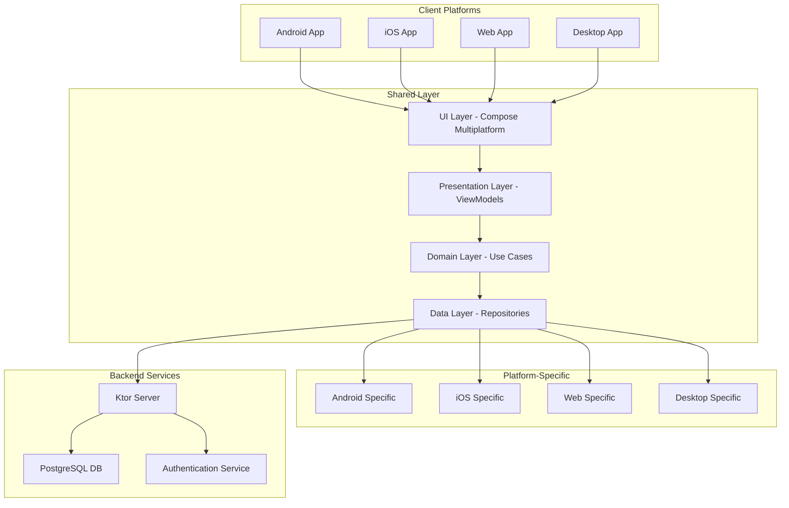
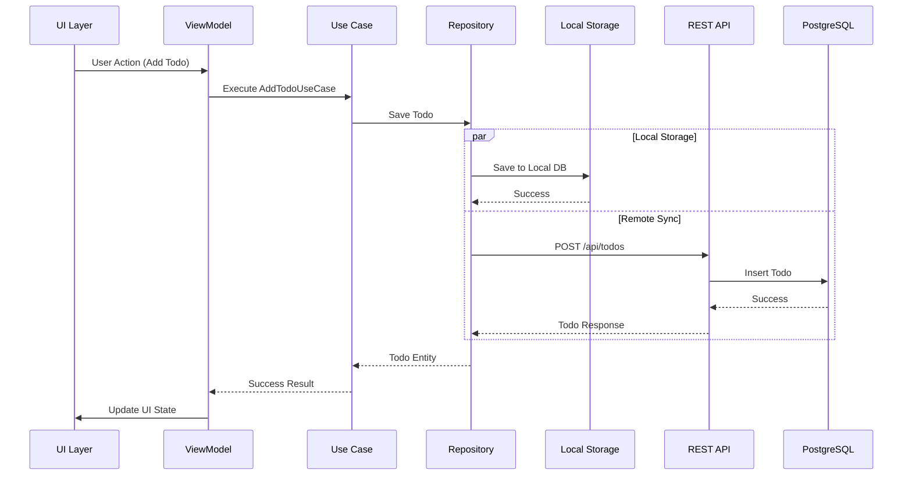

# Design Doc: Technical Architecture Strategy

## 基本情報
- **タスクID**: WBS-1.3.1
- **タスク名**: Technical Architecture Strategy
- **関連PBI**: PBI-001
- **WBS**: PBI-001-wbs.md
- **作成日**: 2025-09-02
- **作成者**: Architecture Strategist
- **レビュー者**: Backend Security Architect, QA Test Strategist
- **ステータス**: draft

## 設計概要
### 目的
Kotlin Multiplatform TODOアプリケーションの包括的システムアーキテクチャ設計とプラットフォーム間で一貫性のある技術戦略を確立する。5プラットフォーム（Android、iOS、Web、Desktop、Server）での同期的なTODO管理機能を実現し、企業レベルの性能要件とセキュリティ要件を満たすアーキテクチャを構築する。

### スコープ
**対象範囲**:
- Kotlin Multiplatform全体アーキテクチャ設計
- 5プラットフォーム技術スタック選定と統合戦略
- データフロー・同期戦略・オフライン対応設計
- モジュール構成・依存関係・expect/actual実装方針
- REST API設計・エンドポイント仕様
- パフォーマンス・セキュリティアーキテクチャ

**除外範囲**:
- UI詳細設計（Design System Architectureで実施）
- 具体的なビジネスロジック実装
- インフラ・デプロイメント戦略

### 前提条件
- PBI Refinement & Backlog Grooming（1.1.3）完了
- 基本的なKotlin Multiplatform環境構築済み
- Compose Multiplatform 1.6.x, Ktor 2.3.x利用可能

## システム設計

### アーキテクチャ概要


### モジュール構成
#### Kotlin Multiplatform構成

**shared/commonMain**: 共通ビジネスロジック・データモデル
- **Domain Layer**: TodoEntity, TodoRepository, UseCases
- **Data Layer**: NetworkClient, LocalStorage抽象化
- **Common Utilities**: Logger, DateUtils, ValidationUtils

**shared/androidMain**: Android固有実装
- Room Database実装
- Android DataStore設定管理
- Push通知サービス連携

**shared/iosMain**: iOS固有実装  
- Core Data統合レイヤー
- iOS Keychain認証情報管理
- iOS通知機能連携

**shared/jvmMain**: Desktop/Server固有実装
- SQLite組み込みDB実装
- ファイルベース設定管理

**shared/wasmJsMain**: Web固有実装
- IndexedDB LocalStorage実装
- PWA対応機能
- Web Crypto API連携

**composeApp**: マルチプラットフォームUI実装
- **commonMain**: 共通UI Components, Screens, Navigation
- **platformMain**: プラットフォーム固有UI調整

**server**: Ktorサーバーアプリケーション
- REST API実装
- JWT認証・認可
- PostgreSQL連携
- リアルタイム同期機能

### データ設計
#### データモデル
```kotlin
// 共通データモデル - shared/commonMain
@Serializable
data class TodoEntity(
    val id: String = UUID.randomUUID().toString(),
    val title: String,
    val description: String = "",
    val isCompleted: Boolean = false,
    val priority: TodoPriority = TodoPriority.MEDIUM,
    val dueDate: LocalDateTime? = null,
    val createdAt: LocalDateTime = Clock.System.now().toLocalDateTime(TimeZone.currentSystemDefault()),
    val updatedAt: LocalDateTime = Clock.System.now().toLocalDateTime(TimeZone.currentSystemDefault()),
    val syncStatus: SyncStatus = SyncStatus.SYNCED
)

@Serializable
enum class TodoPriority { HIGH, MEDIUM, LOW }

@Serializable
enum class SyncStatus { SYNCED, PENDING_SYNC, CONFLICT }

// ユーザー認証モデル
@Serializable
data class UserEntity(
    val id: String,
    val email: String,
    val displayName: String,
    val createdAt: LocalDateTime,
    val lastSyncedAt: LocalDateTime? = null
)

// 同期情報管理
@Serializable
data class SyncMetadata(
    val entityId: String,
    val entityType: String,
    val lastModified: LocalDateTime,
    val version: Long,
    val deviceId: String
)
```

#### データフロー


### API設計
#### エンドポイント仕様
```yaml
# REST API 仕様
/api/v1/auth:
  post:
    path: /api/v1/auth/login
    summary: ユーザーログイン
    requestBody:
      required: true
      content:
        application/json:
          schema:
            type: object
            properties:
              email:
                type: string
                format: email
              password:
                type: string
                minLength: 8
    responses:
      200:
        description: ログイン成功
        content:
          application/json:
            schema:
              type: object
              properties:
                token:
                  type: string
                  description: JWT Access Token
                user:
                  $ref: '#/components/schemas/UserResponse'

/api/v1/todos:
  get:
    summary: TODO一覧取得
    parameters:
      - name: page
        in: query
        schema:
          type: integer
          default: 1
      - name: limit
        in: query
        schema:
          type: integer
          default: 50
          maximum: 100
      - name: filter
        in: query
        schema:
          type: string
          enum: [all, completed, pending]
      - name: sort
        in: query
        schema:
          type: string
          enum: [created_desc, created_asc, due_date_asc, priority_desc]
    responses:
      200:
        description: TODO一覧取得成功
        content:
          application/json:
            schema:
              type: object
              properties:
                data:
                  type: array
                  items:
                    $ref: '#/components/schemas/TodoResponse'
                pagination:
                  $ref: '#/components/schemas/PaginationInfo'
  
  post:
    summary: TODO作成
    requestBody:
      required: true
      content:
        application/json:
          schema:
            $ref: '#/components/schemas/CreateTodoRequest'
    responses:
      201:
        description: TODO作成成功
        content:
          application/json:
            schema:
              $ref: '#/components/schemas/TodoResponse'

/api/v1/todos/{id}:
  get:
    summary: TODO詳細取得
    parameters:
      - name: id
        in: path
        required: true
        schema:
          type: string
    responses:
      200:
        description: TODO詳細取得成功
        content:
          application/json:
            schema:
              $ref: '#/components/schemas/TodoResponse'
      404:
        description: TODO not found
  
  put:
    summary: TODO更新
    parameters:
      - name: id
        in: path
        required: true
        schema:
          type: string
    requestBody:
      required: true
      content:
        application/json:
          schema:
            $ref: '#/components/schemas/UpdateTodoRequest'
    responses:
      200:
        description: TODO更新成功
        content:
          application/json:
            schema:
              $ref: '#/components/schemas/TodoResponse'
  
  delete:
    summary: TODO削除
    parameters:
      - name: id
        in: path
        required: true
        schema:
          type: string
    responses:
      204:
        description: TODO削除成功

/api/v1/sync:
  post:
    summary: データ同期
    requestBody:
      required: true
      content:
        application/json:
          schema:
            type: object
            properties:
              lastSyncTime:
                type: string
                format: date-time
              deviceId:
                type: string
              changes:
                type: array
                items:
                  $ref: '#/components/schemas/SyncChange'
    responses:
      200:
        description: 同期成功
        content:
          application/json:
            schema:
              type: object
              properties:
                serverChanges:
                  type: array
                  items:
                    $ref: '#/components/schemas/SyncChange'
                conflicts:
                  type: array
                  items:
                    $ref: '#/components/schemas/ConflictInfo'
```

#### リクエスト/レスポンス仕様
```kotlin
// リクエストモデル
@Serializable
data class CreateTodoRequest(
    val title: String,
    val description: String = "",
    val priority: TodoPriority = TodoPriority.MEDIUM,
    val dueDate: LocalDateTime? = null
) {
    init {
        require(title.trim().isNotEmpty()) { "Title cannot be empty" }
        require(title.length <= 200) { "Title too long" }
        require(description.length <= 2000) { "Description too long" }
    }
}

@Serializable
data class UpdateTodoRequest(
    val title: String? = null,
    val description: String? = null,
    val isCompleted: Boolean? = null,
    val priority: TodoPriority? = null,
    val dueDate: LocalDateTime? = null
)

// レスポンスモデル
@Serializable
data class TodoResponse(
    val id: String,
    val title: String,
    val description: String,
    val isCompleted: Boolean,
    val priority: TodoPriority,
    val dueDate: LocalDateTime?,
    val createdAt: LocalDateTime,
    val updatedAt: LocalDateTime,
    val version: Long
)

@Serializable
data class PaginationInfo(
    val page: Int,
    val limit: Int,
    val total: Int,
    val hasNext: Boolean
)

@Serializable
data class SyncChange(
    val id: String,
    val type: ChangeType,
    val entity: String,
    val data: JsonElement?,
    val timestamp: LocalDateTime,
    val version: Long
)

@Serializable
enum class ChangeType { CREATE, UPDATE, DELETE }

@Serializable
data class ConflictInfo(
    val entityId: String,
    val clientVersion: Long,
    val serverVersion: Long,
    val clientData: JsonElement,
    val serverData: JsonElement
)
```

### UI設計
#### 画面構成
**主要画面**:
- **TodoListScreen**: TODO一覧・フィルター・検索機能
- **TodoDetailScreen**: TODO詳細・編集機能  
- **CreateTodoScreen**: 新規TODO作成
- **SettingsScreen**: 設定・同期状態・ユーザー管理
- **LoginScreen**: ユーザー認証

**表示データ**: TODOリスト、完了状態、優先度、期限情報、同期状態
**操作**: CRUD操作、完了状態トグル、優先度変更、フィルタリング、検索

#### Compose実装方針
```kotlin
// 共通UIアーキテクチャパターン
@Composable
fun TodoListScreen(
    viewModel: TodoListViewModel = hiltViewModel()
) {
    val uiState by viewModel.uiState.collectAsState()
    
    LaunchedEffect(Unit) {
        viewModel.loadTodos()
    }
    
    TodoListContent(
        todos = uiState.todos,
        isLoading = uiState.isLoading,
        onTodoClick = viewModel::selectTodo,
        onToggleComplete = viewModel::toggleComplete,
        onDeleteTodo = viewModel::deleteTodo
    )
}

// プラットフォーム共通UIコンポーネント
@Composable
expect fun TodoListContent(
    todos: List<TodoEntity>,
    isLoading: Boolean,
    onTodoClick: (String) -> Unit,
    onToggleComplete: (String) -> Unit,
    onDeleteTodo: (String) -> Unit
)

// ViewModelの共通実装
class TodoListViewModel(
    private val getTodosUseCase: GetTodosUseCase,
    private val toggleTodoUseCase: ToggleTodoUseCase
) : ViewModel() {
    
    private val _uiState = MutableStateFlow(TodoListUiState())
    val uiState: StateFlow<TodoListUiState> = _uiState.asStateFlow()
    
    suspend fun loadTodos() {
        _uiState.update { it.copy(isLoading = true) }
        getTodosUseCase()
            .onSuccess { todos ->
                _uiState.update { 
                    it.copy(todos = todos, isLoading = false)
                }
            }
            .onFailure { error ->
                _uiState.update { 
                    it.copy(error = error.message, isLoading = false)
                }
            }
    }
}
```

#### プラットフォーム固有UI要件
- **Android**: Material Design 3準拠、Bottom Navigation、Floating Action Button
- **iOS**: Human Interface Guidelines準拠、Tab Bar Navigation、Swipe Actions
- **Web**: Responsive Design、キーボードショートカット、PWA対応
- **Desktop**: Menu Bar、Multi-window Support、システムトレイ統合

## 技術仕様

### 依存関係
```kotlin
// shared/build.gradle.kts - 共通依存関係
dependencies {
    // Coroutines & Serialization
    implementation("org.jetbrains.kotlinx:kotlinx-coroutines-core:1.7.3")
    implementation("org.jetbrains.kotlinx:kotlinx-serialization-json:1.6.0")
    implementation("org.jetbrains.kotlinx:kotlinx-datetime:0.4.1")
    
    // Network & HTTP
    implementation("io.ktor:ktor-client-core:2.3.5")
    implementation("io.ktor:ktor-client-content-negotiation:2.3.5")
    implementation("io.ktor:ktor-serialization-kotlinx-json:2.3.5")
    implementation("io.ktor:ktor-client-auth:2.3.5")
    implementation("io.ktor:ktor-client-logging:2.3.5")
    
    // Local Database
    implementation("app.cash.sqldelight:runtime:2.0.0")
    implementation("app.cash.sqldelight:coroutines-extensions:2.0.0")
    
    // Dependency Injection  
    implementation("io.insert-koin:koin-core:3.5.0")
    
    // Logging
    implementation("io.github.aakira:napier:2.7.1")
}

// Platform-specific dependencies
androidMain.dependencies {
    // Android specific
    implementation("io.ktor:ktor-client-android:2.3.5")
    implementation("app.cash.sqldelight:android-driver:2.0.0")
    implementation("androidx.room:room-runtime:2.5.0")
    implementation("androidx.room:room-ktx:2.5.0")
    implementation("androidx.datastore:datastore-preferences:1.0.0")
    implementation("io.insert-koin:koin-android:3.5.0")
}

iosMain.dependencies {
    // iOS specific
    implementation("io.ktor:ktor-client-darwin:2.3.5")
    implementation("app.cash.sqldelight:native-driver:2.0.0")
}

jvmMain.dependencies {
    // Desktop/Server specific
    implementation("io.ktor:ktor-client-cio:2.3.5")
    implementation("app.cash.sqldelight:sqlite-driver:2.0.0")
    implementation("org.xerial:sqlite-jdbc:3.42.0.0")
}

wasmJsMain.dependencies {
    // Web specific
    implementation("io.ktor:ktor-client-js:2.3.5")
    implementation("app.cash.sqldelight:web-worker-driver:2.0.0")
}

// composeApp/build.gradle.kts - UI dependencies
dependencies {
    implementation("org.jetbrains.compose.runtime:runtime:1.6.0")
    implementation("org.jetbrains.compose.foundation:foundation:1.6.0")
    implementation("org.jetbrains.compose.material3:material3:1.6.0")
    implementation("org.jetbrains.compose.ui:ui:1.6.0")
    implementation("androidx.lifecycle:lifecycle-viewmodel-compose:2.7.0")
    implementation("androidx.navigation:navigation-compose:2.7.0")
    implementation("io.insert-koin:koin-compose:3.5.0")
}

// server/build.gradle.kts - サーバー依存関係
dependencies {
    // Ktor Server
    implementation("io.ktor:ktor-server-core:2.3.5")
    implementation("io.ktor:ktor-server-netty:2.3.5")
    implementation("io.ktor:ktor-server-content-negotiation:2.3.5")
    implementation("io.ktor:ktor-serialization-kotlinx-json:2.3.5")
    implementation("io.ktor:ktor-server-auth:2.3.5")
    implementation("io.ktor:ktor-server-auth-jwt:2.3.5")
    implementation("io.ktor:ktor-server-cors:2.3.5")
    implementation("io.ktor:ktor-server-rate-limit:2.3.5")
    
    // Database
    implementation("org.postgresql:postgresql:42.6.0")
    implementation("com.zaxxer:HikariCP:5.0.1")
    implementation("org.jetbrains.exposed:exposed-core:0.44.1")
    implementation("org.jetbrains.exposed:exposed-dao:0.44.1")
    implementation("org.jetbrains.exposed:exposed-jdbc:0.44.1")
    implementation("org.jetbrains.exposed:exposed-kotlin-datetime:0.44.1")
    
    // Security & Validation
    implementation("at.favre.lib:bcrypt:0.10.2")
    implementation("io.konform:konform:0.4.0")
    
    // Monitoring & Logging
    implementation("ch.qos.logback:logback-classic:1.4.11")
    implementation("io.micrometer:micrometer-core:1.11.5")
}
```

### 設定・環境変数
| 項目 | 環境 | 値 | 説明 |
|------|------|----|----|
| API_BASE_URL | dev | https://api.dev.playground.com | 開発環境API |
| API_BASE_URL | staging | https://api.staging.playground.com | ステージング環境API |
| API_BASE_URL | prod | https://api.playground.com | 本番環境API |
| DATABASE_URL | dev | postgresql://localhost:5432/todos_dev | 開発DB |
| DATABASE_URL | prod | postgresql://prod-db:5432/todos_prod | 本番DB |
| JWT_SECRET | all | [環境固有シークレット] | JWT署名キー |
| JWT_EXPIRY | all | 24h | JWTトークン有効期限 |
| SYNC_INTERVAL | all | 30s | 自動同期間隔 |
| OFFLINE_CACHE_SIZE | all | 1000 | オフライン時最大キャッシュサイズ |
| LOG_LEVEL | dev | DEBUG | ログレベル |
| LOG_LEVEL | prod | INFO | 本番ログレベル |

### パフォーマンス要件
- **リスト表示応答時間**: <1秒（1000件のTODOリスト表示）
- **CRUD操作応答時間**: <500ms（単一TODO操作）
- **同期処理時間**: <2秒（100件以下の差分同期）
- **アプリ起動時間**: <3秒（コールドスタート、ログイン済み）
- **メモリ使用量**: <200MB（通常利用時）
- **オフライン時データアクセス**: <100ms（ローカルキャッシュ）

### セキュリティ要件
- **認証**: JWT Bearer Token認証、リフレッシュトークン機能
- **認可**: ユーザー毎のリソースアクセス制御、Role-Based Access Control
- **データ暗号化**: 
  - 通信: TLS 1.3以上での全API通信暗号化
  - 保存: SQLCipherでローカルDB暗号化、機密情報のKeychain/Keystore保存
- **入力検証**: サーバーサイド全入力値検証、SQLインジェクション対策
- **レート制限**: API毎のレート制限（100req/min/user）、ブルートフォース攻撃対策

## 実装詳細

### クラス設計
#### 主要クラス
```kotlin
// Repository Pattern
interface TodoRepository {
    suspend fun getAllTodos(): Result<List<TodoEntity>>
    suspend fun getTodoById(id: String): Result<TodoEntity?>
    suspend fun insertTodo(todo: TodoEntity): Result<TodoEntity>
    suspend fun updateTodo(todo: TodoEntity): Result<TodoEntity>
    suspend fun deleteTodo(id: String): Result<Unit>
    suspend fun syncWithRemote(): Result<SyncResult>
    fun observeTodos(): Flow<List<TodoEntity>>
}

class TodoRepositoryImpl(
    private val localDataSource: TodoLocalDataSource,
    private val remoteDataSource: TodoRemoteDataSource,
    private val syncManager: SyncManager
) : TodoRepository {
    
    override suspend fun getAllTodos(): Result<List<TodoEntity>> = withContext(Dispatchers.IO) {
        try {
            val localTodos = localDataSource.getAllTodos()
            // バックグラウンド同期をトリガー
            syncManager.scheduleSyncIfNeeded()
            Result.success(localTodos)
        } catch (e: Exception) {
            Result.failure(e)
        }
    }
    
    override suspend fun insertTodo(todo: TodoEntity): Result<TodoEntity> = withContext(Dispatchers.IO) {
        try {
            // ローカル保存
            val savedTodo = localDataSource.insertTodo(todo.copy(syncStatus = SyncStatus.PENDING_SYNC))
            
            // リモート同期（バックグラウンド）
            launch { syncManager.syncSingle(savedTodo) }
            
            Result.success(savedTodo)
        } catch (e: Exception) {
            Result.failure(e)
        }
    }
}

// Use Case Layer
class GetTodosUseCase(
    private val todoRepository: TodoRepository
) {
    suspend operator fun invoke(filter: TodoFilter = TodoFilter.ALL): Result<List<TodoEntity>> {
        return todoRepository.getAllTodos()
            .map { todos ->
                when (filter) {
                    TodoFilter.ALL -> todos
                    TodoFilter.COMPLETED -> todos.filter { it.isCompleted }
                    TodoFilter.PENDING -> todos.filter { !it.isCompleted }
                    TodoFilter.HIGH_PRIORITY -> todos.filter { it.priority == TodoPriority.HIGH }
                }
            }
    }
}

class CreateTodoUseCase(
    private val todoRepository: TodoRepository,
    private val validator: TodoValidator
) {
    suspend operator fun invoke(request: CreateTodoRequest): Result<TodoEntity> {
        return validator.validate(request)
            .mapCatching { validRequest ->
                val todo = TodoEntity(
                    title = validRequest.title,
                    description = validRequest.description,
                    priority = validRequest.priority,
                    dueDate = validRequest.dueDate
                )
                todoRepository.insertTodo(todo).getOrThrow()
            }
    }
}

// Sync Manager
class SyncManager(
    private val localDataSource: TodoLocalDataSource,
    private val remoteDataSource: TodoRemoteDataSource,
    private val conflictResolver: ConflictResolver
) {
    suspend fun syncAll(): Result<SyncResult> = withContext(Dispatchers.IO) {
        try {
            val localChanges = localDataSource.getPendingChanges()
            val lastSyncTime = localDataSource.getLastSyncTime()
            
            // リモートに変更を送信
            val remoteResponse = remoteDataSource.sync(localChanges, lastSyncTime)
            
            // 競合解決
            val resolvedChanges = conflictResolver.resolve(remoteResponse.conflicts)
            
            // ローカルに反映
            localDataSource.applyRemoteChanges(remoteResponse.serverChanges + resolvedChanges)
            localDataSource.markAsSynced(localChanges.map { it.id })
            localDataSource.updateLastSyncTime(Clock.System.now().toLocalDateTime(TimeZone.currentSystemDefault()))
            
            Result.success(SyncResult(
                syncedCount = localChanges.size,
                conflictsResolved = resolvedChanges.size,
                lastSyncTime = Clock.System.now().toLocalDateTime(TimeZone.currentSystemDefault())
            ))
        } catch (e: Exception) {
            Result.failure(e)
        }
    }
}

// ViewModel Pattern
class TodoListViewModel(
    private val getTodosUseCase: GetTodosUseCase,
    private val toggleTodoUseCase: ToggleTodoUseCase,
    private val deleteTodoUseCase: DeleteTodoUseCase
) : ViewModel() {
    
    private val _uiState = MutableStateFlow(TodoListUiState())
    val uiState: StateFlow<TodoListUiState> = _uiState.asStateFlow()
    
    init {
        observeTodos()
    }
    
    private fun observeTodos() {
        viewModelScope.launch {
            getTodosUseCase()
                .onSuccess { todos ->
                    _uiState.update { 
                        it.copy(todos = todos, isLoading = false, error = null)
                    }
                }
                .onFailure { error ->
                    _uiState.update { 
                        it.copy(error = error.message, isLoading = false)
                    }
                }
        }
    }
    
    fun toggleComplete(todoId: String) {
        viewModelScope.launch {
            toggleTodoUseCase(todoId)
                .onFailure { error ->
                    _uiState.update { 
                        it.copy(error = error.message)
                    }
                }
        }
    }
}

data class TodoListUiState(
    val todos: List<TodoEntity> = emptyList(),
    val isLoading: Boolean = true,
    val error: String? = null,
    val filter: TodoFilter = TodoFilter.ALL,
    val syncStatus: SyncStatus = SyncStatus.SYNCED
)
```

### エラーハンドリング
```kotlin
sealed class TodoError : Exception() {
    // ネットワーク関連エラー
    object NetworkUnavailable : TodoError()
    object TimeoutError : TodoError()
    object ServerError : TodoError()
    
    // データ関連エラー
    object TodoNotFound : TodoError()
    data class ValidationError(val field: String, val message: String) : TodoError()
    
    // 認証関連エラー
    object UnauthorizedError : TodoError()
    object ForbiddenError : TodoError()
    
    // 同期関連エラー
    object SyncConflict : TodoError()
    object SyncFailure : TodoError()
    
    // 一般的エラー
    data class UnknownError(val cause: Throwable) : TodoError()
}

// エラーハンドリング関数
suspend fun <T> safeApiCall(apiCall: suspend () -> T): Result<T> = try {
    Result.success(apiCall())
} catch (e: Exception) {
    when (e) {
        is SocketTimeoutException -> Result.failure(TodoError.TimeoutError)
        is UnknownHostException -> Result.failure(TodoError.NetworkUnavailable)
        is HttpException -> {
            when (e.code()) {
                401 -> Result.failure(TodoError.UnauthorizedError)
                403 -> Result.failure(TodoError.ForbiddenError)
                404 -> Result.failure(TodoError.TodoNotFound)
                in 500..599 -> Result.failure(TodoError.ServerError)
                else -> Result.failure(TodoError.UnknownError(e))
            }
        }
        else -> Result.failure(TodoError.UnknownError(e))
    }
}

// UI層でのエラーハンドリング
@Composable
fun ErrorHandler(
    error: TodoError?,
    onRetry: () -> Unit = {},
    onDismiss: () -> Unit = {}
) {
    error?.let { todoError ->
        AlertDialog(
            onDismissRequest = onDismiss,
            title = { Text("エラー") },
            text = { 
                Text(when (todoError) {
                    is TodoError.NetworkUnavailable -> "ネットワークに接続できません"
                    is TodoError.TimeoutError -> "通信がタイムアウトしました"
                    is TodoError.UnauthorizedError -> "認証が必要です"
                    is TodoError.ValidationError -> "入力エラー: ${todoError.message}"
                    else -> "予期しないエラーが発生しました"
                })
            },
            confirmButton = {
                TextButton(onClick = { onRetry(); onDismiss() }) {
                    Text("再試行")
                }
            },
            dismissButton = {
                TextButton(onClick = onDismiss) {
                    Text("閉じる")
                }
            }
        )
    }
}
```

### ログ設計
```kotlin
// 構造化ログ設定
object Logger {
    private val napierLogger = Napier
    
    fun init() {
        if (BuildConfig.DEBUG) {
            Napier.base(DebugAntilog())
        } else {
            Napier.base(ProductionAntilog())
        }
    }
    
    // 機能別ログ
    fun logUserAction(action: String, todoId: String? = null) {
        napierLogger.i("USER_ACTION", mapOf(
            "action" to action,
            "todoId" to todoId,
            "timestamp" to Clock.System.now().toString()
        ))
    }
    
    fun logApiCall(endpoint: String, method: String, responseTime: Long, statusCode: Int) {
        napierLogger.i("API_CALL", mapOf(
            "endpoint" to endpoint,
            "method" to method,
            "responseTime" to responseTime.toString(),
            "statusCode" to statusCode.toString()
        ))
    }
    
    fun logSyncOperation(operation: String, itemCount: Int, conflicts: Int, duration: Long) {
        napierLogger.i("SYNC_OPERATION", mapOf(
            "operation" to operation,
            "itemCount" to itemCount.toString(),
            "conflicts" to conflicts.toString(),
            "duration" to duration.toString()
        ))
    }
    
    fun logError(error: TodoError, context: Map<String, String> = emptyMap()) {
        napierLogger.e("ERROR", context + mapOf(
            "errorType" to error::class.simpleName.orEmpty(),
            "message" to error.message.orEmpty()
        ), error)
    }
}

// プラットフォーム固有ログ実装
expect class PlatformLogger() {
    fun log(level: LogLevel, tag: String, message: String, throwable: Throwable?)
}

// Android実装
actual class PlatformLogger {
    actual fun log(level: LogLevel, tag: String, message: String, throwable: Throwable?) {
        when (level) {
            LogLevel.DEBUG -> Log.d(tag, message, throwable)
            LogLevel.INFO -> Log.i(tag, message, throwable)
            LogLevel.ERROR -> Log.e(tag, message, throwable)
        }
    }
}
```

## テスト設計

### テスト方針
- **単体テスト**: UseCaseクラス、Repositoryクラス、ViewModelクラスの個別テスト（80%カバレッジ目標）
- **統合テスト**: Repository-DataSource間、API通信、同期機能のエンドツーエンドテスト
- **UIテスト**: 主要画面でのユーザーシナリオテスト、プラットフォーム間UI一貫性テスト

### テストケース
#### 正常系
| ケース | 入力 | 期待結果 |
|--------|------|----------|
| TODO一覧取得成功 | 認証済みユーザー | TODOリスト返却（空リスト含む） |
| TODO作成成功 | 有効なTODO情報 | 新規TODO作成・一意ID付与 |
| TODO完了状態変更成功 | 有効なTODO ID | 完了状態トグル・更新時刻更新 |
| TODO削除成功 | 有効なTODO ID | TODOが一覧から削除 |
| オフライン時作成 | ネットワーク無効 | ローカル保存・同期待ち状態 |
| 同期成功 | オンライン復帰 | ローカル変更のリモート反映 |

#### 異常系
| ケース | 入力 | 期待結果 |
|--------|------|----------|
| ネットワークエラー | 接続タイムアウト | エラーメッセージ表示・オフライン継続 |
| 認証エラー | 無効なトークン | ログイン画面へ自動遷移 |
| 存在しないTODO | 無効なID | 404エラー・適切なエラーハンドリング |
| 入力検証エラー | 空のタイトル | バリデーションエラー表示 |
| 同期競合 | 同一TODO同時更新 | 競合解決ダイアログ表示 |
| サーバーエラー | 500系エラー | 適切なエラーメッセージ・再試行機能 |

### テスト実装例
```kotlin
// UseCase単体テスト
@Test
fun `getTodos should return filtered todos when filter is applied`() = runTest {
    // Given
    val todos = listOf(
        TodoEntity(id = "1", title = "Task 1", isCompleted = true),
        TodoEntity(id = "2", title = "Task 2", isCompleted = false),
        TodoEntity(id = "3", title = "Task 3", isCompleted = true)
    )
    coEvery { todoRepository.getAllTodos() } returns Result.success(todos)
    
    // When
    val result = getTodosUseCase(TodoFilter.COMPLETED)
    
    // Then
    assertTrue(result.isSuccess)
    val completedTodos = result.getOrNull()!!
    assertEquals(2, completedTodos.size)
    assertTrue(completedTodos.all { it.isCompleted })
}

// Repository統合テスト
@Test
fun `insertTodo should save locally and trigger sync`() = runTest {
    // Given
    val newTodo = TodoEntity(title = "Test Todo", description = "Test Description")
    
    // When
    val result = todoRepository.insertTodo(newTodo)
    
    // Then
    assertTrue(result.isSuccess)
    val savedTodo = result.getOrNull()!!
    assertEquals(SyncStatus.PENDING_SYNC, savedTodo.syncStatus)
    
    // ローカル保存確認
    val localTodos = localDataSource.getAllTodos()
    assertTrue(localTodos.any { it.id == savedTodo.id })
    
    // 同期トリガー確認（遅延実行のため時間待ち）
    advanceTimeBy(100)
    coVerify { syncManager.syncSingle(savedTodo) }
}

// ViewModel UIロジックテスト
@Test
fun `toggleComplete should update todo and handle errors`() = runTest {
    // Given
    val todoId = "test-id"
    coEvery { toggleTodoUseCase(todoId) } returns Result.failure(TodoError.NetworkUnavailable)
    
    // When
    viewModel.toggleComplete(todoId)
    advanceUntilIdle()
    
    // Then
    val uiState = viewModel.uiState.value
    assertEquals("ネットワークに接続できません", uiState.error)
    assertFalse(uiState.isLoading)
}

// API統合テスト
@Test
fun `sync should resolve conflicts correctly`() = runTest {
    // Given
    val localTodo = TodoEntity(id = "1", title = "Local Title", version = 1)
    val serverTodo = TodoEntity(id = "1", title = "Server Title", version = 2)
    val conflictInfo = ConflictInfo(
        entityId = "1",
        clientVersion = 1,
        serverVersion = 2,
        clientData = Json.encodeToJsonElement(localTodo),
        serverData = Json.encodeToJsonElement(serverTodo)
    )
    
    coEvery { remoteDataSource.sync(any(), any()) } returns SyncResponse(
        serverChanges = emptyList(),
        conflicts = listOf(conflictInfo)
    )
    
    // When
    val result = syncManager.syncAll()
    
    // Then
    assertTrue(result.isSuccess)
    val syncResult = result.getOrNull()!!
    assertEquals(1, syncResult.conflictsResolved)
    
    // 競合解決の確認（ここでは最新版を採用する戦略を想定）
    coVerify { conflictResolver.resolve(listOf(conflictInfo)) }
}

// Compose UIテスト
@Test
fun `TodoListScreen should display todos and handle interactions`() = runTest {
    // Given
    val todos = listOf(
        TodoEntity(id = "1", title = "Task 1", isCompleted = false),
        TodoEntity(id = "2", title = "Task 2", isCompleted = true)
    )
    
    composeTestRule.setContent {
        TodoListScreen()
    }
    
    // When & Then
    // TODOが表示されることを確認
    composeTestRule.onNodeWithText("Task 1").assertIsDisplayed()
    composeTestRule.onNodeWithText("Task 2").assertIsDisplayed()
    
    // 完了ボタンクリックの動作確認
    composeTestRule.onNodeWithContentDescription("Mark as complete").performClick()
    
    // ViewModel呼び出し確認
    coVerify { toggleTodoUseCase("1") }
}
```

## 非機能要件

### パフォーマンス
- **起動時間**: 3秒以内（コールドスタート、ログイン済み状態）
- **画面遷移時間**: 300ms以内（アニメーション含む）
- **API応答時間**: 
  - GET /todos: 500ms以内（100件以下）
  - POST /todos: 300ms以内（単一TODO作成）
  - PUT /todos/{id}: 200ms以内（単一TODO更新）
- **同期処理時間**: 2秒以内（100件以下の差分同期）
- **リスト表示時間**: 1秒以内（1000件のTODO表示・仮想化対応）

### 可用性
- **稼働率**: 99.9%（年間ダウンタイム8.77時間以内）
- **ダウンタイム許容時間**: 計画メンテナンス月1回2時間以内
- **オフライン機能**: 完全オフライン時でも基本CRUD操作可能
- **自動復旧**: ネットワーク復旧時の自動同期機能

### 拡張性
- **データ量スケーラビリティ**: ユーザー毎10,000件のTODO対応
- **ユーザー数スケーラビリティ**: 100,000アクティブユーザー対応
- **プラットフォーム拡張性**: 新規プラットフォーム追加時のコード再利用率80%以上
- **機能拡張性**: プラグインアーキテクチャでの機能追加対応

### 保守性
- **コード規約**: Kotlin Coding Conventions準拠
- **ドキュメント**: API仕様書、アーキテクチャ図、運用マニュアル
- **モニタリング**: アプリケーション性能監視、エラー率監視
- **テスト自動化**: CI/CDでの自動テスト実行・品質ゲート

## リスク・課題

### 技術リスク
| リスク | 影響度 | 対応策 | 担当 |
|--------|--------|--------|------|
| Compose Multiplatformプラットフォーム差異 | 高 | 早期プロトタイプ作成、expect/actual活用、既存事例調査 | Architecture Strategist |
| データ同期競合の複雑性 | 中 | 段階的実装、既存同期ライブラリ活用、競合解決UI設計 | Backend Security Architect |
| WebAssembly性能制約 | 中 | 性能プロファイリング、WebWorker活用、段階的機能追加 | Frontend Generalist Dev |
| iOS固有制約（App Store審査） | 中 | Apple HIG準拠、事前審査チェックリスト、段階的リリース | Frontend Generalist Dev |

### スケジュールリスク
| リスク | 影響度 | 対応策 | 担当 |
|--------|--------|--------|------|
| KMP学習コスト | 中 | 事前研修、ペアプログラミング、段階的実装 | Architecture Strategist |
| 5プラットフォーム同時開発の複雑性 | 高 | MVP優先（Android）、段階的プラットフォーム追加 | プロジェクト全体 |
| 同期機能実装の工数超過 | 中 | シンプルな同期戦略採用、必要最小機能での実装 | Backend Security Architect |

### 依存関係リスク
| リスク | 影響度 | 対応策 | 担当 |
|--------|--------|--------|------|
| Compose Multiplatformアップデート影響 | 中 | 安定版使用、段階的アップデート、互換性検証 | Architecture Strategist |
| 外部ライブラリ脆弱性 | 中 | 定期的依存関係更新、セキュリティ監査、代替手段準備 | Backend Security Architect |

## 実装計画

### タスク分解
1. **共通基盤アーキテクチャセットアップ**
   - 概要: DI、Repository、UseCase基本構造実装
   - 工数: 8時間
   - 成果物: 共通アーキテクチャ基盤、基本インターフェース

2. **データモデル・Repository実装**
   - 概要: TodoEntity、Repository pattern、expect/actual実装
   - 工数: 12時間
   - 成果物: 全プラットフォーム対応データレイヤー

3. **API設計・サーバー実装**
   - 概要: REST API、JWT認証、PostgreSQL連携
   - 工数: 16時間
   - 成果物: 動作するKtorサーバー、API仕様書

4. **同期機能・オフライン対応**
   - 概要: 同期ロジック、競合解決、オフライン機能
   - 工数: 20時間
   - 成果物: 完全な同期システム

### マイルストーン
- **M1: アーキテクチャレビュー完了**: 2025-09-03
  - 成功基準: システム設計承認、技術スタック確定、リスク軽減策承認
- **M2: 共通実装完了**: 2025-09-04
  - 成功基準: shared/commonMain実装完成、基本的なCRUD動作確認
- **M3: サーバー実装完了**: 2025-09-05  
  - 成功基準: REST API動作、認証機能、基本的なデータベース操作
- **M4: 同期機能完了**: 2025-09-06
  - 成功基準: オフライン/オンライン同期動作、競合解決機能

## レビューポイント

### 設計レビュー
- [ ] 5プラットフォーム対応アーキテクチャの妥当性
- [ ] expect/actual パターンの適切な設計・分離度
- [ ] データ同期戦略の実現可能性・性能影響
- [ ] セキュリティ要件の充足性（認証・認可・暗号化）
- [ ] パフォーマンス要件達成の実現可能性
- [ ] エラーハンドリング・ログ設計の包括性
- [ ] テスト戦略の妥当性・カバレッジ十分性
- [ ] 拡張性・保守性の確保

### コードレビュー
- [ ] Kotlin Multiplatform規約準拠
- [ ] Compose最適化・再コンポーション対策
- [ ] Repository pattern適切性・テスト容易性
- [ ] エラーハンドリング漏れの確認
- [ ] セキュリティベストプラクティス準拠
- [ ] 性能要件への適合性（メモリ・CPU使用量）
- [ ] ドキュメント・コメントの適切性

## 参考資料
- **Context File**: PBI-001-context.md
- **WBS**: PBI-001-wbs.md
- **Kotlin Multiplatform公式ドキュメント**: https://kotlinlang.org/docs/multiplatform.html
- **Compose Multiplatform**: https://github.com/JetBrains/compose-multiplatform
- **Ktor公式ドキュメント**: https://ktor.io/docs/
- **SQLDelight Documentation**: https://cashapp.github.io/sqldelight/
- **Material Design 3**: https://m3.material.io/
- **Apple Human Interface Guidelines**: https://developer.apple.com/design/human-interface-guidelines/

## 変更履歴
| 日付 | 版 | 変更者 | 変更内容 |
|------|----|----|--------|
| 2025-09-02 | 1.0 | Architecture Strategist | 初版作成・包括的アーキテクチャ設計 |