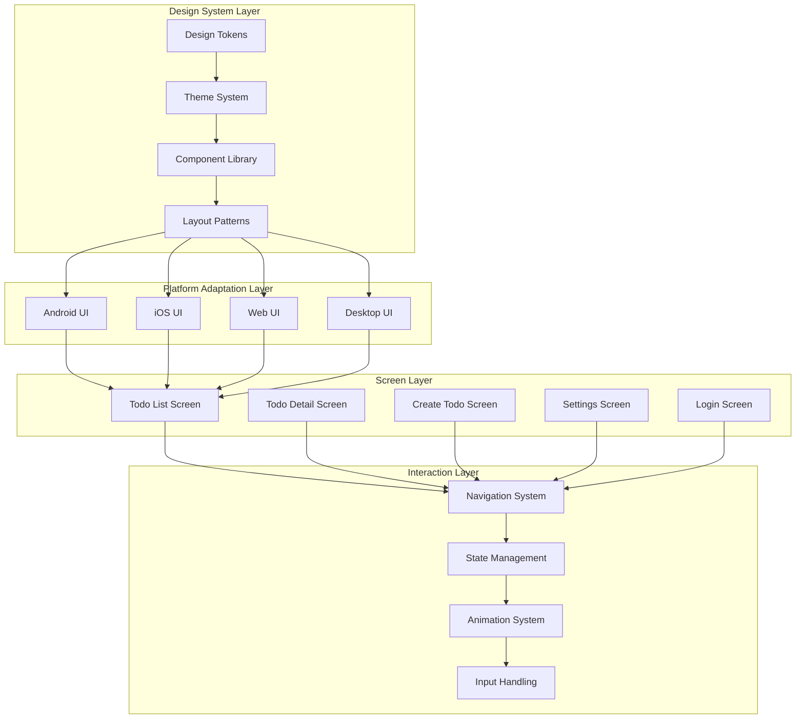

# Design Doc: UI Design System

## 基本情報
- **タスクID**: WBS-2.1
- **タスク名**: UI設計
- **関連PBI**: PBI-001
- **WBS**: PBI-001-wbs.md
- **作成日**: 2025-09-02
- **作成者**: Design System UI Architect
- **レビュー者**: UX Persona Journey Designer, Interaction Prototyping Agent
- **ステータス**: draft

## 設計概要
### 目的
Kotlin Multiplatform TODOアプリケーションの統一UIデザインシステムを構築し、Material Design 3に準拠したプラットフォーム間で一貫したユーザーエクスペリエンスを提供する。5プラットフォーム（Android、iOS、Web、Desktop）での最適な操作感とアクセシビリティを実現する包括的なUI設計を行う。

### スコープ
**対象範囲**:
- Material Design 3ベースのデザインシステム設計
- プラットフォーム別UI仕様・ガイドライン策定
- Compose Multiplatform共通コンポーネント設計
- レスポンシブデザイン・アダプティブレイアウト設計
- アクセシビリティ（WCAG 2.1 AA）対応設計
- カラーシステム・タイポグラフィ・スペーシング体系
- インタラクション設計・マイクロアニメーション仕様

**除外範囲**:
- 実装コード詳細（WBS-3.3で実装）
- サーバー側UI（管理画面等）
- デバッグ・開発者向けUI

### 前提条件
- Technical Architecture Strategy（WBS-1.3.1）完了
- User Persona & Journey Design完了
- Material Design 3ガイドライン理解
- 各プラットフォームのHuman Interface Guidelines把握

## システム設計

### UIアーキテクチャ概要


### デザインシステム基盤設計
#### Design Tokens
```kotlin
// Material Design 3 Color Scheme
object TodoColors {
    // Primary Colors
    val Primary = Color(0xFF6750A4)
    val OnPrimary = Color(0xFFFFFFFF)
    val PrimaryContainer = Color(0xFFEADDFF)
    val OnPrimaryContainer = Color(0xFF21005D)
    
    // Secondary Colors
    val Secondary = Color(0xFF625B71)
    val OnSecondary = Color(0xFFFFFFFF)
    val SecondaryContainer = Color(0xFFE8DEF8)
    val OnSecondaryContainer = Color(0xFF1D192B)
    
    // Tertiary Colors
    val Tertiary = Color(0xFF7D5260)
    val OnTertiary = Color(0xFFFFFFFF)
    val TertiaryContainer = Color(0xFFFFD8E4)
    val OnTertiaryContainer = Color(0xFF31111D)
    
    // Error Colors
    val Error = Color(0xFFBA1A1A)
    val OnError = Color(0xFFFFFFFF)
    val ErrorContainer = Color(0xFFFFDAD6)
    val OnErrorContainer = Color(0xFF410002)
    
    // Surface Colors
    val Surface = Color(0xFFFFFBFE)
    val OnSurface = Color(0xFF1C1B1F)
    val SurfaceVariant = Color(0xFFE7E0EC)
    val OnSurfaceVariant = Color(0xFF49454F)
    
    // Custom Todo Priority Colors
    val HighPriority = Color(0xFFD32F2F)
    val MediumPriority = Color(0xFFF57C00)
    val LowPriority = Color(0xFF388E3C)
    
    // Status Colors
    val CompletedTodo = Color(0xFF4CAF50)
    val PendingSync = Color(0xFFFF9800)
    val SyncError = Color(0xFFF44336)
}

// Typography System
object TodoTypography {
    val displayLarge = TextStyle(
        fontFamily = FontFamily.Default,
        fontWeight = FontWeight.Normal,
        fontSize = 57.sp,
        lineHeight = 64.sp,
        letterSpacing = (-0.25).sp
    )
    
    val headlineMedium = TextStyle(
        fontFamily = FontFamily.Default,
        fontWeight = FontWeight.Normal,
        fontSize = 28.sp,
        lineHeight = 36.sp,
        letterSpacing = 0.sp
    )
    
    val titleLarge = TextStyle(
        fontFamily = FontFamily.Default,
        fontWeight = FontWeight.Normal,
        fontSize = 22.sp,
        lineHeight = 28.sp,
        letterSpacing = 0.sp
    )
    
    val bodyLarge = TextStyle(
        fontFamily = FontFamily.Default,
        fontWeight = FontWeight.Normal,
        fontSize = 16.sp,
        lineHeight = 24.sp,
        letterSpacing = 0.5.sp
    )
    
    val bodyMedium = TextStyle(
        fontFamily = FontFamily.Default,
        fontWeight = FontWeight.Normal,
        fontSize = 14.sp,
        lineHeight = 20.sp,
        letterSpacing = 0.25.sp
    )
    
    val labelMedium = TextStyle(
        fontFamily = FontFamily.Default,
        fontWeight = FontWeight.Medium,
        fontSize = 12.sp,
        lineHeight = 16.sp,
        letterSpacing = 0.5.sp
    )
}

// Spacing System
object TodoSpacing {
    val None = 0.dp
    val ExtraSmall = 4.dp
    val Small = 8.dp
    val Medium = 16.dp
    val Large = 24.dp
    val ExtraLarge = 32.dp
    val XXL = 48.dp
    
    // Component Specific
    val CardPadding = 16.dp
    val ListItemPadding = 12.dp
    val FABMargin = 16.dp
    val ScreenPadding = 16.dp
}

// Elevation System
object TodoElevation {
    val Level0 = 0.dp      // Surface
    val Level1 = 1.dp      // Cards at rest
    val Level2 = 3.dp      // Cards raised
    val Level3 = 6.dp      // FAB at rest
    val Level4 = 8.dp      // FAB pressed
    val Level5 = 12.dp     // Modal surfaces
}
```

### UI コンポーネント設計
#### 主要コンポーネント仕様
```kotlin
// Todo List Item Component
@Composable
fun TodoListItem(
    todo: TodoEntity,
    onToggleComplete: (String) -> Unit,
    onItemClick: (String) -> Unit,
    onDeleteClick: (String) -> Unit,
    modifier: Modifier = Modifier
) {
    ElevatedCard(
        modifier = modifier
            .fillMaxWidth()
            .padding(horizontal = TodoSpacing.ScreenPadding, vertical = TodoSpacing.ExtraSmall)
            .clickable { onItemClick(todo.id) },
        elevation = CardDefaults.elevatedCardElevation(defaultElevation = TodoElevation.Level1)
    ) {
        Row(
            modifier = Modifier
                .fillMaxWidth()
                .padding(TodoSpacing.CardPadding),
            verticalAlignment = Alignment.CenterVertically
        ) {
            // Priority Indicator
            PriorityIndicator(
                priority = todo.priority,
                modifier = Modifier.padding(end = TodoSpacing.Small)
            )
            
            // Completion Checkbox
            Checkbox(
                checked = todo.isCompleted,
                onCheckedChange = { onToggleComplete(todo.id) },
                modifier = Modifier.padding(end = TodoSpacing.Medium)
            )
            
            // Todo Content
            Column(modifier = Modifier.weight(1f)) {
                Text(
                    text = todo.title,
                    style = TodoTypography.bodyLarge,
                    textDecoration = if (todo.isCompleted) TextDecoration.LineThrough else null,
                    color = if (todo.isCompleted) 
                        TodoColors.OnSurfaceVariant else TodoColors.OnSurface
                )
                
                if (todo.description.isNotEmpty()) {
                    Text(
                        text = todo.description,
                        style = TodoTypography.bodyMedium,
                        color = TodoColors.OnSurfaceVariant,
                        maxLines = 2,
                        overflow = TextOverflow.Ellipsis
                    )
                }
                
                // Due Date & Sync Status
                Row(
                    modifier = Modifier.padding(top = TodoSpacing.ExtraSmall),
                    verticalAlignment = Alignment.CenterVertically
                ) {
                    todo.dueDate?.let { dueDate ->
                        DueDateChip(
                            dueDate = dueDate,
                            modifier = Modifier.padding(end = TodoSpacing.Small)
                        )
                    }
                    
                    SyncStatusIndicator(syncStatus = todo.syncStatus)
                }
            }
            
            // Actions
            IconButton(onClick = { onDeleteClick(todo.id) }) {
                Icon(
                    imageVector = Icons.Default.Delete,
                    contentDescription = "Delete todo",
                    tint = TodoColors.Error
                )
            }
        }
    }
}

// Priority Indicator Component
@Composable
fun PriorityIndicator(
    priority: TodoPriority,
    modifier: Modifier = Modifier
) {
    val color = when (priority) {
        TodoPriority.HIGH -> TodoColors.HighPriority
        TodoPriority.MEDIUM -> TodoColors.MediumPriority
        TodoPriority.LOW -> TodoColors.LowPriority
    }
    
    Box(
        modifier = modifier
            .size(8.dp)
            .background(color, CircleShape)
    )
}

// Floating Action Button
@Composable
fun TodoFAB(
    onClick: () -> Unit,
    modifier: Modifier = Modifier
) {
    FloatingActionButton(
        onClick = onClick,
        modifier = modifier,
        containerColor = TodoColors.Primary,
        contentColor = TodoColors.OnPrimary
    ) {
        Icon(
            imageVector = Icons.Default.Add,
            contentDescription = "Add todo"
        )
    }
}

// Loading State Component
@Composable
fun LoadingState(
    modifier: Modifier = Modifier
) {
    Box(
        modifier = modifier.fillMaxSize(),
        contentAlignment = Alignment.Center
    ) {
        Column(
            horizontalAlignment = Alignment.CenterHorizontally
        ) {
            CircularProgressIndicator(
                color = TodoColors.Primary,
                modifier = Modifier.size(48.dp)
            )
            Spacer(modifier = Modifier.height(TodoSpacing.Medium))
            Text(
                text = "Loading todos...",
                style = TodoTypography.bodyMedium,
                color = TodoColors.OnSurfaceVariant
            )
        }
    }
}

// Empty State Component
@Composable
fun EmptyTodoState(
    onAddClick: () -> Unit,
    modifier: Modifier = Modifier
) {
    Column(
        modifier = modifier
            .fillMaxSize()
            .padding(TodoSpacing.Large),
        horizontalAlignment = Alignment.CenterHorizontally,
        verticalArrangement = Arrangement.Center
    ) {
        Icon(
            imageVector = Icons.Default.CheckCircleOutline,
            contentDescription = null,
            modifier = Modifier.size(96.dp),
            tint = TodoColors.OnSurfaceVariant
        )
        
        Spacer(modifier = Modifier.height(TodoSpacing.Medium))
        
        Text(
            text = "No todos yet",
            style = TodoTypography.headlineMedium,
            color = TodoColors.OnSurface,
            textAlign = TextAlign.Center
        )
        
        Text(
            text = "Add your first todo to get started",
            style = TodoTypography.bodyMedium,
            color = TodoColors.OnSurfaceVariant,
            textAlign = TextAlign.Center,
            modifier = Modifier.padding(top = TodoSpacing.Small)
        )
        
        Spacer(modifier = Modifier.height(TodoSpacing.Large))
        
        Button(
            onClick = onAddClick,
            modifier = Modifier.fillMaxWidth(0.6f)
        ) {
            Icon(
                imageVector = Icons.Default.Add,
                contentDescription = null,
                modifier = Modifier.padding(end = TodoSpacing.ExtraSmall)
            )
            Text("Add Todo")
        }
    }
}
```

### 画面設計仕様
#### Todo List Screen
```kotlin
@Composable
fun TodoListScreen(
    viewModel: TodoListViewModel = hiltViewModel(),
    onNavigateToDetail: (String) -> Unit,
    onNavigateToCreate: () -> Unit
) {
    val uiState by viewModel.uiState.collectAsState()
    
    Scaffold(
        topBar = {
            TodoAppBar(
                title = "My Todos",
                actions = {
                    FilterMenuButton(
                        currentFilter = uiState.filter,
                        onFilterChange = viewModel::setFilter
                    )
                    
                    SyncStatusButton(
                        syncStatus = uiState.syncStatus,
                        onClick = viewModel::forcSync
                    )
                }
            )
        },
        floatingActionButton = {
            TodoFAB(onClick = onNavigateToCreate)
        }
    ) { paddingValues ->
        Box(
            modifier = Modifier
                .fillMaxSize()
                .padding(paddingValues)
        ) {
            when {
                uiState.isLoading && uiState.todos.isEmpty() -> {
                    LoadingState()
                }
                
                uiState.todos.isEmpty() -> {
                    EmptyTodoState(onAddClick = onNavigateToCreate)
                }
                
                else -> {
                    LazyColumn(
                        modifier = Modifier.fillMaxSize(),
                        contentPadding = PaddingValues(
                            bottom = TodoSpacing.XXL + 56.dp // FAB height consideration
                        )
                    ) {
                        items(
                            items = uiState.todos,
                            key = { it.id }
                        ) { todo ->
                            TodoListItem(
                                todo = todo,
                                onToggleComplete = viewModel::toggleComplete,
                                onItemClick = onNavigateToDetail,
                                onDeleteClick = viewModel::deleteTodo,
                                modifier = Modifier.animateItemPlacement()
                            )
                        }
                    }
                }
            }
            
            // Pull to refresh
            if (uiState.isLoading && uiState.todos.isNotEmpty()) {
                LinearProgressIndicator(
                    modifier = Modifier
                        .fillMaxWidth()
                        .padding(top = 4.dp),
                    color = TodoColors.Primary
                )
            }
        }
    }
    
    // Error handling
    uiState.error?.let { error ->
        ErrorSnackbar(
            error = error,
            onDismiss = viewModel::clearError,
            onRetry = viewModel::retry
        )
    }
}

// App Bar Component
@OptIn(ExperimentalMaterial3Api::class)
@Composable
fun TodoAppBar(
    title: String,
    actions: @Composable RowScope.() -> Unit = {},
    onNavigationClick: () -> Unit = {}
) {
    TopAppBar(
        title = { 
            Text(
                text = title,
                style = TodoTypography.titleLarge
            )
        },
        actions = actions,
        colors = TopAppBarDefaults.topAppBarColors(
            containerColor = TodoColors.Surface,
            titleContentColor = TodoColors.OnSurface
        )
    )
}
```

#### Todo Detail/Edit Screen
```kotlin
@Composable
fun TodoDetailScreen(
    todoId: String,
    viewModel: TodoDetailViewModel = hiltViewModel(),
    onNavigateBack: () -> Unit
) {
    val uiState by viewModel.uiState.collectAsState()
    val todo = uiState.todo
    
    LaunchedEffect(todoId) {
        viewModel.loadTodo(todoId)
    }
    
    Scaffold(
        topBar = {
            TodoDetailAppBar(
                isEditing = uiState.isEditing,
                onNavigateBack = onNavigateBack,
                onToggleEdit = viewModel::toggleEditMode,
                onSave = viewModel::saveTodo,
                isSaving = uiState.isSaving
            )
        }
    ) { paddingValues ->
        if (todo != null) {
            LazyColumn(
                modifier = Modifier
                    .fillMaxSize()
                    .padding(paddingValues)
                    .padding(horizontal = TodoSpacing.ScreenPadding),
                verticalArrangement = Arrangement.spacedBy(TodoSpacing.Medium)
            ) {
                item {
                    // Title Section
                    TodoDetailSection(title = "Title") {
                        if (uiState.isEditing) {
                            OutlinedTextField(
                                value = uiState.editingTitle,
                                onValueChange = viewModel::updateTitle,
                                modifier = Modifier.fillMaxWidth(),
                                placeholder = { Text("Enter todo title") },
                                isError = uiState.titleError != null,
                                supportingText = uiState.titleError?.let { error ->
                                    { Text(error, color = TodoColors.Error) }
                                }
                            )
                        } else {
                            Text(
                                text = todo.title,
                                style = TodoTypography.bodyLarge,
                                color = if (todo.isCompleted) 
                                    TodoColors.OnSurfaceVariant else TodoColors.OnSurface,
                                textDecoration = if (todo.isCompleted) 
                                    TextDecoration.LineThrough else null
                            )
                        }
                    }
                }
                
                item {
                    // Description Section
                    TodoDetailSection(title = "Description") {
                        if (uiState.isEditing) {
                            OutlinedTextField(
                                value = uiState.editingDescription,
                                onValueChange = viewModel::updateDescription,
                                modifier = Modifier
                                    .fillMaxWidth()
                                    .height(120.dp),
                                placeholder = { Text("Enter description (optional)") },
                                maxLines = 5
                            )
                        } else {
                            if (todo.description.isNotEmpty()) {
                                Text(
                                    text = todo.description,
                                    style = TodoTypography.bodyMedium,
                                    color = TodoColors.OnSurface
                                )
                            } else {
                                Text(
                                    text = "No description",
                                    style = TodoTypography.bodyMedium,
                                    color = TodoColors.OnSurfaceVariant,
                                    fontStyle = FontStyle.Italic
                                )
                            }
                        }
                    }
                }
                
                item {
                    // Priority Section
                    TodoDetailSection(title = "Priority") {
                        if (uiState.isEditing) {
                            PrioritySelector(
                                selectedPriority = uiState.editingPriority,
                                onPriorityChange = viewModel::updatePriority
                            )
                        } else {
                            Row(verticalAlignment = Alignment.CenterVertically) {
                                PriorityIndicator(
                                    priority = todo.priority,
                                    modifier = Modifier.padding(end = TodoSpacing.Small)
                                )
                                Text(
                                    text = todo.priority.name.lowercase().capitalize(),
                                    style = TodoTypography.bodyMedium
                                )
                            }
                        }
                    }
                }
                
                item {
                    // Due Date Section
                    TodoDetailSection(title = "Due Date") {
                        if (uiState.isEditing) {
                            DueDateSelector(
                                selectedDate = uiState.editingDueDate,
                                onDateChange = viewModel::updateDueDate
                            )
                        } else {
                            todo.dueDate?.let { dueDate ->
                                DueDateChip(dueDate = dueDate)
                            } ?: Text(
                                text = "No due date",
                                style = TodoTypography.bodyMedium,
                                color = TodoColors.OnSurfaceVariant,
                                fontStyle = FontStyle.Italic
                            )
                        }
                    }
                }
                
                item {
                    // Status Section
                    TodoDetailSection(title = "Status") {
                        Row(
                            verticalAlignment = Alignment.CenterVertically
                        ) {
                            if (uiState.isEditing) {
                                Switch(
                                    checked = uiState.editingIsCompleted,
                                    onCheckedChange = viewModel::updateCompletionStatus
                                )
                                Text(
                                    text = if (uiState.editingIsCompleted) "Completed" else "Pending",
                                    modifier = Modifier.padding(start = TodoSpacing.Small),
                                    style = TodoTypography.bodyMedium
                                )
                            } else {
                                Checkbox(
                                    checked = todo.isCompleted,
                                    onCheckedChange = { viewModel.toggleCompletion() }
                                )
                                Text(
                                    text = if (todo.isCompleted) "Completed" else "Pending",
                                    modifier = Modifier.padding(start = TodoSpacing.Small),
                                    style = TodoTypography.bodyMedium
                                )
                            }
                        }
                    }
                }
                
                item {
                    // Metadata Section
                    TodoMetadataSection(todo = todo)
                }
            }
        } else {
            LoadingState()
        }
    }
}

@Composable
fun TodoDetailSection(
    title: String,
    content: @Composable () -> Unit
) {
    Card(
        modifier = Modifier.fillMaxWidth(),
        elevation = CardDefaults.cardElevation(defaultElevation = TodoElevation.Level1)
    ) {
        Column(
            modifier = Modifier
                .fillMaxWidth()
                .padding(TodoSpacing.CardPadding)
        ) {
            Text(
                text = title,
                style = TodoTypography.labelMedium,
                color = TodoColors.OnSurfaceVariant,
                modifier = Modifier.padding(bottom = TodoSpacing.Small)
            )
            content()
        }
    }
}
```

### プラットフォーム固有UI要件

#### Android固有実装
```kotlin
// Android Material Design 3 Navigation
@Composable
fun AndroidTodoNavigation() {
    NavigationBar(
        containerColor = TodoColors.Surface,
        contentColor = TodoColors.OnSurface
    ) {
        NavigationBarItem(
            selected = true,
            onClick = { },
            icon = { Icon(Icons.Default.List, contentDescription = "Todos") },
            label = { Text("Todos") }
        )
        NavigationBarItem(
            selected = false,
            onClick = { },
            icon = { Icon(Icons.Default.Settings, contentDescription = "Settings") },
            label = { Text("Settings") }
        )
    }
}

// Android System UI Configuration
@Composable
fun AndroidSystemUI() {
    val systemUiController = rememberSystemUiController()
    val darkTheme = isSystemInDarkTheme()
    
    SideEffect {
        systemUiController.setStatusBarColor(
            color = if (darkTheme) TodoColors.Surface else TodoColors.Surface,
            darkIcons = !darkTheme
        )
        systemUiController.setNavigationBarColor(
            color = if (darkTheme) TodoColors.Surface else TodoColors.Surface,
            darkIcons = !darkTheme
        )
    }
}
```

#### iOS固有実装
```kotlin
// iOS Human Interface Guidelines準拠
@Composable
fun IOSTodoNavigation() {
    // iOS Tab Bar style navigation
    expect fun IOSTabBar(
        tabs: List<TabItem>,
        selectedTab: Int,
        onTabSelected: (Int) -> Unit
    )
}

// iOS Swipe Actions for Todo Items
@Composable
fun IOSTodoListItem(
    todo: TodoEntity,
    onComplete: () -> Unit,
    onDelete: () -> Unit
) {
    // iOS style swipe actions
    SwipeableRow(
        leadingActions = listOf(
            SwipeAction(
                icon = Icons.Default.Check,
                backgroundColor = TodoColors.CompletedTodo,
                onSwipe = onComplete
            )
        ),
        trailingActions = listOf(
            SwipeAction(
                icon = Icons.Default.Delete,
                backgroundColor = TodoColors.Error,
                onSwipe = onDelete
            )
        )
    ) {
        // Regular todo item content
        TodoListItemContent(todo = todo)
    }
}
```

#### Web固有実装
```kotlin
// Web Responsive Layout
@Composable
fun WebTodoLayout(
    screenSize: ScreenSize
) {
    when (screenSize) {
        ScreenSize.COMPACT -> MobileTodoLayout()
        ScreenSize.MEDIUM -> TabletTodoLayout()
        ScreenSize.EXPANDED -> DesktopTodoLayout()
    }
}

// Web Keyboard Shortcuts
@Composable
fun WebKeyboardShortcuts(
    onNewTodo: () -> Unit,
    onSearch: () -> Unit,
    onSync: () -> Unit
) {
    val focusManager = LocalFocusManager.current
    
    LaunchedEffect(Unit) {
        // Ctrl+N: New Todo
        // Ctrl+F: Search
        // Ctrl+R: Sync
        // Escape: Clear focus
    }
}

// PWA Support
@Composable
fun PWAConfiguration() {
    LaunchedEffect(Unit) {
        // Service Worker registration
        // Offline support
        // Install prompt
    }
}
```

#### Desktop固有実装
```kotlin
// Desktop Menu Bar
@Composable
fun DesktopMenuBar(
    onNewTodo: () -> Unit,
    onImport: () -> Unit,
    onExport: () -> Unit,
    onPreferences: () -> Unit
) {
    MenuBar {
        Menu("File") {
            Item("New Todo", shortcut = KeyShortcut(Key.N, ctrl = true), onClick = onNewTodo)
            Item("Import", onClick = onImport)
            Item("Export", onClick = onExport)
            Separator()
            Item("Preferences", shortcut = KeyShortcut(Key.Comma, ctrl = true), onClick = onPreferences)
        }
        
        Menu("Edit") {
            Item("Find", shortcut = KeyShortcut(Key.F, ctrl = true), onClick = {})
            Item("Sync", shortcut = KeyShortcut(Key.R, ctrl = true), onClick = {})
        }
    }
}

// Desktop Multi-Window Support
@Composable
fun DesktopWindowConfiguration() {
    Window(
        onCloseRequest = ::exitApplication,
        title = "Todo App",
        state = rememberWindowState(
            width = 1024.dp,
            height = 768.dp,
            position = WindowPosition.Aligned(Alignment.Center)
        )
    ) {
        TodoApp()
    }
}

// Desktop System Tray Integration
@Composable
fun DesktopSystemTray() {
    Tray(
        icon = loadResourceIcon("app_icon.png"),
        menu = {
            Item("Show", onClick = { /* Show window */ })
            Item("New Todo", onClick = { /* Quick add todo */ })
            Separator()
            Item("Quit", onClick = { exitApplication() })
        }
    )
}
```

### レスポンシブデザイン仕様

#### Breakpoint System
```kotlin
enum class ScreenSize {
    COMPACT,    // 0-600dp (Mobile Portrait)
    MEDIUM,     // 600-840dp (Mobile Landscape, Small Tablet)
    EXPANDED    // 840dp+ (Large Tablet, Desktop)
}

object Breakpoints {
    val Compact = 600.dp
    val Medium = 840.dp
}

@Composable
fun calculateScreenSize(): ScreenSize {
    val configuration = LocalConfiguration.current
    val screenWidthDp = configuration.screenWidthDp.dp
    
    return when {
        screenWidthDp < Breakpoints.Compact -> ScreenSize.COMPACT
        screenWidthDp < Breakpoints.Medium -> ScreenSize.MEDIUM
        else -> ScreenSize.EXPANDED
    }
}
```

#### Adaptive Layouts
```kotlin
@Composable
fun AdaptiveTodoLayout(
    screenSize: ScreenSize = calculateScreenSize()
) {
    when (screenSize) {
        ScreenSize.COMPACT -> {
            // Single pane layout
            NavigationSuiteScaffold(
                navigationSuiteItems = {
                    item(
                        icon = { Icon(Icons.Default.List, contentDescription = null) },
                        label = { Text("Todos") },
                        selected = true,
                        onClick = { }
                    )
                    item(
                        icon = { Icon(Icons.Default.Settings, contentDescription = null) },
                        label = { Text("Settings") },
                        selected = false,
                        onClick = { }
                    )
                },
                layoutType = NavigationSuiteType.NavigationBar
            ) {
                TodoListScreen()
            }
        }
        
        ScreenSize.MEDIUM -> {
            // Navigation rail + content
            Row {
                NavigationRail(
                    modifier = Modifier.width(80.dp)
                ) {
                    NavigationRailItem(
                        selected = true,
                        onClick = { },
                        icon = { Icon(Icons.Default.List, contentDescription = "Todos") },
                        label = { Text("Todos") }
                    )
                    NavigationRailItem(
                        selected = false,
                        onClick = { },
                        icon = { Icon(Icons.Default.Settings, contentDescription = "Settings") },
                        label = { Text("Settings") }
                    )
                }
                
                TodoListScreen()
            }
        }
        
        ScreenSize.EXPANDED -> {
            // Master-detail layout
            Row {
                // Navigation drawer + todo list
                Surface(
                    modifier = Modifier.width(400.dp),
                    color = TodoColors.SurfaceVariant
                ) {
                    Column {
                        NavigationDrawer()
                        TodoListScreen()
                    }
                }
                
                // Detail pane
                TodoDetailPane()
            }
        }
    }
}
```

### アクセシビリティ設計

#### WCAG 2.1 AA準拠要件
```kotlin
// Screen Reader Support
@Composable
fun AccessibleTodoItem(
    todo: TodoEntity,
    onToggle: () -> Unit
) {
    Card(
        modifier = Modifier
            .fillMaxWidth()
            .semantics {
                // Detailed content description
                contentDescription = buildString {
                    append("Todo: ${todo.title}")
                    if (todo.description.isNotEmpty()) {
                        append(", Description: ${todo.description}")
                    }
                    append(", Priority: ${todo.priority.name}")
                    append(", Status: ${if (todo.isCompleted) "Completed" else "Pending"}")
                    todo.dueDate?.let { date ->
                        append(", Due: ${date.format(DateTimeFormatter.ofLocalizedDate(FormatStyle.MEDIUM))}")
                    }
                }
                
                // Custom actions
                customActions = listOf(
                    CustomAccessibilityAction(
                        label = if (todo.isCompleted) "Mark as incomplete" else "Mark as complete",
                        action = { onToggle(); true }
                    )
                )
            }
    ) {
        // Item content
    }
}

// High Contrast Theme Support
@Composable
fun HighContrastTheme(
    content: @Composable () -> Unit
) {
    val isHighContrast = LocalAccessibilityManager.current.isHighContrastEnabled
    
    MaterialTheme(
        colorScheme = if (isHighContrast) {
            darkColorScheme(
                primary = Color.White,
                onPrimary = Color.Black,
                surface = Color.Black,
                onSurface = Color.White
            )
        } else {
            dynamicLightColorScheme(LocalContext.current)
        }
    ) {
        content()
    }
}

// Large Text Support
@Composable
fun ScalableTypography() {
    val fontScale = LocalDensity.current.fontScale
    val scaledTypography = TodoTypography.copy(
        bodyLarge = TodoTypography.bodyLarge.copy(fontSize = TodoTypography.bodyLarge.fontSize * fontScale),
        bodyMedium = TodoTypography.bodyMedium.copy(fontSize = TodoTypography.bodyMedium.fontSize * fontScale)
    )
    
    ProvideTodoTypography(scaledTypography) {
        // App content
    }
}
```

### インタラクション・アニメーション設計

#### マイクロアニメーション仕様
```kotlin
// Todo completion animation
@Composable
fun AnimatedTodoCompletion(
    isCompleted: Boolean,
    content: @Composable () -> Unit
) {
    val alpha by animateFloatAsState(
        targetValue = if (isCompleted) 0.6f else 1.0f,
        animationSpec = tween(300, easing = EaseInOut),
        label = "completion_alpha"
    )
    
    val scale by animateFloatAsState(
        targetValue = if (isCompleted) 0.95f else 1.0f,
        animationSpec = spring(
            dampingRatio = Spring.DampingRatioMediumBouncy,
            stiffness = Spring.StiffnessLow
        ),
        label = "completion_scale"
    )
    
    Box(
        modifier = Modifier
            .alpha(alpha)
            .scale(scale)
    ) {
        content()
    }
}

// List item addition animation
@Composable
fun AnimatedTodoList(
    todos: List<TodoEntity>,
    itemContent: @Composable (TodoEntity) -> Unit
) {
    LazyColumn {
        items(
            items = todos,
            key = { it.id }
        ) { todo ->
            AnimatedVisibility(
                visible = true,
                enter = slideInVertically(
                    initialOffsetY = { -it },
                    animationSpec = tween(300, easing = EaseOut)
                ) + fadeIn(animationSpec = tween(300)),
                exit = slideOutVertically(
                    targetOffsetY = { -it },
                    animationSpec = tween(200, easing = EaseIn)
                ) + fadeOut(animationSpec = tween(200)),
                modifier = Modifier.animateItemPlacement(
                    animationSpec = tween(300, easing = EaseInOut)
                )
            ) {
                itemContent(todo)
            }
        }
    }
}

// FAB animation states
@Composable
fun AnimatedTodoFAB(
    isVisible: Boolean,
    onClick: () -> Unit
) {
    AnimatedVisibility(
        visible = isVisible,
        enter = scaleIn(
            animationSpec = spring(
                dampingRatio = Spring.DampingRatioMediumBouncy,
                stiffness = Spring.StiffnessHigh
            )
        ) + fadeIn(),
        exit = scaleOut() + fadeOut()
    ) {
        FloatingActionButton(
            onClick = onClick,
            modifier = Modifier
                .size(56.dp)
                .shadow(elevation = TodoElevation.Level3, shape = CircleShape)
        ) {
            Icon(
                imageVector = Icons.Default.Add,
                contentDescription = "Add todo",
                modifier = Modifier.size(24.dp)
            )
        }
    }
}
```

## テスト設計

### UI テスト方針
- **Component Tests**: 各UIコンポーネントの単体テスト（80%カバレッジ目標）
- **Screen Tests**: 画面全体の統合テスト、ユーザーシナリオテスト
- **Platform Tests**: プラットフォーム固有UI適応の検証テスト
- **Accessibility Tests**: スクリーンリーダー、高コントラスト、大文字対応テスト
- **Responsive Tests**: 各画面サイズでのレイアウト検証テスト

### UIテストケース

#### 正常系テスト
| ケース | 入力 | 期待結果 |
|--------|------|----------|
| Todo一覧表示 | 複数Todo存在 | 全Todoがリスト表示、適切なレイアウト |
| Todo完了操作 | チェックボックスタップ | 完了状態変更、アニメーション実行 |
| Todo作成画面遷移 | FABタップ | 作成画面表示、入力フォーカス |
| フィルター機能 | フィルター選択 | 対象Todoのみ表示 |
| レスポンシブ対応 | 画面サイズ変更 | 適切なレイアウト調整 |

#### アクセシビリティテスト
| ケース | 入力 | 期待結果 |
|--------|------|----------|
| スクリーンリーダー | TalkBack/VoiceOver有効 | 適切な読み上げ |
| 高コントラスト | システム設定変更 | 高コントラストテーマ適用 |
| 大きな文字 | フォントサイズ変更 | 文字サイズ適切にスケール |
| キーボードナビゲーション | Tabキー操作 | フォーカス順序正常 |

### UIテスト実装例
```kotlin
@Test
fun todoListScreen_displaysCorrectly() = runComposeUiTest {
    val testTodos = listOf(
        TodoEntity(id = "1", title = "Task 1", isCompleted = false),
        TodoEntity(id = "2", title = "Task 2", isCompleted = true)
    )
    
    setContent {
        TodoTheme {
            TodoListScreen(
                todos = testTodos,
                onToggleComplete = {},
                onItemClick = {},
                onAddClick = {}
            )
        }
    }
    
    // Verify todos are displayed
    onNodeWithText("Task 1").assertIsDisplayed()
    onNodeWithText("Task 2").assertIsDisplayed()
    
    // Verify FAB is present
    onNodeWithContentDescription("Add todo").assertIsDisplayed()
    
    // Verify completion states
    onNodeWithText("Task 1").assertHasNoClickAction()
    onNodeWithText("Task 2").assertTextContains(decorations = listOf(TextDecoration.LineThrough))
}

@Test
fun todoItem_accessibilitySupport() = runComposeUiTest {
    val testTodo = TodoEntity(
        id = "1", 
        title = "Test Todo", 
        description = "Test Description",
        priority = TodoPriority.HIGH
    )
    
    setContent {
        TodoTheme {
            TodoListItem(
                todo = testTodo,
                onToggleComplete = {},
                onItemClick = {},
                onDeleteClick = {}
            )
        }
    }
    
    // Verify accessibility properties
    onNode(hasContentDescription("Todo: Test Todo, Description: Test Description, Priority: HIGH, Status: Pending"))
        .assertIsDisplayed()
    
    // Verify custom actions
    onNode(hasContentDescription("Todo: Test Todo, Description: Test Description, Priority: HIGH, Status: Pending"))
        .assert(hasAnyChild(hasContentDescription("Mark as complete")))
}
```

## パフォーマンス要件

### UI性能目標
- **画面遷移時間**: 300ms以内（アニメーション含む）
- **リスト表示時間**: 1秒以内（1000件表示、仮想化適用）
- **スクロール性能**: 60FPS維持（複雑なリストアイテム）
- **アニメーション性能**: 60FPS維持（全マイクロアニメーション）
- **メモリ使用量**: UI層は50MB以内（通常利用時）

### 性能最適化戦略
```kotlin
// LazyColumn仮想化最適化
@Composable
fun OptimizedTodoList(
    todos: List<TodoEntity>
) {
    LazyColumn(
        contentPadding = PaddingValues(16.dp),
        verticalArrangement = Arrangement.spacedBy(8.dp)
    ) {
        items(
            items = todos,
            key = { it.id },
            itemContent = { todo ->
                // 重いコンポーネントのComposition最適化
                key(todo.id) {
                    TodoListItem(
                        todo = todo,
                        modifier = Modifier.animateItemPlacement()
                    )
                }
            }
        )
    }
}

// State hoisting最適化
@Composable
fun PerformantTodoApp() {
    // ViewModelは画面レベルで管理
    val todoListViewModel: TodoListViewModel = hiltViewModel()
    
    // UI stateの適切な分離
    val uiState by todoListViewModel.uiState.collectAsState()
    
    // Remembering expensive computations
    val filteredTodos by remember(uiState.todos, uiState.filter) {
        derivedStateOf {
            when (uiState.filter) {
                TodoFilter.ALL -> uiState.todos
                TodoFilter.COMPLETED -> uiState.todos.filter { it.isCompleted }
                TodoFilter.PENDING -> uiState.todos.filter { !it.isCompleted }
            }
        }
    }
    
    TodoListContent(
        todos = filteredTodos,
        onToggleComplete = todoListViewModel::toggleComplete
    )
}
```

## リスク・課題

### UI設計リスク
| リスク | 影響度 | 対応策 | 担当 |
|--------|--------|--------|------|
| プラットフォーム間UI一貫性確保の困難さ | 高 | デザインシステム統一、expect/actual適切活用 | Design System UI Architect |
| Material Design 3の各プラットフォーム対応差異 | 中 | プラットフォーム固有調整、段階的適用 | Design System UI Architect |
| アクセシビリティ要件達成の複雑性 | 中 | 早期検証、専門家レビュー、自動テスト導入 | UX Persona Journey Designer |
| レスポンシブデザインの複雑性 | 中 | Breakpoint system確立、段階的実装 | Design System UI Architect |

### 技術実装リスク  
| リスク | 影響度 | 対応策 | 担当 |
|--------|--------|--------|------|
| Compose Multiplatform性能制約 | 中 | 性能プロファイリング、最適化パターン適用 | Frontend Generalist Dev |
| Web（WASM）でのパフォーマンス問題 | 中 | WebWorker活用、段階的機能実装 | Frontend Generalist Dev |
| iOS HIG準拠とMaterial Design 3の兼ね合い | 中 | プラットフォーム固有デザイン調整 | Design System UI Architect |

## 実装計画

### タスク分解
1. **デザインシステム基盤構築**
   - 概要: Design Tokens、Color System、Typography設定
   - 工数: 4時間
   - 成果物: 統一デザインシステム、共通テーマ

2. **共通UIコンポーネント実装**
   - 概要: TodoListItem、FAB、AppBarなどの基本コンポーネント
   - 工数: 8時間
   - 成果物: 再利用可能コンポーネントライブラリ

3. **主要画面レイアウト実装**
   - 概要: TodoListScreen、TodoDetailScreen、CreateTodoScreen
   - 工数: 12時間
   - 成果物: 完全な画面実装

4. **プラットフォーム固有UI調整**
   - 概要: Android Navigation、iOS Swipe、Web Responsive、Desktop Menu
   - 工数: 16時間
   - 成果物: 各プラットフォーム最適化UI

5. **アクセシビリティ・アニメーション実装**
   - 概要: Screen Reader対応、高コントラスト、マイクロアニメーション
   - 工数: 8時間
   - 成果物: WCAG 2.1 AA準拠UI、滑らかなアニメーション

### マイルストーン
- **M1: デザインシステム確立**: 2025-09-03
  - 成功基準: Design Token設定完了、共通テーマ確定
- **M2: 基本コンポーネント完成**: 2025-09-04
  - 成功基準: 主要コンポーネント動作確認、スタイル適用確認
- **M3: 主要画面実装完了**: 2025-09-05
  - 成功基準: 5画面の基本レイアウト完成、ナビゲーション動作
- **M4: プラットフォーム最適化完了**: 2025-09-06
  - 成功基準: 各プラットフォーム固有UI適用、一貫性確認
- **M5: アクセシビリティ対応完了**: 2025-09-07
  - 成功基準: WCAG 2.1 AA準拠、アニメーション動作確認

## レビューポイント

### 設計レビュー
- [ ] Material Design 3準拠の適切性
- [ ] プラットフォーム間UI一貫性の確保
- [ ] アクセシビリティ要件（WCAG 2.1 AA）の充足性
- [ ] レスポンシブデザインの適切性
- [ ] パフォーマンス要件達成の実現可能性
- [ ] デザインシステムの拡張性・保守性

### UIレビュー
- [ ] ユーザビリティテスト結果の反映
- [ ] プラットフォーム固有ガイドライン準拠
- [ ] アニメーション・インタラクションの自然さ
- [ ] 色彩コントラスト比の適切性（4.5:1以上）
- [ ] タッチターゲットサイズの適切性（44dp以上）
- [ ] 文字サイズの可読性確保

## 参考資料
- **Context File**: PBI-001-context.md
- **WBS**: PBI-001-wbs.md
- **Technical Architecture**: WBS-1.3.1-architecture-design.md
- **Material Design 3**: https://m3.material.io/
- **Apple Human Interface Guidelines**: https://developer.apple.com/design/human-interface-guidelines/
- **Web Content Accessibility Guidelines 2.1**: https://www.w3.org/WAI/WCAG21/quickref/
- **Compose Multiplatform Documentation**: https://github.com/JetBrains/compose-multiplatform
- **Compose Accessibility**: https://developer.android.com/jetpack/compose/accessibility

## 変更履歴
| 日付 | 版 | 変更者 | 変更内容 |
|------|----|----|--------|
| 2025-09-02 | 1.0 | Design System UI Architect | 初版作成・包括的UI設計システム |