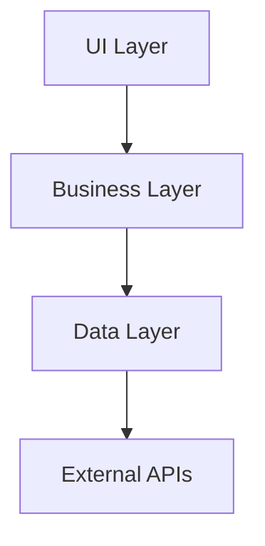
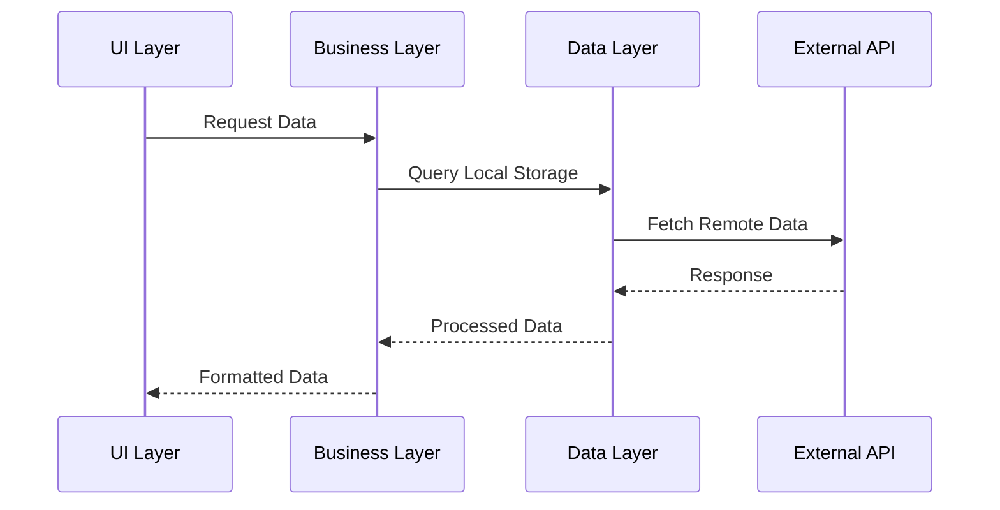

# Design Doc Template

## 基本情報
- **タスクID**: [WBS-X.X.X]
- **タスク名**: [タスク名]
- **関連PBI**: [PBI-XXX]
- **WBS**: [wbs-file-name.md]
- **作成日**: [YYYY-MM-DD]
- **作成者**: [作成者名]
- **レビュー者**: [レビュー者名]
- **ステータス**: [draft/review/approved/implemented]

## 設計概要
### 目的
[このタスクで実現する機能・目標]

### スコープ
[対象範囲と除外範囲]

### 前提条件
[依存するタスクや外部条件]

## システム設計

### アーキテクチャ概要


### モジュール構成
#### Kotlin Multiplatform構成
- **shared/commonMain**: [共通実装内容]
- **shared/androidMain**: [Android固有実装]
- **shared/iosMain**: [iOS固有実装]
- **composeApp**: [UI実装]
- **server**: [サーバー実装]

### データ設計
#### データモデル
```kotlin
// 主要なデータクラス定義例
data class SampleModel(
    val id: String,
    val name: String,
    val createdAt: LocalDateTime
)
```

#### データフロー


### API設計
#### エンドポイント仕様
```yaml
/api/v1/sample:
  get:
    summary: Get sample data
    parameters:
      - name: id
        in: query
        required: true
        schema:
          type: string
    responses:
      200:
        description: Success
        content:
          application/json:
            schema:
              $ref: '#/components/schemas/SampleResponse'
```

#### リクエスト/レスポンス仕様
```kotlin
// Request
data class SampleRequest(
    val filter: String? = null,
    val limit: Int = 20
)

// Response
data class SampleResponse(
    val data: List<SampleModel>,
    val totalCount: Int,
    val hasMore: Boolean
)
```

### UI設計
#### 画面構成
- **画面名**: [画面の説明]
- **表示データ**: [表示する情報]
- **操作**: [可能な操作]

#### Compose実装方針
```kotlin
@Composable
fun SampleScreen(
    viewModel: SampleViewModel = hiltViewModel()
) {
    // UI実装の方針と主要コンポーネント
}
```

#### プラットフォーム固有UI要件
- **Android**: [Android固有のUI要件]
- **iOS**: [iOS固有のUI要件]  
- **Web**: [Web固有のUI要件]
- **Desktop**: [Desktop固有のUI要件]

## 技術仕様

### 依存関係
```kotlin
// build.gradle.kts での依存関係例
dependencies {
    implementation("io.ktor:ktor-client-core:2.3.x")
    implementation("org.jetbrains.kotlinx:kotlinx-serialization-json:1.6.x")
    // その他の依存関係
}
```

### 設定・環境変数
| 項目 | 環境 | 値 | 説明 |
|------|------|----|----|
| API_BASE_URL | dev | https://api.dev.example.com | 開発環境API |
| API_BASE_URL | prod | https://api.example.com | 本番環境API |

### パフォーマンス要件
- **レスポンス時間**: [具体的な目標値]
- **メモリ使用量**: [制限値]
- **ネットワーク使用量**: [制限値]

### セキュリティ要件
- **認証**: [認証方法]
- **認可**: [認可方式]
- **データ暗号化**: [暗号化要件]
- **通信暗号化**: [HTTPS/TLS要件]

## 実装詳細

### クラス設計
#### 主要クラス
```kotlin
// Repository
interface SampleRepository {
    suspend fun getSamples(filter: String?): Result<List<SampleModel>>
    suspend fun createSample(sample: SampleModel): Result<SampleModel>
}

// UseCase
class GetSamplesUseCase(
    private val repository: SampleRepository
) {
    suspend operator fun invoke(filter: String?): Result<List<SampleModel>> {
        return repository.getSamples(filter)
    }
}

// ViewModel
class SampleViewModel(
    private val getSamplesUseCase: GetSamplesUseCase
) : ViewModel() {
    // ViewModel実装
}
```

### エラーハンドリング
```kotlin
sealed class SampleError : Exception() {
    object NetworkError : SampleError()
    object DataNotFound : SampleError()
    data class ValidationError(val field: String) : SampleError()
}
```

### ログ設計
```kotlin
// ログレベルと出力内容
private val logger = KLogger.getLogger("SampleFeature")

logger.info("Sample operation started")
logger.debug("Processing data: $data")
logger.error("Operation failed", exception)
```

## テスト設計

### テスト方針
- **単体テスト**: [対象と方針]
- **統合テスト**: [対象と方針]
- **UIテスト**: [対象と方針]

### テストケース
#### 正常系
| ケース | 入力 | 期待結果 |
|--------|------|----------|
| データ取得成功 | valid filter | データリスト返却 |

#### 異常系
| ケース | 入力 | 期待結果 |
|--------|------|----------|
| ネットワークエラー | network timeout | エラーメッセージ表示 |

### テスト実装例
```kotlin
@Test
fun `getSamples should return success when data exists`() = runTest {
    // Given
    val filter = "test"
    val expected = listOf(SampleModel("1", "Test", now()))
    
    // When
    val result = useCase(filter)
    
    // Then
    assertTrue(result.isSuccess)
    assertEquals(expected, result.getOrNull())
}
```

## 非機能要件

### パフォーマンス
- **起動時間**: [目標値]
- **画面遷移時間**: [目標値]
- **API応答時間**: [目標値]

### 可用性
- **稼働率**: [目標値]
- **ダウンタイム許容時間**: [制限値]

### 拡張性
- **データ量スケーラビリティ**: [対応可能な規模]
- **ユーザー数スケーラビリティ**: [対応可能な規模]

### 保守性
- **コード規約**: [適用する規約]
- **ドキュメント**: [必要なドキュメント]

## リスク・課題

### 技術リスク
| リスク | 影響度 | 対応策 | 担当 |
|--------|--------|--------|------|
| [リスク内容] | [高/中/低] | [対応策] | [担当者] |

### スケジュールリスク
| リスク | 影響度 | 対応策 | 担当 |
|--------|--------|--------|------|
| [リスク内容] | [高/中/低] | [対応策] | [担当者] |

## 実装計画

### タスク分解
1. **[サブタスク1]**
   - 概要: [内容]
   - 工数: [X時間]
   - 成果物: [成果物]

2. **[サブタスク2]**
   - 概要: [内容]
   - 工数: [X時間]
   - 成果物: [成果物]

### マイルストーン
- **設計レビュー完了**: [日付]
- **実装完了**: [日付]
- **テスト完了**: [日付]
- **デプロイ完了**: [日付]

## レビューポイント

### 設計レビュー
- [ ] アーキテクチャの妥当性
- [ ] パフォーマンス要件の実現可能性
- [ ] セキュリティ要件の適切性
- [ ] テスト設計の十分性

### コードレビュー
- [ ] コード規約準拠
- [ ] エラーハンドリングの適切性
- [ ] テストカバレッジの十分性
- [ ] ドキュメントの整備

## 参考資料
- [Context File]: [file-name.md]
- [WBS]: [wbs-file-name.md]
- [API仕様書]: [spec-url]
- [デザインモック]: [design-url]
- [その他参考資料]: [url]

## 変更履歴
| 日付 | 版 | 変更者 | 変更内容 |
|------|----|----|--------|
| [YYYY-MM-DD] | 1.0 | [作成者] | 初版作成 |