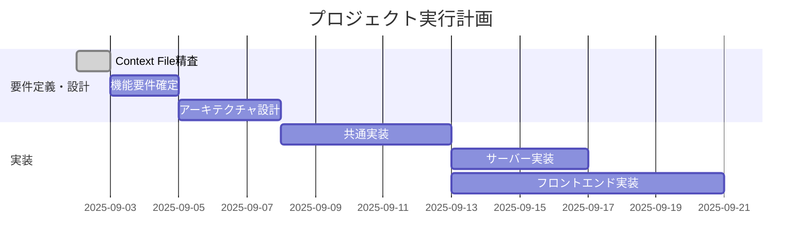

# WBS Template

## 基本情報
- **PBI ID**: [PBI-XXX]
- **Context File**: [context-file-name.md]
- **作成日**: [YYYY-MM-DD]
- **作成者**: [作成者名]
- **見積もり総工数**: [XX人日]

## プロジェクト概要
### 目的
[Context Fileから転記]

### スコープ
[主要な成果物とマイルストーン]

## Work Breakdown Structure

### 1. 要件定義・設計フェーズ
#### 1.1 要件整理
- **1.1.1** Context File精査・詳細化
  - 工数: [X人日]
  - 担当: [担当者]
  - 前提条件: Context File完成
  - 成果物: 詳細化されたContext File
  
- **1.1.2** 機能要件確定
  - 工数: [X人日]
  - 担当: [担当者]
  - 前提条件: 1.1.1完了
  - 成果物: 機能仕様書

#### 1.2 システム設計
- **1.2.1** アーキテクチャ設計
  - 工数: [X人日]
  - 担当: [担当者]
  - 前提条件: 1.1完了
  - 成果物: システムアーキテクチャ図
  
- **1.2.2** データベース設計
  - 工数: [X人日]
  - 担当: [担当者]
  - 前提条件: 1.2.1完了
  - 成果物: ER図、DDL

- **1.2.3** API設計
  - 工数: [X人日]
  - 担当: [担当者]
  - 前提条件: 1.2.2完了
  - 成果物: API仕様書

### 2. UI/UXデザインフェーズ
#### 2.1 画面設計
- **2.1.1** ワイヤーフレーム作成
  - 工数: [X人日]
  - 担当: [担当者]
  - 前提条件: 1.1完了
  - 成果物: ワイヤーフレーム

- **2.1.2** UIモックアップ作成
  - 工数: [X人日]
  - 担当: [担当者]
  - 前提条件: 2.1.1完了
  - 成果物: デザインモック（全プラットフォーム）

#### 2.2 インタラクション設計
- **2.2.1** ユーザーフロー定義
  - 工数: [X人日]
  - 担当: [担当者]
  - 前提条件: 2.1完了
  - 成果物: ユーザーフロー図

### 3. 実装フェーズ
#### 3.1 共通実装(shared/commonMain)
- **3.1.1** データモデル実装
  - 工数: [X人日]
  - 担当: [担当者]
  - 前提条件: 1.2.2完了
  - 成果物: データクラス、Repository interface

- **3.1.2** ビジネスロジック実装
  - 工数: [X人日]
  - 担当: [担当者]
  - 前提条件: 3.1.1完了
  - 成果物: UseCase、Service層

#### 3.2 サーバー実装
- **3.2.1** Ktor サーバーセットアップ
  - 工数: [X人日]
  - 担当: [担当者]
  - 前提条件: 1.2.3完了
  - 成果物: サーバー基盤コード

- **3.2.2** API エンドポイント実装
  - 工数: [X人日]
  - 担当: [担当者]
  - 前提条件: 3.2.1、3.1.2完了
  - 成果物: REST API実装

- **3.2.3** データアクセス層実装
  - 工数: [X人日]
  - 担当: [担当者]
  - 前提条件: 3.2.1完了
  - 成果物: Repository実装

#### 3.3 フロントエンド実装
##### 3.3.1 Android実装
- **3.3.1.1** Compose UI実装
  - 工数: [X人日]
  - 担当: [担当者]
  - 前提条件: 2.1.2、3.1完了
  - 成果物: Android画面コンポーネント

- **3.3.1.2** プラットフォーム固有機能
  - 工数: [X人日]
  - 担当: [担当者]
  - 前提条件: 3.3.1.1完了
  - 成果物: Android固有実装

##### 3.3.2 iOS実装
- **3.3.2.1** Compose UI実装
  - 工数: [X人日]
  - 担当: [担当者]
  - 前提条件: 2.1.2、3.1完了
  - 成果物: iOS画面コンポーネント

- **3.3.2.2** プラットフォーム固有機能
  - 工数: [X人日]
  - 担当: [担当者]
  - 前提条件: 3.3.2.1完了
  - 成果物: iOS固有実装

##### 3.3.3 Web(WASM)実装
- **3.3.3.1** Compose for Web UI実装
  - 工数: [X人日]
  - 担当: [担当者]
  - 前提条件: 2.1.2、3.1完了
  - 成果物: Web画面コンポーネント

- **3.3.3.2** Web固有機能
  - 工数: [X人日]
  - 担当: [担当者]
  - 前提条件: 3.3.3.1完了
  - 成果物: Web固有実装

##### 3.3.4 Desktop(JVM)実装
- **3.3.4.1** Compose Desktop UI実装
  - 工数: [X人日]
  - 担当: [担当者]
  - 前提条件: 2.1.2、3.1完了
  - 成果物: Desktop画面コンポーネント

- **3.3.4.2** Desktop固有機能
  - 工数: [X人日]
  - 担当: [担当者]
  - 前提条件: 3.3.4.1完了
  - 成果物: Desktop固有実装

### 4. テストフェーズ
#### 4.1 単体テスト
- **4.1.1** 共通ロジック単体テスト
  - 工数: [X人日]
  - 担当: [担当者]
  - 前提条件: 3.1完了
  - 成果物: commonMain用テストコード

- **4.1.2** サーバー単体テスト
  - 工数: [X人日]
  - 担当: [担当者]
  - 前提条件: 3.2完了
  - 成果物: サーバー用テストコード

- **4.1.3** プラットフォーム別単体テスト
  - 工数: [X人日]
  - 担当: [担当者]
  - 前提条件: 3.3完了
  - 成果物: 各プラットフォーム用テストコード

#### 4.2 統合テスト
- **4.2.1** API統合テスト
  - 工数: [X人日]
  - 担当: [担当者]
  - 前提条件: 4.1完了
  - 成果物: API統合テストコード

- **4.2.2** E2Eテスト
  - 工数: [X人日]
  - 担当: [担当者]
  - 前提条件: 4.2.1完了
  - 成果物: E2Eテストシナリオと実装

### 5. デプロイメント・リリースフェーズ
#### 5.1 環境構築
- **5.1.1** 開発環境整備
  - 工数: [X人日]
  - 担当: [担当者]
  - 前提条件: なし
  - 成果物: 開発環境

- **5.1.2** ステージング環境構築
  - 工数: [X人日]
  - 担当: [担当者]
  - 前提条件: 5.1.1完了
  - 成果物: ステージング環境

#### 5.2 リリース
- **5.2.1** プロダクション環境デプロイ
  - 工数: [X人日]
  - 担当: [担当者]
  - 前提条件: 4.2完了
  - 成果物: 本番リリース

## タスク依存関係図

## 着手順序と優先度
### Phase 1: 基盤整備 (優先度: 最高)
1. Context File精査・詳細化
2. アーキテクチャ設計
3. 共通データモデル実装

### Phase 2: コア実装 (優先度: 高)
1. サーバーAPI実装
2. 共通ビジネスロジック実装
3. Android実装 (MVP対象)

### Phase 3: プラットフォーム拡張 (優先度: 中)
1. iOS実装
2. Web実装
3. Desktop実装

### Phase 4: 品質向上 (優先度: 中)
1. テスト実装
2. パフォーマンス最適化
3. セキュリティ強化

## リスクと対応策
| タスク | リスク | 影響度 | 対応策 |
|-------|--------|--------|-------|
| [タスク名] | [リスク内容] | [高/中/低] | [対応策] |

## マイルストーン
- **M1**: 設計完了 ([日付])
- **M2**: MVP実装完了 ([日付])
- **M3**: 全プラットフォーム実装完了 ([日付])
- **M4**: テスト完了・リリース ([日付])

## 工数配分
- **設計**: [X人日] ([X%])
- **実装**: [X人日] ([X%])
- **テスト**: [X人日] ([X%])
- **その他**: [X人日] ([X%])
- **合計**: [X人日] ([100%])