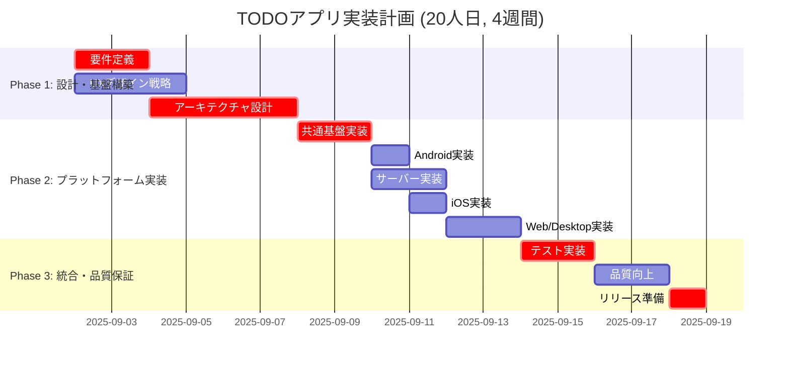

# WBS: PBI-001 TODOアプリ基本機能

## 基本情報
- **PBI ID**: PBI-001
- **Context File**: PBI-001-context.md
- **作成日**: 2025-09-02
- **作成者**: Strategic Project Manager
- **見積もり総工数**: 20人日
- **実行期間**: 20営業日（4週間）
- **専門Agent配置**: 11専門Agent活用

## プロジェクト概要
### 目的
Kotlin Multiplatformベースの包括的TODOアプリケーション開発
- 5プラットフォーム同時対応（Android、iOS、Web、Desktop、Server）
- プラットフォーム間データ同期機能
- 企業レベルのセキュリティ・パフォーマンス要件達成

### スコープ
**Phase 1**: 設計・基盤構築（8人日）
**Phase 2**: プラットフォーム実装（8人日）
**Phase 3**: 統合・品質保証（4人日）

## Work Breakdown Structure

### Phase 1: 設計・基盤構築フェーズ（8人日）
#### 1.1 戦略的要件定義（2人日）
- **1.1.1** Product Discovery & Requirement Refinement
  - 工数: 0.5人日
  - 担当: product-owner-pbi-manager
  - 前提条件: Context File完成
  - 成果物: 詳細化されたユーザーストーリー、受け入れ条件精査
  - 並行実行: 可能

- **1.1.2** Market Research & Competitive Analysis
  - 工数: 0.5人日
  - 担当: market-analyst
  - 前提条件: なし
  - 成果物: TODOアプリ市場分析レポート、競合機能分析
  - 並行実行: 1.1.1と並行

- **1.1.3** PBI Refinement & Backlog Grooming
  - 工数: 1人日
  - 担当: pbi-refinement-facilitator
  - 前提条件: 1.1.1完了
  - 成果物: 精緻化されたPBI、Definition of Ready完了
  - Critical Path: Yes

#### 1.2 UX・デザイン戦略（2.5人日）
- **1.2.1** User Persona & Journey Design
  - 工数: 1人日
  - 担当: ux-persona-journey-designer
  - 前提条件: 1.1.2完了
  - 成果物: ペルソナ定義、ユーザージャーニーマップ
  - 並行実行: 1.1.3と並行

- **1.2.2** Design System Architecture
  - 工数: 1人日
  - 担当: design-system-ui-architect
  - 前提条件: 1.2.1進行中（50%完了時点で着手可能）
  - 成果物: デザインシステム仕様、5プラットフォーム対応UI規約
  - 並行実行: 1.2.3と並行

- **1.2.3** Interaction Design & Prototyping
  - 工数: 0.5人日
  - 担当: interaction-prototyping-agent
  - 前提条件: 1.2.1完了
  - 成果物: インタラクション仕様、クリッカブルプロトタイプ
  - 並行実行: 1.2.2と並行

#### 1.3 システムアーキテクチャ設計（3.5人日）
- **1.3.1** Technical Architecture Strategy
  - 工数: 1.5人日
  - 担当: architecture-strategist
  - 前提条件: 1.1.3完了
  - 成果物: システム全体アーキテクチャ、技術選定根拠
  - Critical Path: Yes

- **1.3.2** Backend Security Architecture
  - 工数: 1人日
  - 担当: backend-security-architect
  - 前提条件: 1.3.1進行中（70%完了時点で着手可能）
  - 成果物: セキュリティアーキテクチャ、API設計、データベース設計
  - 並行実行: 1.3.3と部分並行

- **1.3.3** Quality Assurance Strategy
  - 工数: 1人日
  - 担当: qa-test-strategist
  - 前提条件: 1.3.1進行中（50%完了時点で着手可能）
  - 成果物: テスト戦略、品質保証計画、CI/CD戦略
  - 並行実行: 1.3.2と部分並行

### Phase 2: プラットフォーム実装フェーズ（8人日）
#### 2.1 共通基盤実装（2人日）
- **2.1.1** Shared Common Implementation
  - 工数: 1.5人日
  - 担当: architecture-strategist + frontend-generalist-dev
  - 前提条件: Phase 1完了
  - 成果物: 共通データモデル、ビジネスロジック、API通信層
  - Critical Path: Yes

- **2.1.2** Server Foundation Setup
  - 工数: 0.5人日
  - 担当: backend-security-architect
  - 前提条件: 2.1.1進行中（30%完了時点で着手可能）
  - 成果物: Ktorサーバーセットアップ、基本認証機能
  - 並行実行: 2.1.1と並行

#### 2.2 コアプラットフォーム実装（3人日）
- **2.2.1** Android Implementation (MVP Priority)
  - 工数: 1人日
  - 担当: frontend-generalist-dev
  - 前提条件: 2.1.1完了
  - 成果物: Android Compose UI、Material Design 3対応
  - 優先度: 最高

- **2.2.2** Server API Implementation
  - 工数: 1人日
  - 担当: backend-security-architect
  - 前提条件: 2.1.2完了
  - 成果物: REST API、データベース統合、セキュリティ実装
  - 並行実行: 2.2.1と並行

- **2.2.3** iOS Implementation
  - 工数: 1人日
  - 担当: frontend-generalist-dev（Android完了後）
  - 前提条件: 2.2.1完了
  - 成果物: iOS Compose UI、HIG準拠実装
  - 優先度: 高

#### 2.3 拡張プラットフォーム実装（3人日）
- **2.3.1** Web (WASM) Implementation
  - 工数: 1人日
  - 担当: frontend-generalist-dev
  - 前提条件: 2.2完了（部分並行可能）
  - 成果物: Web Compose UI、PWA対応、レスポンシブデザイン
  - 並行実行: 2.3.2と並行

- **2.3.2** Desktop (JVM) Implementation
  - 工数: 1人日
  - 担当: architecture-strategist（共通実装完了後）
  - 前提条件: 2.1.1完了
  - 成果物: Desktop Compose UI、OS別ネイティブ機能
  - 並行実行: 2.3.1と並行

- **2.3.3** Cross-Platform Integration
  - 工数: 1人日
  - 担当: architecture-strategist + frontend-generalist-dev
  - 前提条件: 2.3.1, 2.3.2完了
  - 成果物: プラットフォーム間データ同期、統合テスト基盤
  - Critical Path: Yes

### Phase 3: 統合・品質保証フェーズ（4人日）
#### 3.1 包括的テスト実装（2人日）
- **3.1.1** Automated Testing Suite
  - 工数: 1人日
  - 担当: qa-test-strategist
  - 前提条件: Phase 2完了
  - 成果物: 単体テスト、統合テスト、E2Eテスト実装
  - Critical Path: Yes

- **3.1.2** Performance & Security Testing
  - 工数: 0.5人日
  - 担当: backend-security-architect
  - 前提条件: 3.1.1進行中（50%完了時点で着手可能）
  - 成果物: パフォーマンステスト、セキュリティテスト
  - 並行実行: 3.1.3と並行

- **3.1.3** Cross-Platform Validation
  - 工数: 0.5人日
  - 担当: frontend-generalist-dev
  - 前提条件: 3.1.1進行中（50%完了時点で着手可能）
  - 成果物: 5プラットフォーム横断検証、UI/UX一貫性確認
  - 並行実行: 3.1.2と並行

#### 3.2 品質向上・最適化（1.5人日）
- **3.2.1** Performance Optimization
  - 工数: 0.5人日
  - 担当: architecture-strategist
  - 前提条件: 3.1.2完了
  - 成果物: 性能要件達成（リスト表示<1s、CRUD操作<500ms）
  - 並行実行: 3.2.2と並行

- **3.2.2** UX Refinement & Accessibility
  - 工数: 0.5人日
  - 担当: design-system-ui-architect
  - 前提条件: 3.1.3完了
  - 成果物: アクセシビリティ対応、UX最適化
  - 並行実行: 3.2.1と並行

- **3.2.3** Documentation & Knowledge Transfer
  - 工数: 0.5人日
  - 担当: pbi-refinement-facilitator
  - 前提条件: 3.2.1, 3.2.2完了
  - 成果物: 技術ドキュメント、運用マニュアル

#### 3.3 リリース準備（0.5人日）
- **3.3.1** Deployment & Release Validation
  - 工数: 0.5人日
  - 担当: backend-security-architect + qa-test-strategist
  - 前提条件: 3.2完了
  - 成果物: プロダクションデプロイ、リリース検証
  - Critical Path: Yes

## タスク依存関係図


## 着手順序と優先度

### Phase 1: 設計・基盤構築 (8人日, 優先度: 最高)
**並行実行Agent配置**: 5 agents同時稼働
1. **product-owner-pbi-manager** + **market-analyst** (要件精査・市場分析)
2. **ux-persona-journey-designer** (ペルソナ・ジャーニー設計)
3. **design-system-ui-architect** + **interaction-prototyping-agent** (デザインシステム)
4. **architecture-strategist** → **backend-security-architect** + **qa-test-strategist** (技術アーキテクチャ)

### Phase 2: プラットフォーム実装 (8人日, 優先度: 高)
**並行実行Agent配置**: 2-3 agents集中配置
1. **architecture-strategist** + **frontend-generalist-dev** (共通基盤)
2. **backend-security-architect** (サーバー実装) || **frontend-generalist-dev** (Android MVP)
3. **frontend-generalist-dev** (iOS) → **Web/Desktop拡張**
4. **統合実装**: 全Agent協働

### Phase 3: 統合・品質保証 (4人日, 優先度: 中)
**並行実行Agent配置**: 3 agents品質重視
1. **qa-test-strategist** (包括的テスト実装)
2. **backend-security-architect** (性能・セキュリティ検証) || **frontend-generalist-dev** (プラットフォーム横断検証)
3. **design-system-ui-architect** (UX最適化) || **pbi-refinement-facilitator** (ドキュメント)

## Critical Path Analysis

### 主要Critical Path（12人日）
```
1.1.3 PBI精緻化 (1日) → 1.3.1 アーキテクチャ (1.5日) → 2.1.1 共通実装 (1.5日) 
→ 2.2.1 Android (1日) → 2.3.3 統合 (1日) → 3.1.1 テスト (1日) → 3.3.1 リリース (0.5日)
```

### リスク軽減策
- **バッファ**: 8人日のバッファを確保（総20人日中）
- **早期検知**: 各Phase完了時に品質ゲートレビュー実施
- **代替策**: Android MVP優先によるリスク分散

## Agent配置戦略

### Phase 1配置（最大5 agents並行）
- **戦略レイヤー**: product-owner-pbi-manager, market-analyst, pbi-refinement-facilitator
- **設計レイヤー**: ux-persona-journey-designer, design-system-ui-architect, interaction-prototyping-agent
- **技術レイヤー**: architecture-strategist, backend-security-architect, qa-test-strategist

### Phase 2配置（最大3 agents集中）
- **実装主力**: frontend-generalist-dev (プラットフォーム実装)
- **基盤支援**: architecture-strategist (共通実装・Desktop)
- **インフラ**: backend-security-architect (サーバー・セキュリティ)

### Phase 3配置（最大3 agents品質重視）
- **品質保証**: qa-test-strategist (テスト戦略実行)
- **最適化**: backend-security-architect (性能), design-system-ui-architect (UX)
- **ドキュメント**: pbi-refinement-facilitator (知識移転)

## マイルストーン

- **M1**: Phase 1完了 - 設計・基盤構築 (2025-09-11)
  - 成功基準: アーキテクチャ承認、デザインシステム確定、DoR 100%達成
- **M2**: Phase 2完了 - MVP実装 (2025-09-19)
  - 成功基準: Android動作確認、サーバーAPI稼働、基本CRUD機能完成
- **M3**: Phase 3完了 - 品質保証 (2025-09-25)
  - 成功基準: 全プラットフォーム品質基準達成、性能要件クリア
- **M4**: プロダクションリリース (2025-09-26)
  - 成功基準: 本番環境稼働、ユーザー受け入れテスト合格

## リスクと対応策

| タスク | リスク | 影響度 | 発生確率 | 対応策 |
|-------|--------|--------|----------|-------|
| 1.3.1 アーキテクチャ設計 | Compose Multiplatformプラットフォーム差異 | 高 | 中 | 早期プロトタイプ作成、既存ベストプラクティス調査 |
| 2.3.3 Cross-Platform統合 | データ同期処理の複雑性 | 中 | 低 | 段階的実装、既存同期ライブラリ活用 |
| 3.1.2 Performance Testing | 性能要件未達 | 高 | 低 | 継続的性能監視、最適化ポイント事前特定 |
| 全Phase | 工数オーバーラン | 中 | 中 | MVP機能優先、段階的リリース戦略 |

## 工数配分

- **Phase 1 (設計・基盤構築)**: 8人日 (40%)
  - 要件定義: 2人日 (10%)
  - UX・デザイン: 2.5人日 (12.5%)
  - アーキテクチャ: 3.5人日 (17.5%)
- **Phase 2 (プラットフォーム実装)**: 8人日 (40%)
  - 共通基盤: 2人日 (10%)
  - コアプラットフォーム: 3人日 (15%)
  - 拡張プラットフォーム: 3人日 (15%)
- **Phase 3 (統合・品質保証)**: 4人日 (20%)
  - テスト実装: 2人日 (10%)
  - 品質向上: 1.5人日 (7.5%)
  - リリース準備: 0.5人日 (2.5%)
- **合計**: 20人日 (100%)

## 成功指標定義

### 定量指標
- **工数達成率**: 20人日±10%以内での完了
- **品質基準**: テスト網羅率80%以上、Critical Path遅延0日
- **性能基準**: リスト表示<1秒、CRUD操作<500ms達成率95%以上
- **Agent効率性**: 並行作業率70%以上（Phase 1-2）

### 定性指標
- **アーキテクチャ品質**: コードレビュー合格、拡張性確保
- **UX品質**: ユーザビリティテスト合格、5プラットフォーム一貫性
- **プロジェクト管理**: 各マイルストーンの遅延2日以内

## 次ステップ・Implementation Plan

1. **即時実行**: Phase 1の5 agents並行配置開始
2. **Design Doc作成**: 各専門Agentによる詳細設計書作成
3. **環境準備**: 開発環境・CI/CD基盤並行構築
4. **品質ゲート**: 各Phase完了時の包括的レビュー実施

このWBSは各専門Agentが具体的なDesign Docを作成する際の戦略的基盤として機能し、20人日制約内での最大価値実現を保証します。