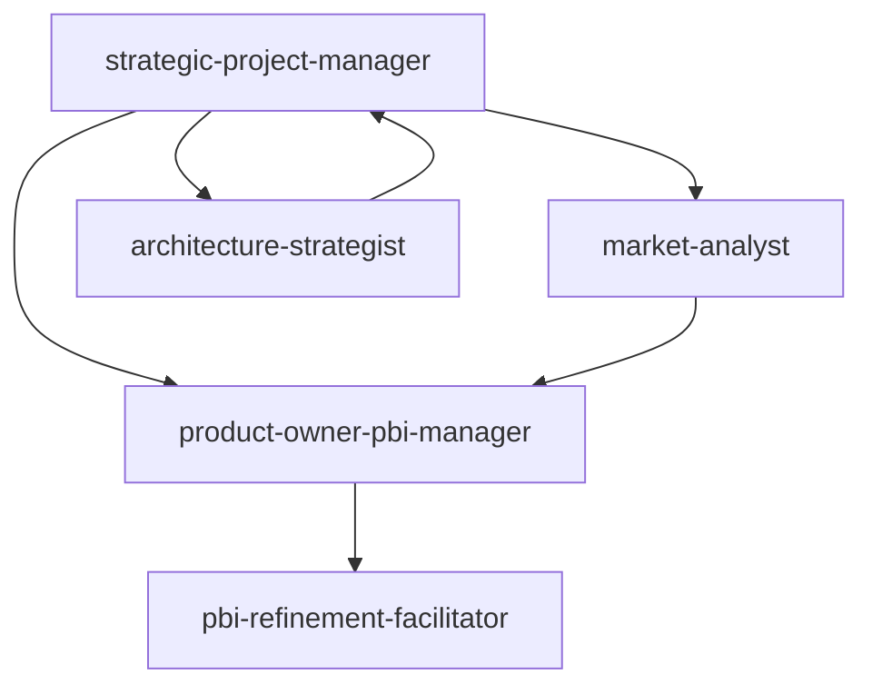
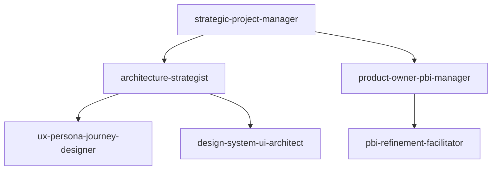
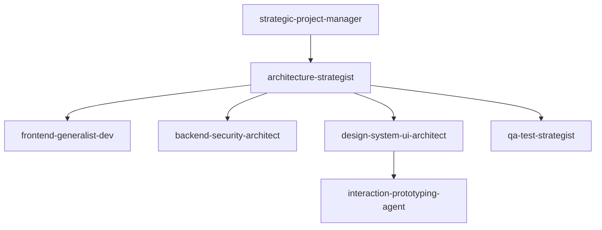
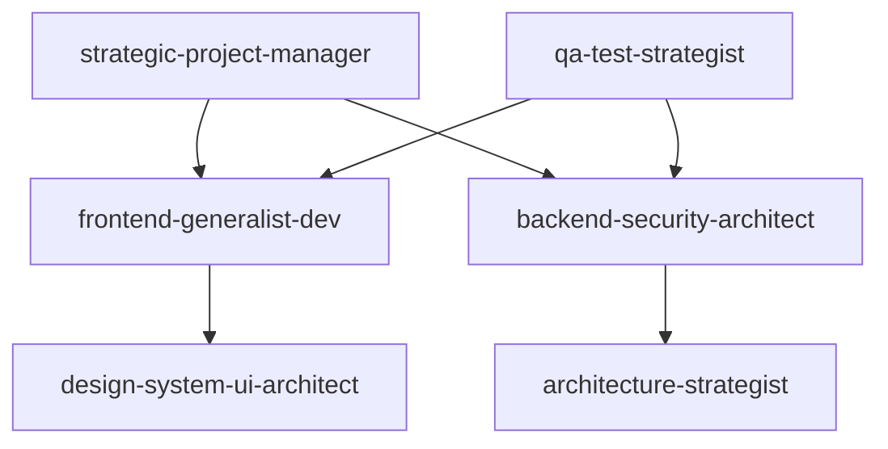
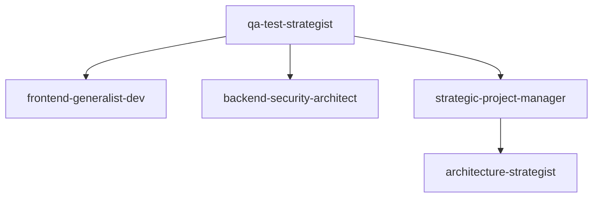

# Agent連携マトリクス

## 全Agent一覧と専門領域

### 11専門Agent構成

| カテゴリ | Agent名 | 専門領域 | 主要責任 |
|----------|---------|----------|-----------|
| **プロジェクト管理** | strategic-project-manager | 全体統制・リソース管理 | プロジェクト統制、リスク管理、品質コントロール |
| **プロダクト・要件管理** | product-owner-pbi-manager | PBI管理・要件定義 | ステークホルダーヒアリング、PBI作成管理 |
| | pbi-refinement-facilitator | PBI詳細化・バックログ | Definition of Ready、PBI詳細化 |
| | market-analyst | 市場分析・競合調査 | 市場動向調査、競合分析 |
| **UX・デザイン** | ux-persona-journey-designer | ペルソナ・ユーザージャーニー | ユーザー体験設計、ペルソナ定義 |
| | design-system-ui-architect | UIシステム・画面設計 | デザインシステム、UI一貫性 |
| | interaction-prototyping-agent | インタラクション・プロトタイプ | 操作フロー、プロトタイピング |
| **開発・アーキテクチャ** | architecture-strategist | システムアーキテクチャ | 技術戦略、設計レビュー |
| | frontend-generalist-dev | フロントエンド総合 | UI実装、マルチプラットフォーム開発 |
| | backend-security-architect | バックエンド・セキュリティ | サーバー実装、セキュリティ設計 |
| **品質保証** | qa-test-strategist | テスト戦略・品質管理 | テスト設計、品質基準策定 |

## フェーズ別Agent連携パターン

### Phase 1: プロジェクト計画・要件定義


**主導**: `strategic-project-manager`
**連携**:
- `product-owner-pbi-manager`: 要件ヒアリング、PBI初期作成
- `market-analyst`: 市場調査、競合分析でPBI優先度決定
- `pbi-refinement-facilitator`: Definition of Ready確認
- `architecture-strategist`: 技術的制約・リスク評価

### Phase 2: Context File・WBS作成


**主導**: `strategic-project-manager` + `architecture-strategist`
**連携**:
- `product-owner-pbi-manager`: 機能要件詳細化
- `ux-persona-journey-designer`: ユーザーシナリオ作成
- `design-system-ui-architect`: UI要件整理
- `pbi-refinement-facilitator`: 実装可能性確認

### Phase 3: Design Doc作成


**主導**: `architecture-strategist`
**連携**:
- `frontend-generalist-dev`: フロントエンド設計
- `backend-security-architect`: バックエンド・API設計
- `design-system-ui-architect`: UI詳細設計
- `interaction-prototyping-agent`: インタラクション設計
- `qa-test-strategist`: テスト設計方針
- `strategic-project-manager`: 設計レビュー・承認

### Phase 4: 実装


**主導**: `frontend-generalist-dev` + `backend-security-architect`
**連携**:
- `strategic-project-manager`: 進捗管理、リソース調整
- `design-system-ui-architect`: UI実装ガイダンス
- `architecture-strategist`: 技術課題解決
- `qa-test-strategist`: 実装品質チェック

### Phase 5: テスト・品質確保


**主導**: `qa-test-strategist`
**連携**:
- `frontend-generalist-dev`: フロントエンドテスト実装
- `backend-security-architect`: バックエンドテスト実装
- `strategic-project-manager`: 品質基準確認
- `architecture-strategist`: パフォーマンステスト

## 特殊連携パターン

### 1. 緊急課題対応
```
strategic-project-manager (影響分析・優先度判定)
    ↓
適切な専門Agent (課題解決)
    ↓
strategic-project-manager (解決策評価・承認)
```

### 2. 要件変更対応
```
product-owner-pbi-manager (変更要件ヒアリング)
    ↓
strategic-project-manager (影響分析)
    ↓
architecture-strategist (技術的影響評価)
    ↓
strategic-project-manager (対応方針決定)
```

### 3. 品質問題対応
```
qa-test-strategist (問題特定・分析)
    ↓
strategic-project-manager (影響評価)
    ↓
該当専門Agent (修正実装)
    ↓
qa-test-strategist (修正確認)
```

## Agent間コミュニケーション効率化

### 並行実行パターン
同時に実行できるAgent組み合わせ：

#### 要件定義段階
```bash
# 並行実行例1: 要件・市場調査
product-owner-pbi-manager: ステークホルダーヒアリング
market-analyst: 競合分析・市場調査
```

#### 設計段階
```bash
# 並行実行例2: UI/UX設計
ux-persona-journey-designer: ペルソナ・ジャーニー作成
design-system-ui-architect: デザインシステム設計
interaction-prototyping-agent: プロトタイプ作成
```

#### 実装段階
```bash
# 並行実行例3: フロント・バックエンド実装
frontend-generalist-dev: UI実装
backend-security-architect: API実装
qa-test-strategist: テストコード準備
```

### 段階的連携パターン
依存関係のあるAgent実行順序：

```bash
# パターン1: PBI → Context → WBS
product-owner-pbi-manager → pbi-refinement-facilitator → strategic-project-manager

# パターン2: 設計 → 実装 → テスト
architecture-strategist → frontend-generalist-dev → qa-test-strategist

# パターン3: UI設計 → プロトタイプ → 実装
design-system-ui-architect → interaction-prototyping-agent → frontend-generalist-dev
```

## プロジェクト統制のベストプラクティス

### strategic-project-manager中心の統制
1. **計画段階**: 全体方針策定、Agent活用戦略決定
2. **実行段階**: 進捗監視、ボトルネック解消、リソース調整
3. **品質管理**: 成果物レビュー、品質基準確認
4. **リスク対応**: 課題特定、対応策立案、影響最小化

### Agent選択指針
| 状況 | 最適Agent | 理由 |
|------|-----------|------|
| プロジェクト全体の方向性決定 | strategic-project-manager | 統制・意思決定権限 |
| 技術的課題・設計判断 | architecture-strategist | 技術専門性 |
| UI/UX品質向上 | design-system-ui-architect | デザイン専門性 |
| 実装効率化 | frontend/backend-*-dev | 実装専門性 |
| 品質・リスク管理 | qa-test-strategist | 品質専門性 |

### 効率的なAgent活用順序
```bash
# 推奨フロー
1. strategic-project-manager: プロジェクト計画
2. product-owner-pbi-manager: 要件定義
3. architecture-strategist: 設計方針
4. 各専門Agent: 詳細作業
5. strategic-project-manager: 統合・品質確認
```

## トラブルシューティング・エスカレーション

### エスカレーションルート
```
専門Agent（一次対応）
    ↓ （解決困難時）
strategic-project-manager（二次対応・統制判断）
    ↓ （プロジェクト影響時）
ステークホルダー（最終判断）
```

### よくある連携課題と対処
| 課題 | 原因 | 対処法 |
|------|------|--------|
| Agent間の方針齟齬 | 統制不足 | strategic-project-manager での調整 |
| 重複作業発生 | 役割分担不明確 | Agent責任範囲の明確化 |
| 品質基準バラつき | 基準統一不足 | qa-test-strategist での基準統一 |
| 進捗遅延 | リソース不足 | strategic-project-manager でのリソース調整 |

このAgent連携マトリクスにより、11の専門Agentが効率的に協働し、Kotlin Multiplatformプロジェクトの成功を支援します。