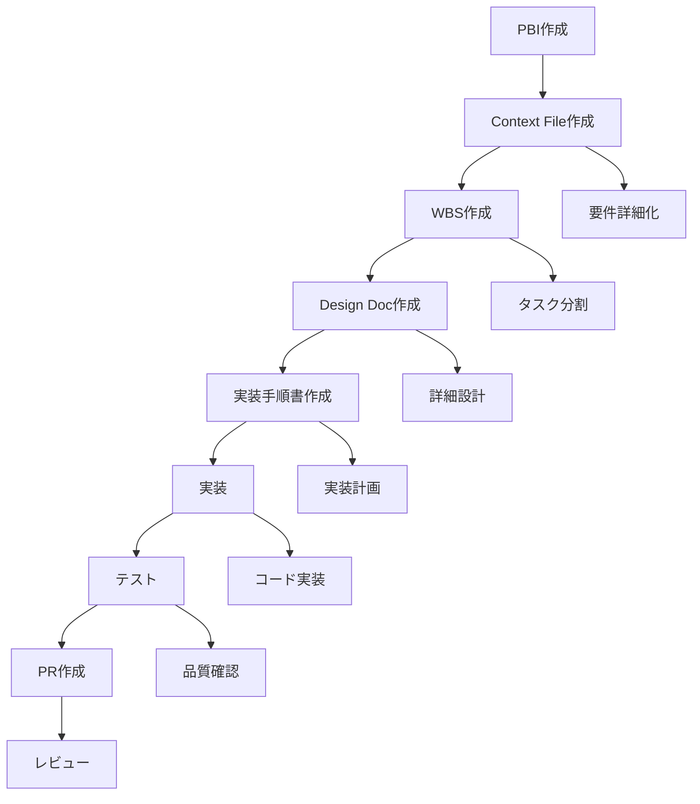

# PBI設計実装フロー定義

## 概要
このドキュメントは、PBI（Product Backlog Item）から設計・実装・PR作成まで一貫したワークフローを定義します。
Claude Code専門agentを活用した効率的な開発プロセスを提供します。

## 全体フロー



## フェーズ別詳細

### Phase 1: PBI要件整理
#### 1.1 PBI作成・管理
**使用Agent**: `product-owner-pbi-manager`

**目的**: ステークホルダー要件を明確なPBIに変換

**手順**:
1. ステークホルダーヒアリング
2. ユーザーストーリー作成
3. 受け入れ条件定義
4. `docs/pbi/requirements/` に配置

**成果物**:
- PBI-XXX-[feature-name].md

#### 1.2 PBI詳細化
**使用Agent**: `pbi-refinement-facilitator`

**目的**: Definition of Ready基準を満たすまでPBIを詳細化

**手順**:
1. PBI内容の精査
2. 不明点の洗い出し
3. 追加調査・ヒアリング実施
4. `docs/pbi/ready/` に移動

**成果物**:
- 詳細化されたPBI
- Definition of Ready確認済み

### Phase 2: Context File作成
#### 2.1 要件抽出・整理
**使用Agent**: `product-owner-pbi-manager` または手動実行

**目的**: PBIから具体的な実装要件を抽出

**手順**:
1. PBIの内容分析
2. 機能要件・非機能要件の整理
3. プラットフォーム別要件の明確化
4. システム境界の定義
5. ユーザーシナリオの作成

**テンプレート**: `docs/design/templates/context-file-template.md`

**成果物**:
- `docs/design/context-files/PBI-XXX-context.md`

### Phase 3: WBS作成
#### 3.1 タスク分割・計画
**使用Agent**: `architecture-strategist` + 手動実行

**目的**: Context FileからWBS形式でタスクを分割し着手順序を決定

**手順**:
1. Context Fileの内容分析
2. 実装タスクの洗い出し
3. タスク間依存関係の整理
4. 工数見積もりと優先度設定
5. プラットフォーム別実装計画

**テンプレート**: `docs/design/templates/wbs-template.md`

**成果物**:
- `docs/design/wbs/PBI-XXX-wbs.md`

### Phase 4: Design Doc作成
#### 4.1 詳細設計
**使用Agent**: `architecture-strategist` + `design-system-ui-architect`

**目的**: WBSで切り出されたタスクごとの詳細設計

**手順**:
1. アーキテクチャ設計
2. データ設計
3. API設計
4. UI設計
5. 非機能要件の詳細化

**テンプレート**: `docs/design/templates/design-doc-template.md`

**成果物**:
- `docs/design/design-docs/WBS-X.X.X-[task-name]-design.md`

#### 4.2 UI/UX設計
**使用Agent**: `ux-persona-journey-designer` + `interaction-prototyping-agent`

**目的**: ユーザー体験とインタラクションの設計

**手順**:
1. ユーザーペルソナ設定
2. ユーザージャーニー設計
3. インタラクションフロー作成
4. プロトタイプ作成

**成果物**:
- ユーザージャーニーマップ
- インタラクションプロトタイプ

### Phase 5: 実装手順書作成
#### 5.1 実装計画詳細化
**使用Agent**: 手動実行

**目的**: Design Docを基に具体的な実装手順を作成

**手順**:
1. Design Docの実装方針を詳細化
2. ステップバイステップの手順作成
3. コードテンプレートの準備
4. チェックリストの作成

**テンプレート**: `docs/design/templates/implementation-guide-template.md`

**成果物**:
- `docs/design/implementation-guides/WBS-X.X.X-[task-name]-guide.md`

### Phase 6: 実装
#### 6.1 コード実装
**使用Agent**: `frontend-generalist-dev` + `backend-security-architect`

**目的**: 実装手順書に従った実際のコード実装

**手順**:
1. 環境準備
2. データ層実装
3. ビジネスロジック層実装  
4. プレゼンテーション層実装
5. サーバー実装（該当する場合）
6. プラットフォーム固有実装

**成果物**:
- 実装コード一式
- プラットフォーム別実装

#### 6.2 コード品質確保
**使用Agent**: 手動実行

**手順**:
1. コード規約チェック
2. 静的解析実行
3. セキュリティチェック
4. パフォーマンスチェック

### Phase 7: テスト
#### 7.1 テスト実装・実行
**使用Agent**: `qa-test-strategist`

**目的**: 包括的なテスト実行と品質確保

**手順**:
1. テスト戦略策定
2. 単体テスト実装・実行
3. 統合テスト実装・実行
4. E2Eテスト実装・実行
5. プラットフォーム別テスト
6. 動作確認

**成果物**:
- テスト実装コード
- テスト実行結果レポート

### Phase 8: PR作成
#### 8.1 プルリクエスト作成
**使用Agent**: 手動実行

**目的**: 実装内容をレビュー可能な状態でPR作成

**手順**:
1. git commit作成
2. ブランチプッシュ
3. PR作成（要約・テスト計画を含む）
4. レビュー依頼

**成果物**:
- GitHub Pull Request

## Agent活用パターン

### 並行実行パターン
複数のAgentを並行実行して効率化：

```bash
# 例: PBI詳細化と市場調査を並行実行
- pbi-refinement-facilitator: PBI詳細化
- market-analyst: 競合分析・市場調査
```

### 段階的実行パターン
段階的にAgentを切り替えて詳細化：

```bash
# 例: 要件→設計→実装の段階実行
1. product-owner-pbi-manager: 要件整理
2. architecture-strategist: システム設計
3. frontend-generalist-dev: 実装
```

## ディレクトリ構造
```
docs/
├── pbi/                          # PBI管理
│   ├── requirements/             # 要件定義中
│   ├── ready/                   # 着手可能
│   ├── active/                  # 進行中
│   └── completed/               # 完了
├── design/                      # 設計ドキュメント
│   ├── context-files/           # コンテキストファイル
│   ├── wbs/                     # Work Breakdown Structure  
│   ├── design-docs/             # 詳細設計書
│   ├── implementation-guides/   # 実装手順書
│   └── templates/               # テンプレート集
└── workflows/                   # ワークフロー定義
    └── pbi-to-implementation.md # このファイル
```

## 品質ゲート

### Phase別品質チェック
各Phaseで以下をチェック：

#### Context File品質ゲート
- [ ] 機能要件が明確に定義されている
- [ ] 非機能要件が具体的に記述されている
- [ ] プラットフォーム別要件が整理されている
- [ ] ユーザーシナリオが具体的である
- [ ] システム境界が明確である

#### WBS品質ゲート  
- [ ] タスクが実装可能なサイズに分割されている
- [ ] タスク間依存関係が整理されている
- [ ] 工数見積もりが妥当である
- [ ] 優先度が適切に設定されている
- [ ] マイルストーンが明確である

#### Design Doc品質ゲート
- [ ] アーキテクチャが適切に設計されている
- [ ] データ設計が完成している
- [ ] API仕様が明確である
- [ ] 非機能要件への対応策が記載されている
- [ ] テスト方針が明確である

#### 実装品質ゲート
- [ ] コード規約に準拠している
- [ ] 単体テストが実装されている
- [ ] 統合テストが成功している
- [ ] 全プラットフォームでビルドが成功している
- [ ] Definition of Doneを満たしている

## ツール・コマンド

### よく使用するコマンド
```bash
# ビルド・テスト
./gradlew build                    # 全体ビルド
./gradlew check                    # 全テスト実行
./gradlew allTests                 # マルチプラットフォームテスト

# 実行
./gradlew run                      # サーバー実行
./gradlew :composeApp:wasmJsBrowserDevelopmentRun  # Web実行

# コード品質
./gradlew lint                     # 静的解析
./gradlew lintFix                  # 自動修正
```

### Agent呼び出しコマンド
```bash
# PBI管理
/create-pbi [テーマ]               # PBI作成

# 専門Agent活用例
# Context File作成 → product-owner-pbi-manager
# WBS作成 → architecture-strategist  
# Design Doc作成 → architecture-strategist + design-system-ui-architect
# 実装 → frontend-generalist-dev + backend-security-architect
# テスト → qa-test-strategist
```

## トラブルシューティング

### よくある問題と対応

#### PBI要件不明
**問題**: 要件が曖昧でContext Fileが作成できない
**対応**: `product-owner-pbi-manager`で追加ヒアリング実施

#### 技術選定迷い
**問題**: 実装方針が決まらない
**対応**: `architecture-strategist`でアーキテクチャレビュー

#### UI/UX設計不明
**問題**: ユーザー体験が設計できない
**対応**: `ux-persona-journey-designer`でペルソナ・ジャーニー作成

#### 実装ブロック
**問題**: 実装で技術的問題が発生
**対応**: 該当専門Agent（frontend/backend）で解決策検討

## ベストプラクティス

### 効率化のコツ
1. **早期のAgent活用**: 要件が曖昧な段階から専門Agentを活用
2. **並行実行**: 独立性の高いタスクは並行してAgent実行
3. **段階的詳細化**: 粒度を徐々に細かくしていく
4. **テンプレート活用**: 一貫性を保つためテンプレートを積極活用
5. **品質ゲート遵守**: 各Phaseで品質を確認してから次に進む

### 陥りやすい罠
1. **要件飛ばし**: Context File作成を省略して直接実装に入る
2. **設計不足**: Design Docを簡略化しすぎる
3. **テスト後回し**: 実装優先でテスト設計を軽視する
4. **Agent使い分け不足**: 適切な専門Agentを選択しない

## まとめ
このワークフローにより、PBIから実装・PR作成まで一貫した品質とトレーサビリティを確保できます。
専門Agentの適切な活用により、各分野の専門性を活かした効率的な開発が可能になります。