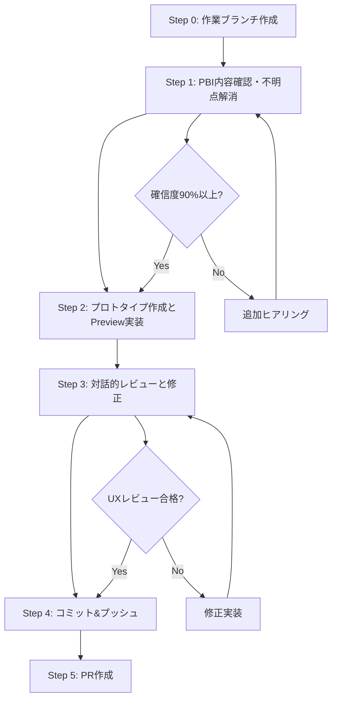

# UI開発ワークフロー

PBIからCompose UIを対話的に開発するための標準化されたワークフローです。このワークフローは、要件の明確化から実装、レビュー、PR作成まで、UI開発の全プロセスをカバーします。

## ワークフロー概要



## 詳細ワークフロー

### Step 0: 作業ブランチの作成

**目的**: UI開発専用の作業環境を構築

**実行者**: strategic-project-manager

**手順**:
1. **現在ブランチの確認**
   ```bash
   git status
   git branch -v
   ```

2. **新規ブランチ作成**
   ```bash
   git checkout -b feature/ui-[PBI-ID]
   # 例: git checkout -b feature/ui-PBI-001A
   ```

3. **開発環境確認**
   ```bash
   ./gradlew build
   ./gradlew :composeApp:build
   ```

**完了基準**:
- [ ] feature/ui-[PBI-ID] ブランチが作成済み
- [ ] プロジェクトがビルド成功
- [ ] Compose Multiplatform 環境が正常動作

---

### Step 1: PBI内容確認・不明点解消

**目的**: 90%以上の確信が持てるまで要件を明確化

**実行者**: product-owner-pbi-manager

**確認項目**:

#### 1.1 UI機能要件の詳細化
- **画面構成**: レイアウト、コンポーネント配置、ナビゲーション
- **状態管理**: UI状態の種類、状態遷移、エラーハンドリング
- **データ表示**: 表示データの種類、フォーマット、更新タイミング
- **ユーザー入力**: 入力フィールド、バリデーション、送信処理

#### 1.2 ユーザーエクスペリエンス要件
- **インタラクション**: タップ、スワイプ、長押し等の操作方法
- **フィードバック**: ローディング、成功/エラー通知、バイブレーション
- **アニメーション**: 画面遷移、状態変化、リスト操作のアニメーション
- **レスポンシビリティ**: 異なる画面サイズでの表示対応

#### 1.3 プラットフォーム要件
- **対象プラットフォーム**: Android, iOS, Desktop, Web での表示・動作
- **プラットフォーム固有機能**: ネイティブ機能の活用方針
- **パフォーマンス要件**: 描画速度、メモリ使用量、バッテリー消費

#### 1.4 技術制約・非機能要件
- **アクセシビリティ**: スクリーンリーダー対応、キーボードナビゲーション
- **セキュリティ**: 機密情報の表示制御、入力データの保護
- **テスト要件**: UI テスト、スクリーンショットテストの方針

**ヒアリング手法**:
- **5W1H分析**: Who, What, When, Where, Why, How の観点での確認
- **ユーザーストーリーマッピング**: ユーザージャーニー全体での位置づけ確認
- **プロトタイプベース確認**: 既存UIや競合アプリを参考にした要件確認

**アウトプット**:
- `docs/design/ui-requirements/[PBI-ID]-ui-requirements.md`

**完了基準**:
- [ ] 全確認項目で90%以上の確信度を達成
- [ ] 受け入れ条件が具体的で測定可能
- [ ] ステークホルダーからの要件承認を取得

---

### Step 2: プロトタイプ作成とPreview実装

**目的**: 動作確認可能なCompose UIプロトタイプを作成

**実行者**: design-system-ui-architect

#### 2.1 UI状態設計

**UiStateクラスの設計**:
```kotlin
data class [FeatureName]UiState(
    val isLoading: Boolean = false,
    val data: List<DataItem> = emptyList(),
    val errorMessage: String? = null,
    val selectedItem: DataItem? = null,
    val searchQuery: String = "",
    val filterState: FilterState = FilterState.All
)
```

**状態遷移の定義**:
- Loading → Success/Error
- Empty → HasData
- Selected → Unselected

#### 2.2 コンポーネント構造設計

**再利用可能コンポーネントの分解**:
```
[FeatureName]Screen
├── [FeatureName]TopBar
├── [FeatureName]Content
│   ├── [FeatureName]List
│   │   └── [FeatureName]Item
│   └── [FeatureName]EmptyState
└── [FeatureName]FloatingActionButton
```

#### 2.3 Compose実装

**ファイル構成**:
```
composeApp/src/commonMain/kotlin/com/example/playground/
├── ui/
│   ├── screens/[featurename]/
│   │   ├── [FeatureName]Screen.kt
│   │   └── [FeatureName]ScreenPreview.kt
│   ├── components/[featurename]/
│   │   ├── [FeatureName]Content.kt
│   │   ├── [FeatureName]Item.kt
│   │   └── [FeatureName]Components.kt
│   └── state/
│       └── [FeatureName]UiState.kt
```

**実装標準**:
- Material 3 Design System 準拠
- Compose Multiplatform ベストプラクティス適用
- State Hoisting パターンの採用
- アクセシビリティ属性の設定

#### 2.4 Preview実装

**@Preview実装例**:
```kotlin
@Preview
@Composable
fun [FeatureName]ScreenPreview() {
    PlaygroundTheme {
        [FeatureName]Screen(
            uiState = [FeatureName]UiState(
                isLoading = false,
                data = sampleData()
            ),
            onAction = { /* Preview用の空実装 */ }
        )
    }
}

@Preview
@Composable
fun [FeatureName]ScreenLoadingPreview() {
    PlaygroundTheme {
        [FeatureName]Screen(
            uiState = [FeatureName]UiState(isLoading = true),
            onAction = { }
        )
    }
}

@Preview
@Composable
fun [FeatureName]ScreenErrorPreview() {
    PlaygroundTheme {
        [FeatureName]Screen(
            uiState = [FeatureName]UiState(
                errorMessage = "ネットワークエラーが発生しました"
            ),
            onAction = { }
        )
    }
}
```

**プラットフォーム別Preview**:
- Android: 複数画面サイズでの確認
- iOS: iPhoneとiPadでの表示確認
- Desktop: ウィンドウサイズ変更への対応確認
- Web: ブラウザでの表示確認

**完了基準**:
- [ ] 全Preview が正常表示される
- [ ] 基本的なユーザーインタラクションが動作する
- [ ] Material 3 Design System に準拠している
- [ ] アクセシビリティ属性が適切に設定されている

---

### Step 3: 対話的レビューと修正点確認

**目的**: ユーザー視点でのUI/UX評価と改善実施

**実行者**: ux-persona-journey-designer

#### 3.1 レビュー観点

**ユーザビリティ評価**:
- **直感性**: 初回利用時の理解しやすさ
- **効率性**: タスク完了までの操作数・時間
- **学習容易性**: 操作方法の習得しやすさ
- **エラー回復**: エラー発生時の復旧しやすさ

**視覚デザイン評価**:
- **デザインシステム準拠**: Material 3 コンポーネントの適切な使用
- **視覚的階層**: 情報の重要度に応じた表示優先度
- **色彩・コントラスト**: アクセシビリティ基準への準拠
- **タイポグラフィ**: 読みやすさと一貫性

**インタラクション評価**:
- **レスポンシブ性**: 操作に対する即座のフィードバック
- **自然さ**: プラットフォームの慣習に沿った操作感
- **予測可能性**: 操作結果の予想しやすさ

#### 3.2 対話的レビュープロセス

**レビューセッション実行**:
1. **デモ実行**: 実装したUIの動作確認
2. **ユーザーシナリオテスト**: 典型的な利用シーンでの操作確認
3. **エッジケーステスト**: エラー状態、ネットワーク不安定時の動作確認
4. **アクセシビリティ確認**: スクリーンリーダーでの操作確認

**改善点の特定**:
- **課題の分類**: Critical/High/Medium/Low での重要度分類
- **改善提案**: 具体的な修正方法の提示
- **優先度付け**: リリースブロッカーとなる課題の特定

#### 3.3 修正実装とRe-review

**修正実装サイクル**:
```
Review → 課題特定 → 修正実装 → Re-review → 承認
```

**修正追跡**:
- 修正前後のスクリーンショット比較
- 改善点の定量的評価（可能な場合）
- ユーザビリティスコアの改善確認

**完了基準**:
- [ ] UX評価スコア 4.0/5.0 以上
- [ ] 重要度High以上の課題が解決済み
- [ ] デザインシステム準拠率 100%
- [ ] 各プラットフォームでの一貫性確認済み

---

### Step 4: コミット＆プッシュ

**目的**: 段階的コミット戦略での変更履歴管理

**実行者**: strategic-project-manager

#### 4.1 段階的コミット戦略

**コミット順序**:
```bash
# 1. UI状態設計
git add ui/state/[FeatureName]UiState.kt
git commit -m "[feat] UI: [PBI-ID] [FeatureName]UiState クラスを定義

- UI状態の種類と遷移を定義
- ローディング、エラー、データ表示状態を管理
- [具体的な状態の説明]"

# 2. 基本コンポーネント実装
git add ui/components/[featurename]/
git commit -m "[feat] UI: [PBI-ID] [FeatureName] 基本コンポーネントを実装

- [FeatureName]Item コンポーネントを作成
- Material 3 Design System 準拠
- アクセシビリティ属性を設定"

# 3. メイン画面実装
git add ui/screens/[featurename]/[FeatureName]Screen.kt
git commit -m "[feat] UI: [PBI-ID] [FeatureName]Screen メイン画面を実装

- 状態管理とコンポーネント組み合わせ
- ナビゲーションとユーザーインタラクション対応
- レスポンシブレイアウト実装"

# 4. Preview実装
git add ui/screens/[featurename]/[FeatureName]ScreenPreview.kt
git commit -m "[feat] UI: [PBI-ID] Preview実装と表示確認

- 正常状態、ローディング、エラー状態のPreview
- プラットフォーム別表示確認
- デザインシステム適用確認"

# 5. UXレビュー対応
git add .
git commit -m "[fix] UI: [PBI-ID] UXレビュー対応

- ユーザビリティ改善: [具体的な改善内容]
- アクセシビリティ向上: [具体的な対応内容]
- デザインシステム準拠: [修正内容]"
```

#### 4.2 コミット品質基準

**1コミットあたりの基準**:
- **行数制限**: 200行以内
- **責任範囲**: 単一の論理的変更
- **ビルド確認**: 各コミット後にビルド成功
- **メッセージ品質**: 変更理由と影響範囲を明記

#### 4.3 プッシュとブランチ管理

```bash
# リモートブランチにプッシュ
git push -u origin feature/ui-[PBI-ID]

# ブランチ状態確認
git status
git log --oneline -5
```

**完了基準**:
- [ ] 全変更が適切な粒度でコミット済み
- [ ] コミットメッセージが規約に準拠
- [ ] リモートブランチにプッシュ完了
- [ ] ビルドとテストが成功

---

### Step 5: PR作成

**目的**: 統合テスト可能なPull Requestの作成

**実行者**: strategic-project-manager

#### 5.1 PR作成準備

**事前確認**:
```bash
# ビルド確認
./gradlew build
./gradlew :composeApp:allTests

# コード品質確認
./gradlew lint
./gradlew :composeApp:lint
```

**スクリーンショット準備**:
- 各プラットフォームでのPreview表示
- 主要な操作フローの画面キャプチャ
- Before/After比較（修正がある場合）

#### 5.2 PR作成

**PR作成コマンド**:
```bash
gh pr create --title "[UI] [PBI-ID] [機能名] UI Implementation" \
--body "$(cat <<'EOF'
## 概要
[PBI-ID]のUI実装を完了しました。

## 実装内容
- **UI状態設計**: [FeatureName]UiState による状態管理
- **コンポーネント実装**: Material 3 準拠のUI要素
- **プラットフォーム対応**: Android/iOS/Desktop/Web での表示確認
- **アクセシビリティ**: スクリーンリーダー対応実装

## 関連ドキュメント
- UI要件書: [リンク]
- UXレビューレポート: [リンク]
- Design Doc: [リンク]

## プレビュー
### Android
[スクリーンショット]

### iOS
[スクリーンショット]

### Desktop
[スクリーンショット]

## テスト
- [ ] 全Previewが正常表示
- [ ] 基本インタラクションが動作
- [ ] アクセシビリティ確認済み
- [ ] プラットフォーム間一貫性確認

## レビュー観点
- UI/UX設計の妥当性
- Compose実装のベストプラクティス準拠
- デザインシステム一貫性
- プラットフォーム対応完全性

🤖 Generated with [Claude Code](https://claude.ai/code)
EOF
)"
```

**PR要件チェックリスト**:
- [ ] タイトルが命名規約に準拠
- [ ] 説明が包括的で理解しやすい
- [ ] 関連ドキュメントへのリンクが含まれる
- [ ] スクリーンショットが添付されている
- [ ] レビュー観点が明確

**完了基準**:
- [ ] PR が正常に作成されている
- [ ] CI/CDが実行され成功している
- [ ] レビュアーがアサインされている
- [ ] プロジェクトボードが更新されている

---

## 品質保証

### 品質ゲート

#### Step 1完了基準（要件明確化）
```yaml
requirements_clarity: ">= 90%"
ui_specifications: "完全"
acceptance_criteria: "測定可能"
stakeholder_approval: "取得済み"
```

#### Step 2完了基準（プロトタイプ）
```yaml
preview_functionality: "全Preview正常"
basic_interaction: "主要機能動作"
accessibility_compliance: "基本対応完了"
code_quality: "ベストプラクティス準拠"
```

#### Step 3完了基準（レビュー）
```yaml
ux_evaluation_score: ">= 4.0/5.0"
critical_issues: "0件"
high_priority_issues: "0件"
design_system_compliance: "100%"
cross_platform_consistency: "確認済み"
```

### テンプレート

#### UI要件書テンプレート
```markdown
# [PBI-ID] UI要件書

## 基本情報
- **PBI-ID**: [PBI-ID]
- **機能名**: [機能名]
- **作成日**: [日付]
- **更新日**: [日付]

## UI機能要件
### 画面構成
- レイアウト構造
- コンポーネント配置
- ナビゲーション仕様

### 状態管理
- UI状態の種類
- 状態遷移図
- エラーハンドリング

## UX要件
### ユーザーインタラクション
- 操作方法
- フィードバック仕様
- アニメーション要件

## プラットフォーム要件
### 対応プラットフォーム
- [ ] Android
- [ ] iOS
- [ ] Desktop
- [ ] Web

## 受け入れ条件
1. [測定可能な条件1]
2. [測定可能な条件2]
3. [測定可能な条件3]
```

### エラー対応

#### 要件不明確時
1. **追加ヒアリング実施**
   - product-owner-pbi-manager による詳細確認
   - ステークホルダーとの直接対話
   - プロトタイプベースでの要件確認

2. **段階的要件確定**
   - 必須要件と推奨要件の分離
   - MVP版での先行実装
   - 段階的機能追加計画

#### 技術実装困難時
1. **代替技術検討**
   - architecture-strategist による技術評価
   - プラットフォーム制約の技術的解決
   - パフォーマンス要件の調整

2. **段階的実装計画**
   - 基本機能先行実装
   - 高度機能の後続実装
   - 技術検証期間の確保

#### UXレビュー不合格時
1. **具体的改善計画**
   - 課題の重要度別分類
   - 修正スケジュールの策定
   - ステークホルダーへの影響説明

2. **修正実装とRe-review**
   - 優先度順での修正実装
   - 段階的レビューの実施
   - 最終品質確認

---

## 設定とカスタマイズ

### デフォルト設定
```yaml
# プラットフォーム設定
default_platform: "android"
supported_platforms: ["android", "ios", "desktop", "web"]

# 品質基準
ux_review_threshold: 4.0
accessibility_compliance_level: "AA"
test_coverage_minimum: 80

# 開発設定
commit_strategy: "incremental"
preview_required: true
design_system: "material3"
```

### Agent設定
```yaml
# 段階別Agent配置
step_agents:
  0: "strategic-project-manager"
  1: "product-owner-pbi-manager"
  2: "design-system-ui-architect"
  3: "ux-persona-journey-designer"
  4: "strategic-project-manager"
  5: "strategic-project-manager"

# レビューAgent設定
review_agents:
  - "ux-persona-journey-designer"
  - "design-system-ui-architect"
  - "qa-test-strategist"
```